# *LightLogR* newsletter

# *LightLogR* newsletter

January 2026, Edition \#02

Author

LightLogR Team

Doi

[10.5281/zenodo.18267830](https://doi.org/10.5281/zenodo.18267830)

## 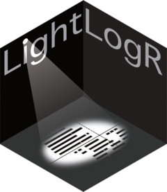

We are back with another dose of *LightLogR* updates, now under a bright
*high noon* sky.

## In this newsletter

- [*LightLogR* 0.10.0 *High noon* is here](#high-noon-release)
- [Open and reproducible analysis of light exposure and visual
  experience data](#open-repro-course)
- [*LightLogR* in publications and projects](#publications)
- [The “big build”: Building a commons for light exposure data](#glee)
- [Subscribe & unsubscribe](#subscribe-unsubscribe)
- [Cite](#cite)

------------------------------------------------------------------------

## *LightLogR* 0.10.0 *High noon* is here

The newest release, [***LightLogR* 0.10.0 *High
noon***](https://tscnlab.github.io/LightLogR/news/index.html#lightlogr-0100-high-noon),
brings mid-day clarity to your analyses with improvements across the
package. Thank you for the continued feedback and energy that made this
possible.

``` r
install.packages("LightLogR")
library(LightLogR)
```

### Highlights in v0.10.0 *High noon*

Switch between the tabs to see a selecton of new additions to the
package.

- [Summaries](https://tscnlab.github.io/LightLogR/)
- [Group selection](https://tscnlab.github.io/LightLogR/)
- [Versioning](https://tscnlab.github.io/LightLogR/)
- [State viz](https://tscnlab.github.io/LightLogR/)
- [Circular time](https://tscnlab.github.io/LightLogR/)

#### Summary table with helpful overview and common light exposure metrics

``` r
data |> summary_table()
```

[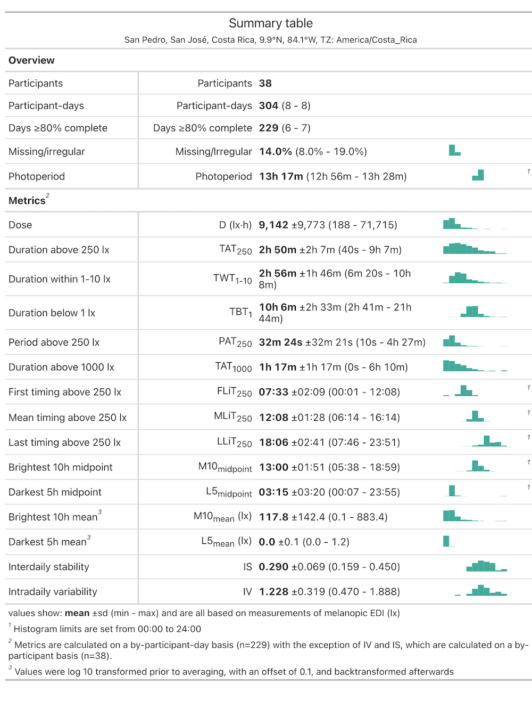](https://tscnlab.github.io/LightLogR/assets/02/table_summary.png)

Access overview and metric functions separately with
[`summary_overview()`](https://tscnlab.github.io/LightLogR/reference/summary_table.html)
and
[`summary_metrics()`](https://tscnlab.github.io/LightLogR/reference/summary_table.html)

#### Quickly select individuals/groups based on number, summary metric, or randomly:

``` r
#return the three topmost groups
data |> sample_groups(n=3) 
```

``` r
#return a random group
data |> sample_groups(sample="random")
```

``` r
#return the group with the highest average melanopic EDI
data |> sample_groups(order.by = mean(MEDI)) 
```

``` r
#return all groups with a median MEDI value above 1000
data |> sample_groups(condition = median(MEDI) > 1000) 
```

Combine these arguments to get quick access to exactly the participants
and groups you need

#### Support for multiple file format versions

File formats evolve over time. *LightLogR* is now ready when things
change, e.g., through a software update. Simply specify the version you
need.

``` r
import$VEET(file, version = "2.1.7")
```

How do you know which formats are available and how they differ? And
which one is the default when you don’t specify anything? Look under
[`supported_versions()`](https://tscnlab.github.io/LightLogR/reference/supported_versions.html)

``` r
supported_versions(device = "VEET") 
```

[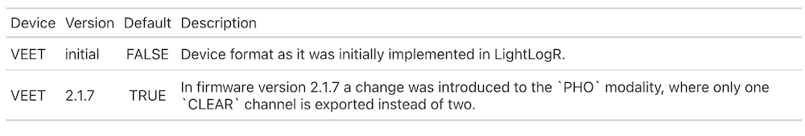](https://tscnlab.github.io/LightLogR/assets/02/versioning.png)

#### Individual heights for states

Before 0.10.0 *High noon*, states and photoperiods would always be
displayed as panel-filling. In some cases this could be confusing. Now,
states can have their `ymin` and `ymax` aesthetic to add the information
where you want it specifically, add states and photoperiods at the same
time, or even add multiple states with multiple heights.

Switch between the tabs to see the difference.

- [old](https://tscnlab.github.io/LightLogR/)
- [new](https://tscnlab.github.io/LightLogR/)

``` r
data |> 
  Brown_cut() |> 
  gg_days() |> 
  gg_states(state, aes_fill = state)
```

[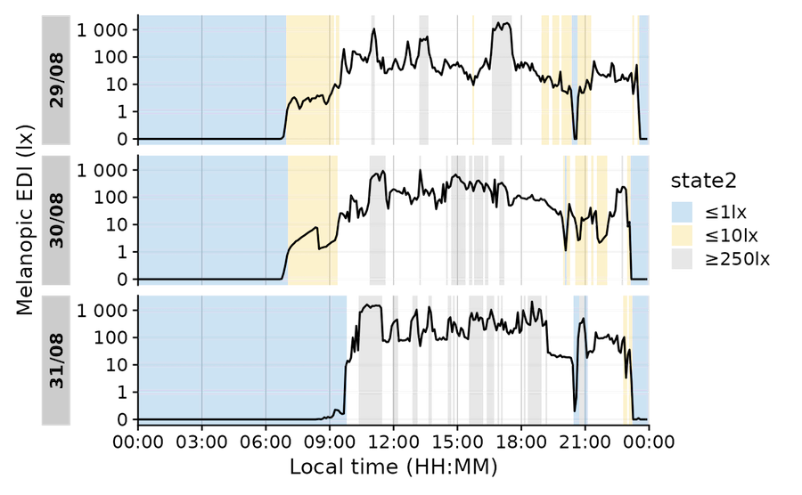](https://tscnlab.github.io/LightLogR/assets/02/states_old.png)

``` r
data |> 
  Brown_cut() |> 
  gg_days() |> 
  gg_states(state, aes_fill = state, ymax = 0, alpha = 1)
```

[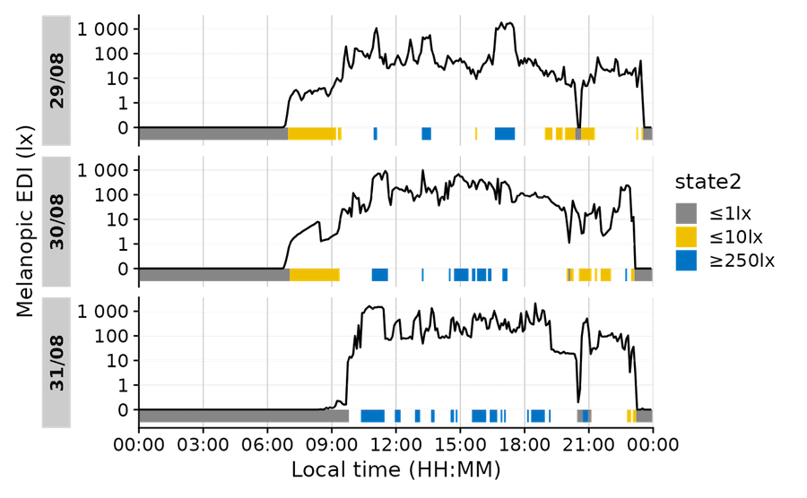](https://tscnlab.github.io/LightLogR/assets/02/states_new.png)

Time of day is circular, but datetimes are not. This regularly leads to
problems when calculating with them, because what happens
mathematically, e.g., during averaging, is not always what we intend.
E.g., consider these datetimes:

[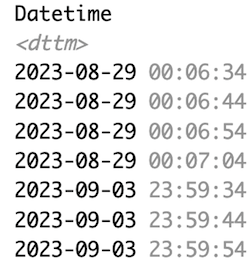](https://tscnlab.github.io/LightLogR/assets/02/time.png)

Depending on what these indicate, we might need a linear or a circular
representation of time-of-day. Let’s say they indicate bedtimes, some
after, and some before midnight. We try both approaches to calculate the
average bedtime. Switch between the tabs to see the difference.

- [linear](https://tscnlab.github.io/LightLogR/)
- [circular](https://tscnlab.github.io/LightLogR/)

``` r
data |> 
  Datetime2Time() |> 
  summarize_numeric()
```

[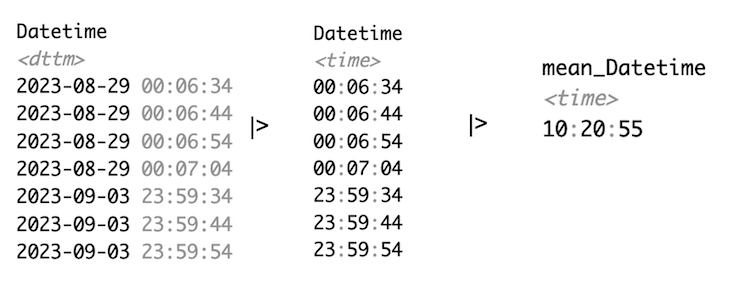](https://tscnlab.github.io/LightLogR/assets/02/linear_time.png)

In linear time, time-of-day is stored as seconds from midnight.
Accordingly, the average is around 10 in the morning - which is not
sensible in the context of this example. Thus we have to switch to
circular time.

Note that we converted datetimes to times prior to averaging. If we had
averaged datetimes, the date-component would have added another layer of
complexity.

``` r
data |> 
  Datetime2Time(circular = TRUE) |> 
  summarize_numeric() |> Circular2Time()
```

[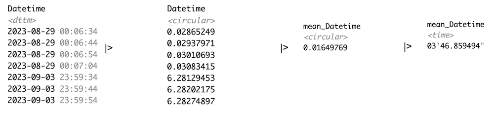](https://tscnlab.github.io/LightLogR/assets/02/circular_time.png)

Circular time is represented as angles on a circular system. When these
are averaged, the distance between two points on the circle is relevant,
not where the circle starts or ends. Thus, we get a sensible average,
which, in this case, is about 3-4 minutes past midnight.

Note that ***LightLogR* 0.10.0 *High noon*** uses the
[`circular`](https://CRAN.R-project.org/package=circular) package to
implement this functionality.

### Explore the release notes

Read the full changelog in the [*LightLogR* news
section](https://tscnlab.github.io/LightLogR/news/index.html#lightlogr-0100-high-noon).

------------------------------------------------------------------------

## Open and reproducible analysis of light exposure and visual experience data

[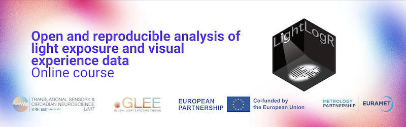](https://tscnlab.github.io/LightLogR_webinar/)

In October, we started a course series on the [**Open and reproducible
analysis of light exposure and visual experience
data**](https://tscnlab.github.io/LightLogR_webinar/), covering
*beginner* and *advanced* levels. The course is targeted at all
researchers that touch base with personal light exposure and visual
experience data collected from wearable devices. The goal is to remove
friction around common tasks when preparing analyses and combining
streams of data through standardized pipelines and reproducible methods.
While *LightLogR* sits at the center of this course, it goes beyond the
package to explain tidy frameworks, common approaches (and pitfalls) in
analysis, and gathers a research community developing and devoliping
standards, instead of reinventing the wheel with every project.

The course consists of dynamic (live) and static analysis scripts that
cover all the bases. *Live* tutorials run a self‑contained version of R
in your browser - no setup required - with only minor functional
limitations. *Static* tutorials provide the complete script exactly as
you would run it in a local R installation.

[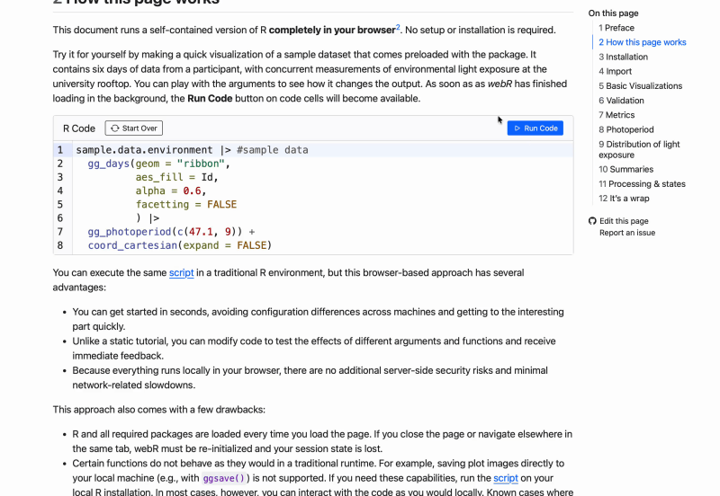](https://tscnlab.github.io/LightLogR/assets/02/Live.gif)

In the spirit of openness and reproducibility, the course is completely
free of charge, does not require a sign-in, and can be done at any
time - just visit the [course
website](https://tscnlab.github.io/LightLogR_webinar/). If you would
like some additional input on the principles, the tutorials, and a
walkthrough, you can register for the free webinar installments of the
course:

[**Register
here**](https://tum-conf.zoom.us/webinar/register/WN_xGoHi1i_Sz2flC6-qGcLoQ#/registration)

The remaining dates for the 25/26 webinar series are:

- Tuesday, 3 March 2026 8:30 - 10:00 CET (Beginner)
- Tuesday, 3 March 2026 18:00 - 19:30 CET (Beginner)
- Wednesday, 6 May 2026 8:30 - 10:00 CEST (Advanced)
- Wednesday, 6 May 2026 18:00 - 19:30 CEST (Advanced)

Beginner webinars are repeated between the morning and the evening
sessions. Advanced webinars cover one use case each. Spreading the
webinars to the central european morning and evening means anyone around
the world can join without sacrificing (too much) sleep.

Recordings of past webinars are made available on the [course
website](https://tscnlab.github.io/LightLogR_webinar/recordings).
Participants of the live webinars have the benefit of a live Q&A at the
end of each session, get to vote for future content and focus points,
and receive a certificate. For a more complete overview, have a look at
the [course
flyer](https://tscnlab.github.io/LightLogR_webinar/assets/Online_course_series_2025-26.pdf).

### Thank you to our learners

A special note of appreciation: we sent out **122 certificates** to
participants from the beginner and advanced webinars. Thank you for your
dedication to open, reproducible research and for being part of this
growing community.

[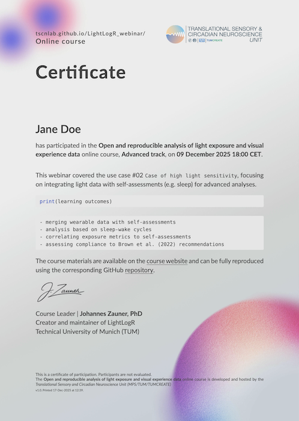](https://tscnlab.github.io/LightLogR/assets/02/certificate.png)

## *LightLogR* in publications and projects

We are happy to share publications and activities from 2025 that use or
feature *LightLogR*:

- Biller & Zauner et al.: [Physiologically-relevant light exposure and
  light behaviour in Switzerland and
  Malaysia](https://pubmed.ncbi.nlm.nih.gov/41339708/)
- Guidolin et al.: [Collecting, detecting, and handling non-wear
  intervals in longitudinal light exposure
  data](https://pmc.ncbi.nlm.nih.gov/articles/PMC12795912/)
- Hartmeyer et al.: [Multi-Wearable Approach for Monitoring Diurnal
  Light Exposure and Body Rhythms in Nightshift
  Workers](https://doi.org/10.1111/apha.70069)
- Fazlali et al.: [Sex and Seasonal Variations in Melatonin Suppression
  and Alerting Response to
  Light](https://doi.org/10.1210/jendso/bvaf155)
- Lazar et al.: [Afternoon to early evening bright light exposure
  reduces later melatonin production in
  adolescents](https://www.nature.com/articles/s44323-025-00040-6)
- Murukesu et al.: [A day in Daylight
  (dashboard)](https://tscnlab.github.io/2025_ADayInDaylight/)
- Zauner & Stefani et al.(in print): [Auxiliary data, quality assurance
  and quality control for wearable light loggers and optical radiation
  dosimeters](https://www.biorxiv.org/content/10.1101/2025.09.11.675633v3)
- Zauner et al.: [How to Deal With Darkness: Modeling and Visualization
  of Zero-Inflated Personal Light Exposure Data on a Logarithmic
  Scale](https://journals.sagepub.com/doi/10.1177/07487304251336624)
- Zauner et al.: [LightLogR: Reproducible analysis of personal light
  exposure data](https://pmc.ncbi.nlm.nih.gov/articles/PMC7617517/)

NoteAre you using *LightLogR* in your paper?

Please let us know by [writing an email to
us](mailto:johannes.zauner@tum.de?subject=Please%20highlight%20this%20paper%20in%20the%20bibliography%20of%20LightLogR%27s%20documentation%20and%20the%20newsletter&body=To%20the%20sender:%20please%20provide%20the%20DOI%20and%20a%20link%20to%20the%20publication.).
We will add it to a bibliography on LightLogR’s documentation webpage
and feature it in the next newsletter.

------------------------------------------------------------------------

##### We are thrilled to see *LightLogR* empowering research teams worldwide and look forward to sharing more tools, courses, and community news soon.

## The “big build”: Building a commons for light exposure data

[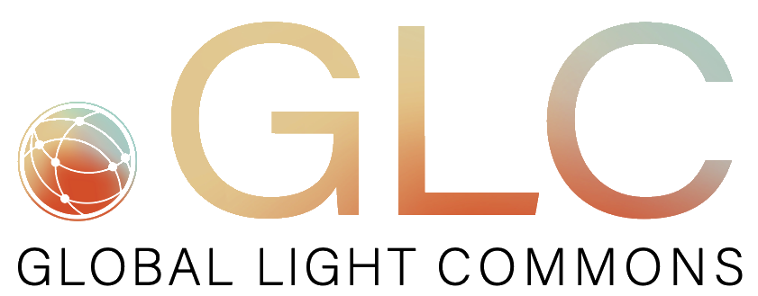](https://tscnlab.github.io/LightLogR/assets/02/GLC_Logo.png)

Our “big build” the *Global Light Commons* (a [GLEE
initiative](https://www.visualdiet.org)) has been busy meeting with
light enthusiasts across continents to understand the needs of our
community globally.

### Our Vision

Our goal is to build a shared, open infrastructure for light exposure
data. We want to ensure this data is:

- Findable and accessible to all.
- Usable across different sectors.
- Reproducible for rigorous science, informed policy, and improved
  public health.

To work toward this vision, we are developing the technical foundations
of the *Global Light Commons*.

### *Global Light Commons* Infrastructure

The *Global Light Commons* aims to support the sharing, discovery, and
reuse of light exposure datasets through a common, metadata-driven
framework. At its core are schemas, developed with community input, that
provide structured, machine-readable descriptions of studies, devices,
contributors, participants, and datasets. These schemas enable
validation of datasets deposited in general-purpose repositories such as
Zenodo, helping ensure that data are interpretable, comparable, and
discoverable across studies. Rather than hosting data itself, the
Commons is designed to index datasets that conform to these
descriptions. A public schema viewer makes the structure of the model
visible, allowing researchers to inspect and understand the schema.

[](https://tscnlab.github.io/LightLogR/assets/02/GLC_datapackage_viewer.png "A sneak peek of the public schema viewer")

A sneak peek of the public schema viewer

### Collaborative Insights

We have been privileged to welcome researchers, government
representatives, NGOs, and thought leaders to the table. Together, we’ve
explored what sustainable data collection looks like, how to ensure a
collective legacy, and the best ways to integrate with existing
frameworks.

While we are often working toward different specific outcomes, these
conversations have unearthed some shared truths felt throughout our
community:

- The constant pressure to “publish or perish.”
- Existing workflows that unfortunately do not prioritize data upload or
  open publication.

These discussions have also underscored the importance of building a
community of practice around light exposure data. Shared infrastructure
alone is not sufficient: long-term sustainability and meaningful reuse
depend on a critical mass of researchers who adopt common descriptions
and norms around data sharing. Establishing this community is essential
both for maintaining the infrastructure over time and for ensuring its
relevance to ongoing research.

### Join the Conversation

Each conversation grounds us in a shared vision for the future. We
believe this infrastructure must be built with the community, not just
for it.

**We want to hear from you**. If you have perspectives or experiences to
share, please get in touch via the [GLEE
homepage](https://www.visualdiet.org).

Read more about the vision for the *Global Light Commons*
[here](https://cet.org/personal-light-exposure-research-needs-a-common-standard-not-a-thousand-wheels/).

## Subscribe & unsubscribe

You can subscribe to this newsletter (and unsubscribe) by visiting the
[*LightLogR* mailing
list](https://lists.lrz.de/mailman/listinfo/lightlogr-users).

## Cite

If you want to cite this newsletter, please do so as:

APA:

> Zauner, J., Thalji, S., Tsukimori, E., & Spitschan, M. (2026,
> January). LightLogR newsletter (No. 02).
> https://doi.org/10.5281/zenodo.18267830

Harvard:

> Zauner, J., Thalji, S., Tsukimori, E. & Spitschan, M. 2026. LightLogR
> Newsletter, no. 2, January. Available at:
> https://doi.org/10.5281/zenodo.18267830 (Published 20 January 2026).
