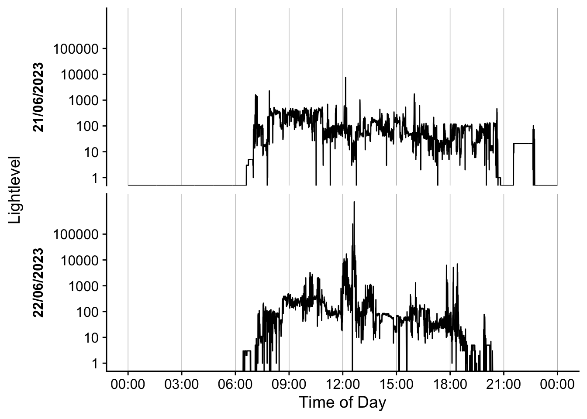

<!-- README.md is generated from README.Rmd. Please edit that file -->

# LightLogR 

<!-- badges: start -->

[](https://github.com/tscnlab/LightLogR/actions/workflows/R-CMD-check.yaml)

<!-- badges: end -->

Personalized light exposure data is progressively gaining importance in
various sectors, including research, occupational affairs, and fitness
tracking. Data are collected through a proliferating selection of
wearable loggers and dosimeters, varying in size, shape, functionality,
and output format. Despite or maybe because of numerous use cases, the
field lacks a unified framework for collecting, validating, and
analyzing the accumulated data. This issue increases the time and
expertise necessary to handle such data and also compromises the
FAIRness (Findability, Accessibility, Interoperability, Reusability) of
the results, especially in meta-analyses.

##### Please note that LightLogR is work in progress! If you are interested in the project and want to know more, please give us a [message](mailto:johannes.zauner@tum.de)

**LightLogR** is a package under development as part of the
[*MeLiDos*](https://www.melidos.eu) project to address these issues.
MeLiDos is a joint, [EURAMET](https://www.euramet.org)-funded project
involving sixteen partners across Europe, aimed at developing a
metrology and a standard workflow for wearable light logger data and
optical radiation dosimeters. Its primary contributions towards
fostering FAIR data include the development of a common file format,
robust metadata descriptors, and an accompanying open-source software
ecosystem. **LightLogR** aims to provide tools for:

- Generation of data and metadata files

- Conversion of popular file formats

- Validation of light logging data

- Verification of crucial metadata

- Calculation of common parameters

- Semi-automated analysis and visualization (both command-line and
  GUI-based)

- Integration of data into a unified database for cross-study analyses

**LightLogR** is developed by the [*Translational Sensory & Circadian
Neuroscience*](https://www.tscnlab.org) lab, a joint group from the
[Technical University of Munich](https://www.tum.de/en/) and the [Max
Planck Institute for Biological
Cybernetics](https://www.mpg.de/152075/biological-cybernetics).

## Installation

You can install the development version of LightLogR from
[GitHub](https://github.com/) with:

``` r
# install.packages("devtools")
devtools::install_github("tscnlab/LightLogR")
```

## Example

Here is a quick starter on how do use **LightLogR**.

``` r
library(LightLogR)
#these packages are just needed for the examples as shown.
library(gt)
library(dplyr)
library(ggplot2)
```

### Import

You can import a light logger dataset with ease. The import functions
give quick, helpful feedback about the dataset.

``` r
filename <- system.file("extdata/sample_data_LYS.csv", package = "LightLogR")
dataset <- import.LYS(filename)
#> Successfully read in 11422 observations from LYS-file
#> Start: 2023-06-21 00:00:12
#> End: 2023-06-22 23:59:48
#> Timespan: 2 days
#> Observation intervals: 
#>   interval.time     n pct    
#> 1 15 secs       10015 87.689%
#> 2 16 secs        1367 11.969%
#> 3 17 secs          23 0.201% 
#> 4 18 secs          16 0.140%

dataset %>% select(Datetime, lux, kelvin, mEDI) %>%  slice(7500:7505) %>% gt()
```

<div id="biukclkxjs" style="padding-left:0px;padding-right:0px;padding-top:10px;padding-bottom:10px;overflow-x:auto;overflow-y:auto;width:auto;height:auto;">
<style>#biukclkxjs table {
  font-family: system-ui, 'Segoe UI', Roboto, Helvetica, Arial, sans-serif, 'Apple Color Emoji', 'Segoe UI Emoji', 'Segoe UI Symbol', 'Noto Color Emoji';
  -webkit-font-smoothing: antialiased;
  -moz-osx-font-smoothing: grayscale;
}
&#10;#biukclkxjs thead, #biukclkxjs tbody, #biukclkxjs tfoot, #biukclkxjs tr, #biukclkxjs td, #biukclkxjs th {
  border-style: none;
}
&#10;#biukclkxjs p {
  margin: 0;
  padding: 0;
}
&#10;#biukclkxjs .gt_table {
  display: table;
  border-collapse: collapse;
  line-height: normal;
  margin-left: auto;
  margin-right: auto;
  color: #333333;
  font-size: 16px;
  font-weight: normal;
  font-style: normal;
  background-color: #FFFFFF;
  width: auto;
  border-top-style: solid;
  border-top-width: 2px;
  border-top-color: #A8A8A8;
  border-right-style: none;
  border-right-width: 2px;
  border-right-color: #D3D3D3;
  border-bottom-style: solid;
  border-bottom-width: 2px;
  border-bottom-color: #A8A8A8;
  border-left-style: none;
  border-left-width: 2px;
  border-left-color: #D3D3D3;
}
&#10;#biukclkxjs .gt_caption {
  padding-top: 4px;
  padding-bottom: 4px;
}
&#10;#biukclkxjs .gt_title {
  color: #333333;
  font-size: 125%;
  font-weight: initial;
  padding-top: 4px;
  padding-bottom: 4px;
  padding-left: 5px;
  padding-right: 5px;
  border-bottom-color: #FFFFFF;
  border-bottom-width: 0;
}
&#10;#biukclkxjs .gt_subtitle {
  color: #333333;
  font-size: 85%;
  font-weight: initial;
  padding-top: 3px;
  padding-bottom: 5px;
  padding-left: 5px;
  padding-right: 5px;
  border-top-color: #FFFFFF;
  border-top-width: 0;
}
&#10;#biukclkxjs .gt_heading {
  background-color: #FFFFFF;
  text-align: center;
  border-bottom-color: #FFFFFF;
  border-left-style: none;
  border-left-width: 1px;
  border-left-color: #D3D3D3;
  border-right-style: none;
  border-right-width: 1px;
  border-right-color: #D3D3D3;
}
&#10;#biukclkxjs .gt_bottom_border {
  border-bottom-style: solid;
  border-bottom-width: 2px;
  border-bottom-color: #D3D3D3;
}
&#10;#biukclkxjs .gt_col_headings {
  border-top-style: solid;
  border-top-width: 2px;
  border-top-color: #D3D3D3;
  border-bottom-style: solid;
  border-bottom-width: 2px;
  border-bottom-color: #D3D3D3;
  border-left-style: none;
  border-left-width: 1px;
  border-left-color: #D3D3D3;
  border-right-style: none;
  border-right-width: 1px;
  border-right-color: #D3D3D3;
}
&#10;#biukclkxjs .gt_col_heading {
  color: #333333;
  background-color: #FFFFFF;
  font-size: 100%;
  font-weight: normal;
  text-transform: inherit;
  border-left-style: none;
  border-left-width: 1px;
  border-left-color: #D3D3D3;
  border-right-style: none;
  border-right-width: 1px;
  border-right-color: #D3D3D3;
  vertical-align: bottom;
  padding-top: 5px;
  padding-bottom: 6px;
  padding-left: 5px;
  padding-right: 5px;
  overflow-x: hidden;
}
&#10;#biukclkxjs .gt_column_spanner_outer {
  color: #333333;
  background-color: #FFFFFF;
  font-size: 100%;
  font-weight: normal;
  text-transform: inherit;
  padding-top: 0;
  padding-bottom: 0;
  padding-left: 4px;
  padding-right: 4px;
}
&#10;#biukclkxjs .gt_column_spanner_outer:first-child {
  padding-left: 0;
}
&#10;#biukclkxjs .gt_column_spanner_outer:last-child {
  padding-right: 0;
}
&#10;#biukclkxjs .gt_column_spanner {
  border-bottom-style: solid;
  border-bottom-width: 2px;
  border-bottom-color: #D3D3D3;
  vertical-align: bottom;
  padding-top: 5px;
  padding-bottom: 5px;
  overflow-x: hidden;
  display: inline-block;
  width: 100%;
}
&#10;#biukclkxjs .gt_spanner_row {
  border-bottom-style: hidden;
}
&#10;#biukclkxjs .gt_group_heading {
  padding-top: 8px;
  padding-bottom: 8px;
  padding-left: 5px;
  padding-right: 5px;
  color: #333333;
  background-color: #FFFFFF;
  font-size: 100%;
  font-weight: initial;
  text-transform: inherit;
  border-top-style: solid;
  border-top-width: 2px;
  border-top-color: #D3D3D3;
  border-bottom-style: solid;
  border-bottom-width: 2px;
  border-bottom-color: #D3D3D3;
  border-left-style: none;
  border-left-width: 1px;
  border-left-color: #D3D3D3;
  border-right-style: none;
  border-right-width: 1px;
  border-right-color: #D3D3D3;
  vertical-align: middle;
  text-align: left;
}
&#10;#biukclkxjs .gt_empty_group_heading {
  padding: 0.5px;
  color: #333333;
  background-color: #FFFFFF;
  font-size: 100%;
  font-weight: initial;
  border-top-style: solid;
  border-top-width: 2px;
  border-top-color: #D3D3D3;
  border-bottom-style: solid;
  border-bottom-width: 2px;
  border-bottom-color: #D3D3D3;
  vertical-align: middle;
}
&#10;#biukclkxjs .gt_from_md > :first-child {
  margin-top: 0;
}
&#10;#biukclkxjs .gt_from_md > :last-child {
  margin-bottom: 0;
}
&#10;#biukclkxjs .gt_row {
  padding-top: 8px;
  padding-bottom: 8px;
  padding-left: 5px;
  padding-right: 5px;
  margin: 10px;
  border-top-style: solid;
  border-top-width: 1px;
  border-top-color: #D3D3D3;
  border-left-style: none;
  border-left-width: 1px;
  border-left-color: #D3D3D3;
  border-right-style: none;
  border-right-width: 1px;
  border-right-color: #D3D3D3;
  vertical-align: middle;
  overflow-x: hidden;
}
&#10;#biukclkxjs .gt_stub {
  color: #333333;
  background-color: #FFFFFF;
  font-size: 100%;
  font-weight: initial;
  text-transform: inherit;
  border-right-style: solid;
  border-right-width: 2px;
  border-right-color: #D3D3D3;
  padding-left: 5px;
  padding-right: 5px;
}
&#10;#biukclkxjs .gt_stub_row_group {
  color: #333333;
  background-color: #FFFFFF;
  font-size: 100%;
  font-weight: initial;
  text-transform: inherit;
  border-right-style: solid;
  border-right-width: 2px;
  border-right-color: #D3D3D3;
  padding-left: 5px;
  padding-right: 5px;
  vertical-align: top;
}
&#10;#biukclkxjs .gt_row_group_first td {
  border-top-width: 2px;
}
&#10;#biukclkxjs .gt_row_group_first th {
  border-top-width: 2px;
}
&#10;#biukclkxjs .gt_summary_row {
  color: #333333;
  background-color: #FFFFFF;
  text-transform: inherit;
  padding-top: 8px;
  padding-bottom: 8px;
  padding-left: 5px;
  padding-right: 5px;
}
&#10;#biukclkxjs .gt_first_summary_row {
  border-top-style: solid;
  border-top-color: #D3D3D3;
}
&#10;#biukclkxjs .gt_first_summary_row.thick {
  border-top-width: 2px;
}
&#10;#biukclkxjs .gt_last_summary_row {
  padding-top: 8px;
  padding-bottom: 8px;
  padding-left: 5px;
  padding-right: 5px;
  border-bottom-style: solid;
  border-bottom-width: 2px;
  border-bottom-color: #D3D3D3;
}
&#10;#biukclkxjs .gt_grand_summary_row {
  color: #333333;
  background-color: #FFFFFF;
  text-transform: inherit;
  padding-top: 8px;
  padding-bottom: 8px;
  padding-left: 5px;
  padding-right: 5px;
}
&#10;#biukclkxjs .gt_first_grand_summary_row {
  padding-top: 8px;
  padding-bottom: 8px;
  padding-left: 5px;
  padding-right: 5px;
  border-top-style: double;
  border-top-width: 6px;
  border-top-color: #D3D3D3;
}
&#10;#biukclkxjs .gt_last_grand_summary_row_top {
  padding-top: 8px;
  padding-bottom: 8px;
  padding-left: 5px;
  padding-right: 5px;
  border-bottom-style: double;
  border-bottom-width: 6px;
  border-bottom-color: #D3D3D3;
}
&#10;#biukclkxjs .gt_striped {
  background-color: rgba(128, 128, 128, 0.05);
}
&#10;#biukclkxjs .gt_table_body {
  border-top-style: solid;
  border-top-width: 2px;
  border-top-color: #D3D3D3;
  border-bottom-style: solid;
  border-bottom-width: 2px;
  border-bottom-color: #D3D3D3;
}
&#10;#biukclkxjs .gt_footnotes {
  color: #333333;
  background-color: #FFFFFF;
  border-bottom-style: none;
  border-bottom-width: 2px;
  border-bottom-color: #D3D3D3;
  border-left-style: none;
  border-left-width: 2px;
  border-left-color: #D3D3D3;
  border-right-style: none;
  border-right-width: 2px;
  border-right-color: #D3D3D3;
}
&#10;#biukclkxjs .gt_footnote {
  margin: 0px;
  font-size: 90%;
  padding-top: 4px;
  padding-bottom: 4px;
  padding-left: 5px;
  padding-right: 5px;
}
&#10;#biukclkxjs .gt_sourcenotes {
  color: #333333;
  background-color: #FFFFFF;
  border-bottom-style: none;
  border-bottom-width: 2px;
  border-bottom-color: #D3D3D3;
  border-left-style: none;
  border-left-width: 2px;
  border-left-color: #D3D3D3;
  border-right-style: none;
  border-right-width: 2px;
  border-right-color: #D3D3D3;
}
&#10;#biukclkxjs .gt_sourcenote {
  font-size: 90%;
  padding-top: 4px;
  padding-bottom: 4px;
  padding-left: 5px;
  padding-right: 5px;
}
&#10;#biukclkxjs .gt_left {
  text-align: left;
}
&#10;#biukclkxjs .gt_center {
  text-align: center;
}
&#10;#biukclkxjs .gt_right {
  text-align: right;
  font-variant-numeric: tabular-nums;
}
&#10;#biukclkxjs .gt_font_normal {
  font-weight: normal;
}
&#10;#biukclkxjs .gt_font_bold {
  font-weight: bold;
}
&#10;#biukclkxjs .gt_font_italic {
  font-style: italic;
}
&#10;#biukclkxjs .gt_super {
  font-size: 65%;
}
&#10;#biukclkxjs .gt_footnote_marks {
  font-size: 75%;
  vertical-align: 0.4em;
  position: initial;
}
&#10;#biukclkxjs .gt_asterisk {
  font-size: 100%;
  vertical-align: 0;
}
&#10;#biukclkxjs .gt_indent_1 {
  text-indent: 5px;
}
&#10;#biukclkxjs .gt_indent_2 {
  text-indent: 10px;
}
&#10;#biukclkxjs .gt_indent_3 {
  text-indent: 15px;
}
&#10;#biukclkxjs .gt_indent_4 {
  text-indent: 20px;
}
&#10;#biukclkxjs .gt_indent_5 {
  text-indent: 25px;
}
</style>
<table class="gt_table" data-quarto-disable-processing="false" data-quarto-bootstrap="false">
  <thead>
    &#10;    <tr class="gt_col_headings">
      <th class="gt_col_heading gt_columns_bottom_border gt_right" rowspan="1" colspan="1" scope="col" id="Datetime">Datetime</th>
      <th class="gt_col_heading gt_columns_bottom_border gt_right" rowspan="1" colspan="1" scope="col" id="lux">lux</th>
      <th class="gt_col_heading gt_columns_bottom_border gt_right" rowspan="1" colspan="1" scope="col" id="kelvin">kelvin</th>
      <th class="gt_col_heading gt_columns_bottom_border gt_right" rowspan="1" colspan="1" scope="col" id="mEDI">mEDI</th>
    </tr>
  </thead>
  <tbody class="gt_table_body">
    <tr><td headers="Datetime" class="gt_row gt_right">2023-06-22 07:30:44</td>
<td headers="lux" class="gt_row gt_right">4</td>
<td headers="kelvin" class="gt_row gt_right">2661</td>
<td headers="mEDI" class="gt_row gt_right">1</td></tr>
    <tr><td headers="Datetime" class="gt_row gt_right">2023-06-22 07:30:59</td>
<td headers="lux" class="gt_row gt_right">6</td>
<td headers="kelvin" class="gt_row gt_right">3024</td>
<td headers="mEDI" class="gt_row gt_right">7</td></tr>
    <tr><td headers="Datetime" class="gt_row gt_right">2023-06-22 07:31:14</td>
<td headers="lux" class="gt_row gt_right">6</td>
<td headers="kelvin" class="gt_row gt_right">3024</td>
<td headers="mEDI" class="gt_row gt_right">7</td></tr>
    <tr><td headers="Datetime" class="gt_row gt_right">2023-06-22 07:31:30</td>
<td headers="lux" class="gt_row gt_right">4</td>
<td headers="kelvin" class="gt_row gt_right">2480</td>
<td headers="mEDI" class="gt_row gt_right">4</td></tr>
    <tr><td headers="Datetime" class="gt_row gt_right">2023-06-22 07:31:45</td>
<td headers="lux" class="gt_row gt_right">8</td>
<td headers="kelvin" class="gt_row gt_right">2820</td>
<td headers="mEDI" class="gt_row gt_right">10</td></tr>
    <tr><td headers="Datetime" class="gt_row gt_right">2023-06-22 07:32:00</td>
<td headers="lux" class="gt_row gt_right">9</td>
<td headers="kelvin" class="gt_row gt_right">2915</td>
<td headers="mEDI" class="gt_row gt_right">11</td></tr>
  </tbody>
  &#10;  
</table>
</div>

### Visualize

Once imported, **LightLogR** allows you conveniently visualize the data.

``` r
dataset %>% gg_day(y.axis = mEDI)
#> Warning: Transformation introduced infinite values in continuous y-axis
```


There is a wide range of options to the `gg_day` function to customize
the output

``` r
dataset %>% gg_day(y.axis = mEDI, col = mEDI >= 250, scales = "fixed")
#> Warning: Transformation introduced infinite values in continuous y-axis
```


``` r
dataset %>% 
  gg_day(y.axis = mEDI, scales = "fixed", geom = "line", format.day = "%d/%m/%Y")
#> Warning: Transformation introduced infinite values in continuous y-axis
```

 \###
Reference data The built-in dataset `sample.data.environment` shows a
combined dataset of light logger data and simultaneous reference data -
in this case unobstructed outdoor light measurements. The data can,
again, be easily visualized with `gg_day`. The `col` parameter used on
the `Source` column of the dataset allows for a color separation between
types of data.

``` r
sample.data.environment %>% 
  gg_day(
    end.date = "2023-08-18",
    y.axis = `MELANOPIC EDI`,
    col = Source,
    scales = "fixed",
    geom = "line")
#> Warning: Transformation introduced infinite values in continuous y-axis
```

 With
the `cut_Datetime` function, the data can further be broken up into
arbitrary time intervals. This can be used to easily compare different
datasets. Just put the function in between the dataset. This makes a new
variable available for plotting: `Datetime.rounded`. Just make sure,
that the `geom` parameter is set to *boxplot* and the `group` parameter
uses both the info from the rounded time interval (`Datetime.rounded`)
and the different datasets (`Source`). The `interaction` function can
easily combine them. The default interval from `cut_Datetime` is 3
hours.

``` r
sample.data.environment %>% 
  cut_Datetime() %>% 
  gg_day(
    end.date = "2023-08-15",
    y.axis = `MELANOPIC EDI`,
    col = Source,
    scales = "fixed",
    geom = "boxplot",
    group = interaction(Source, Datetime.rounded)) + 
  theme(legend.position = "bottom") + 
  coord_cartesian(xlim = c(0, 24*60*60))
#> Warning: Transformation introduced infinite values in continuous y-axis
#> Warning: Removed 3429 rows containing non-finite values (`stat_boxplot()`).
```


