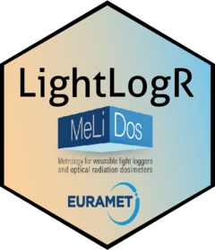
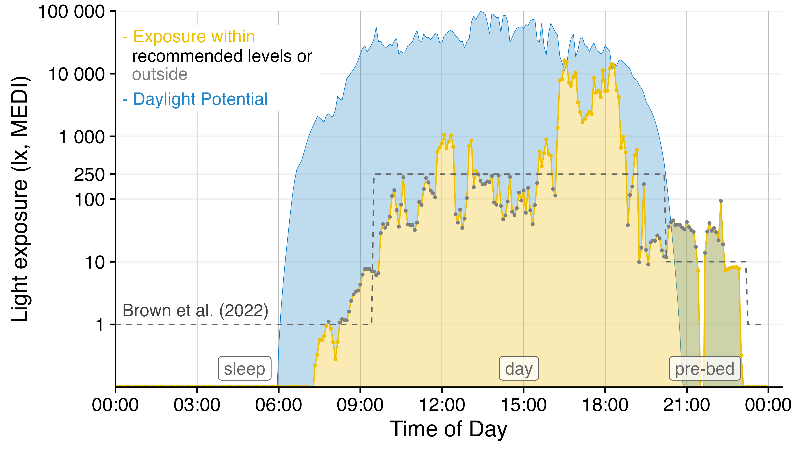
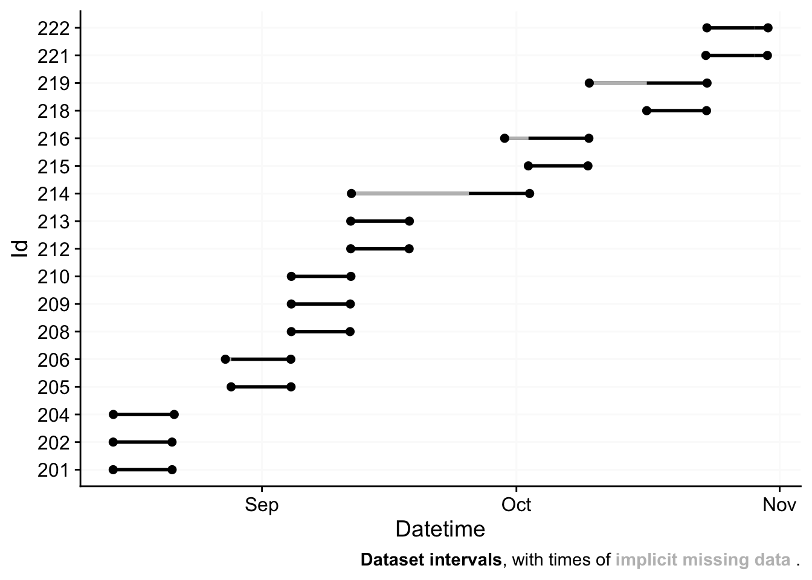
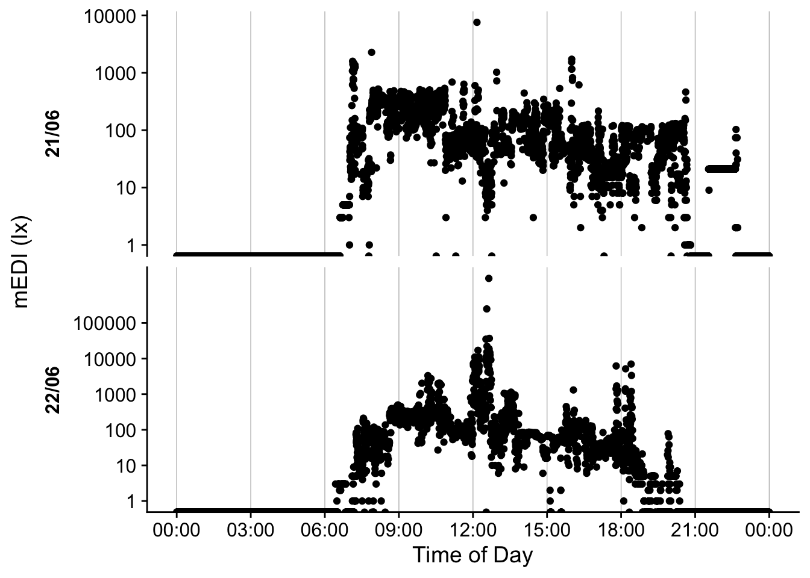
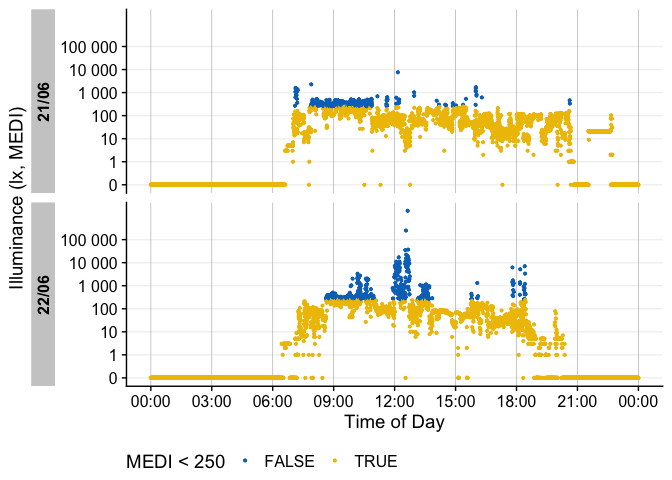
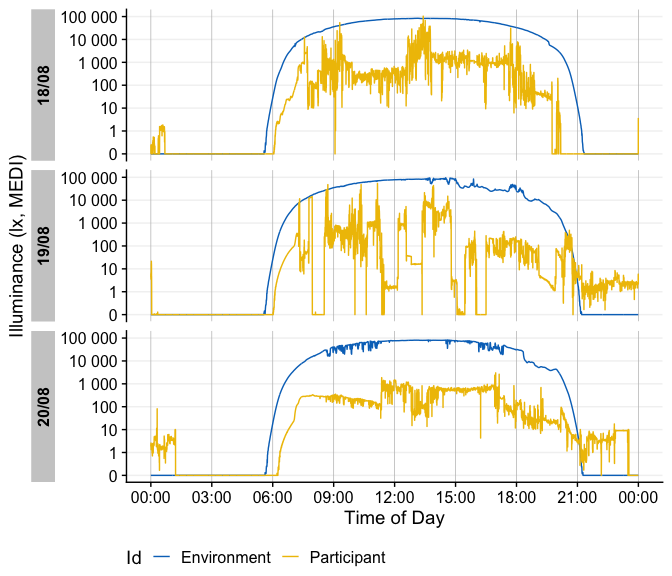
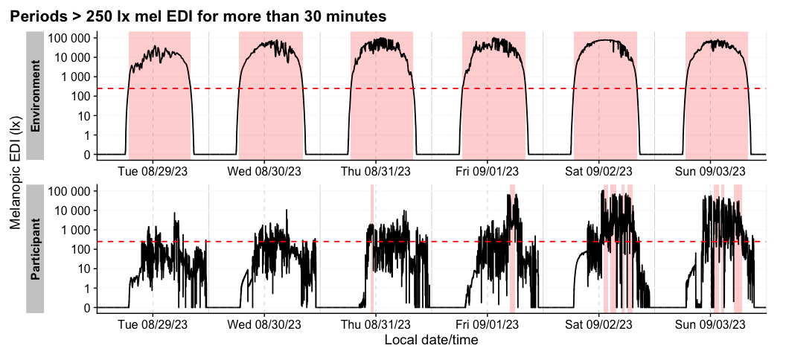
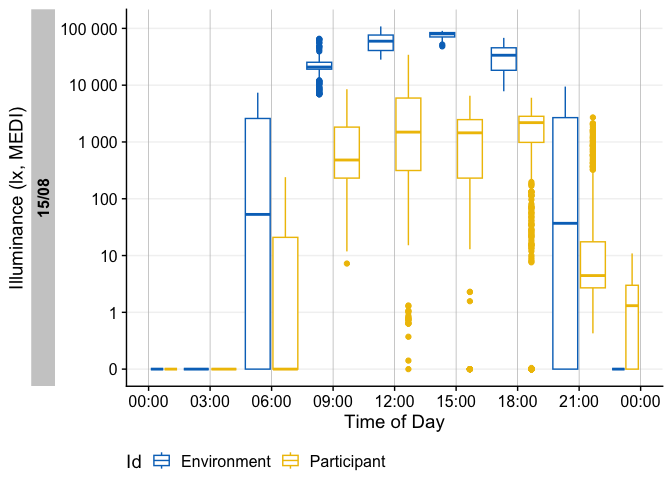
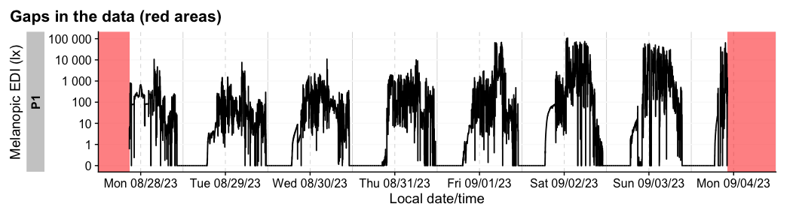
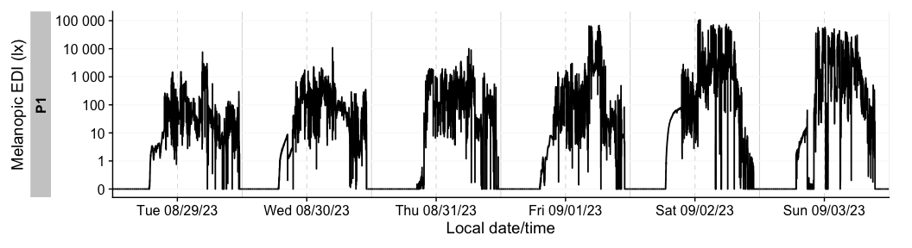

<!-- README.md is generated from README.Rmd. Please edit that file -->

# LightLogR 

<!-- badges: start -->

[](https://github.com/tscnlab/LightLogR/actions/workflows/R-CMD-check.yaml)
[](https://doi.org/10.5281/zenodo.11562600)
[](https://CRAN.R-project.org/package=LightLogR)
[](https://joss.theoj.org/papers/10.21105/joss.07601)

<!-- badges: end -->

Personalized luminous exposure data is progressively gaining importance
in various sectors, including research, occupational affairs, and
fitness tracking. Data are collected through a proliferating selection
of wearable loggers and dosimeters, varying in size, shape,
functionality, and output format. Despite or maybe because of numerous
use cases, the field lacks a unified framework for collecting,
validating, and analyzing the accumulated data. This issue increases the
time and expertise necessary to handle such data and also compromises
the FAIRness (Findability, Accessibility, Interoperability, Reusability)
of the results, especially in meta-analyses.

<div style="text-align:center">

<figure>

<figcaption aria-hidden="true">Light logger data can powerfully convey
insights into personal light exposure</figcaption>
</figure>

</div>

**LightLogR** is a package under development as part of the
[*MeLiDos*](https://www.melidos.eu) project to address these issues. The
package aims to provide tools for:

- Import from common measurement devices (see below for a list of
  [Supported devices](#supported-devices))

- Cleaning and processing of light logging data

- Visualization of light exposure data, both exploratory and publication
  ready

- Calculation of common analysis parameters (see below for a list of
  [Metrics](#metrics))

To come:

- Import, creation, and verification of crucial metadata

- Semi-automated analysis and visualization (both command-line and
  GUI-based)

- Integration of data into a unified database for cross-study analyses

##### Please note that LightLogR is work in progress! If you are interested in the project and want to know more, you can subscribe to the [LightLogR mailing list](https://www.tscnlab.org/software). If you find a bug or would like to see new or improved features, please open an issue on the [GitHub repository](https://github.com/tscnlab/LightLogR/issues).

Have a look at the [Example](#example) section down below to get
started, or dive into the
[Articles](https://tscnlab.github.io/LightLogR/articles/index.html) to
get more in depth information about how to work with the package and
generate images such as the one above, import data, visualization, and
metric calculation.

## Installation

You can install LightLogR from
[CRAN](https://cran.r-project.org/package=LightLogR) with:

``` r
install.packages("LightLogR")
```

You can install the latest development version of LightLogR from
[GitHub](https://github.com/) with:

``` r
# install.packages("devtools")
devtools::install_github("tscnlab/LightLogR")
```

## Example

Here is a quick starter on how to use **LightLogR**.

``` r
library(LightLogR)
#the following packages are needed for the examples as shown below.
library(flextable)
library(dplyr)
library(ggplot2)
```

### Import

You can import a light logger dataset with ease. The import functions
give quick, helpful feedback about the dataset.

``` r
filename <- 
  system.file("extdata/205_actlumus_Log_1020_20230904101707532.txt.zip", 
              package = "LightLogR")
dataset <- import$ActLumus(filename, "Europe/Berlin", manual.id = "P1")
#> 
#> Successfully read in 61'016 observations across 1 Ids from 1 ActLumus-file(s).
#> Timezone set is Europe/Berlin.
#> 
#> First Observation: 2023-08-28 08:47:54
#> Last Observation: 2023-09-04 10:17:04
#> Timespan: 7.1 days
#> 
#> Observation intervals: 
#>   Id    interval.time     n pct  
#> 1 P1    10s           61015 100%
```


For more complex data, there is the useful `gg_overview()` function to
get an immediate grasp of your data. It was automatically called during
import (set `auto.plot = FALSE` to suppress this), but really shines for
datasets with multiple participants. It also indicates where data is
missing, based on the measurement epochs found in the data.

<div style="text-align:center">

<figure>

<figcaption aria-hidden="true">Example for <code>gg_overview()</code>
from a large data collection effort over many months</figcaption>
</figure>

</div>

*note:* the above example image requires a large dataset, not included
in the package. It is available, however, in the article on [Import &
cleaning](https://tscnlab.github.io/LightLogR/articles/Import.html).

    #example code, on how to use gg_overview():
    dataset %>% gg_overview()

### Visualize

Once imported, **LightLogR** has many convenient visualization options.

``` r
dataset %>% gg_days()
```



There is a wide range of options to the `gg_days()` function to
customize the output. Have a look at the reference page (`?gg_days`) to
see all options. You can also override most of the defaults, e.g., for
different `color`, `facetting`, `theme` options. Helper functions can
prepare the data (e.g. to aggregate it to coarser intervals), or to add
to the plot (e.g., to add conditions, such as nighttime)

``` r
dataset |> 
  #change the interval from 10 seconds to 15 minutes:
  aggregate_Datetime("15 min") |> 
  #create groups of 3-hour intervals:
  cut_Datetime("3 hours") |> 
  #plot creation, with a boxplot:
  gg_days(geom = "boxplot", group = Datetime.rounded) |> 
  #adding nighttime indicators:
  gg_photoperiod(c(47.9,9)) + 
  # the output is a standard ggplot, and can be manipulated that way
  geom_line(col = "red", linewidth = 0.25) + 
  labs(title = "Personal light exposure across a week", 
       subtitle = "Boxplot in 3-hour bins")
```



### More than one dataset

The built-in dataset `sample.data.environment` shows a combined dataset
of light logger data and a second set of data - in this case
unobstructed outdoor light measurements. Combined datasets can be easily
visualized with `gg_day()`. The `col` parameter used on the `Id` column
of the dataset allows for a color separation.

``` r
sample.data.environment %>% 
  gg_day(
    start.date = "2023-09-01",
    aes_col = Id,
    geom = "line") + 
  theme(legend.position = "bottom")
#> Only Dates will be used from start.date and end.date input. If you also want to set Datetimes or Times, consider using the `filter_Datetime()` function instead.
```


`gg_day()` will show plots always facetted by day, whereas `gg_days()`
shows a timeline of days for each group. Both functions are opinionated
in terms of the scaling and linebreaks to only show whole days, all of
which can be adjusted.

There are many ways to enhance the plots - if, e.g., we look for periods
of at least 1 hour above 250 lx, we can add and then visualize these
periods easily

``` r
sample.data.environment %>% 
  #search for these conditions:
  add_clusters(MEDI > 250, cluster.duration = "30 min") |> 
  #base plot + add the condition
  gg_days() |> 
  gg_state(state, fill = "red") + 
  #standard ggplot:
  geom_hline(yintercept = 250, col = "red", linetype = "dashed") + 
  labs(title = "Periods > 250 lx mel EDI for more than 30 minutes")
```



There are more visualizations to try - the article on
[Visualizations](https://tscnlab.github.io/LightLogR/articles/Visualizations.html)
dives into them in-depths.

``` r
sample.data.environment |> gg_heatmap(doubleplot = "next")
```



### Metrics

There are many [Metrics](#metrics) used in literature for condensing
personalized light exposure time series to singular values. `LightLogR`
has a rather comprehensive number of these metrics with a consistent,
easy-to-use interface.

``` r
sample.data.environment |> # two groups: participant and environment
  filter_Date(length = "2 days") |> #filter to three days each for better overview
  group_by(Day = lubridate::date(Datetime), .add = TRUE) |>  #add grouping per day
  summarize(
    #time above 250 lx mel EDI:
    duration_above_threshold(MEDI, Datetime, threshold = 250, as.df = TRUE),
    #intradaily variability (IV):
    intradaily_variability(MEDI, Datetime, as.df = TRUE),
    #... as many more metrics as are desired
    .groups = "drop"
  )
#> # A tibble: 4 × 4
#>   Id          Day        duration_above_250    intradaily_variability
#>   <fct>       <date>     <Duration>                             <dbl>
#> 1 Environment 2023-08-29 48240s (~13.4 hours)                   0.248
#> 2 Environment 2023-08-30 49350s (~13.71 hours)                  0.168
#> 3 Participant 2023-08-29 5810s (~1.61 hours)                    1.23 
#> 4 Participant 2023-08-30 9960s (~2.77 hours)                    0.821
```

Other types of metrics can be derived less formally by the
`durations()`, `extract_state()` or `extract_cluster()` function.

``` r
dataset |> 
  gap_handler(full.days = TRUE) |> #extend the viewed time until midnight of the first and last day
  durations(MEDI, show.missing = TRUE)
#> # A tibble: 1 × 4
#> # Groups:   Id [1]
#>   Id    duration              missing               total                
#>   <fct> <Duration>            <Duration>            <Duration>           
#> 1 P1    610160s (~1.01 weeks) 81040s (~22.51 hours) 691200s (~1.14 weeks)

dataset |> 
  group_by(TAT250 = MEDI >= 250, .add = TRUE) |> #creating a grouping column that checks for values above 250lx
  durations(MEDI)
#> # A tibble: 2 × 3
#> # Groups:   Id, TAT250 [2]
#>   Id    TAT250 duration            
#>   <fct> <lgl>  <Duration>          
#> 1 P1    FALSE  498530s (~5.77 days)
#> 2 P1    TRUE   111630s (~1.29 days)
```

The second row indicates where this status is true. This will be
identical to:

``` r
dataset |> 
  summarize(
    duration_above_threshold(MEDI, Datetime, threshold = 250, as.df = TRUE),
    .groups = "drop"
  )
#> # A tibble: 1 × 2
#>   Id    duration_above_250  
#>   <fct> <Duration>          
#> 1 P1    111630s (~1.29 days)
```

What if we are interested in how often this threshold is crossed, and
for how long?

``` r
dataset |> 
  extract_states(TAT250, MEDI >= 250) |> #extract a list of states
  summarize_numeric() |> #summarize the numeric values
  select(Id, TAT250, mean_duration, episodes, total_duration) #collect a subset
#> # A tibble: 2 × 5
#> # Groups:   Id [1]
#>   Id    TAT250 mean_duration        episodes total_duration      
#>   <fct> <lgl>  <Duration>              <int> <Duration>          
#> 1 P1    FALSE  482s (~8.03 minutes)     1034 498530s (~5.77 days)
#> 2 P1    TRUE   108s (~1.8 minutes)      1034 111630s (~1.29 days)
```

We see that there are roughly one thousand instances across the week
where 250 lx was reached, but it only lasted under two minutes on
average. How many long periods are there, say above 30 minutes? As there
might be short interruption, that we consider irrelevant, we are
ignoring interruptions of 1 minute. This is the area of clusters.

``` r
dataset |> 
  extract_clusters(MEDI >= 250, #base condition
                   cluster.duration = "30 mins", #search for at least 30 minute instances
                   interruption.duration = "1 min", #allow 1 minute interrupts
                   add.label = TRUE) |> #add a description of the conditions
  group_by(label) |> #group by the label so it does not get removed next
  summarize_numeric() |> #summarize the output
  select(-mean_epoch) #collect a subset
#> # A tibble: 1 × 6
#>   label   mean_start mean_end mean_duration       total_duration        episodes
#>   <chr>   <time>     <time>   <Duration>          <Duration>               <int>
#> 1 MEDI>=… 13:50:47   15:02:14 4288s (~1.19 hours) 72890s (~20.25 hours)       17
```

We see there are only 17 instances across the week, lasting, on average,
a bit above an hour (and sitting aroung 14:00 - 15:00). Directly
relating the total duration to the 1.29 days time above 250 lx from
above would be misleading, however. This is because here, there are
interruptions present. How prominent are these interruptions?

``` r
dataset |> 
  extract_clusters(MEDI >= 250, #base condition
                   cluster.duration = "30 mins", #search for at least 30 minute instances
                   interruption.duration = "1 min", #allow 1 minute interrupts
                   add.label = TRUE) |>
  #extract the metric:
  extract_metric(dataset, rel_interrupt = sum(MEDI < 250)/n()) |> 
  summarize_numeric(prefix = "") |> #summarize the output
  select(episodes, total_duration, rel_interrupt) |>   #collect a subset
  mutate(interrupt_duration = (total_duration*rel_interrupt) |> round(), #calculate interrupt
         rel_interrupt = rel_interrupt |> scales::percent_format(1)())
#> # A tibble: 1 × 4
#>   episodes total_duration        rel_interrupt interrupt_duration    
#>      <int> <Duration>            <chr>         <Duration>            
#> 1       17 72890s (~20.25 hours) 4%            2918s (~48.63 minutes)
```

Thus we find that only about 4% of the long exposure periods are made up
of interruptions, or just shy of 50 minutes out of over 20 hours.

### Gaps and cleaning

**LightLogR** provides a range of functions to get insight into your
light logger data. Most importantly, you can search for and eliminate
implicit gaps.

``` r
sample.data.irregular |> has_irregulars()
#> [1] TRUE
sample.data.irregular |> has_gaps()
#> [1] TRUE
```

At import, we already get a sense for intervals, but can always show
them with `count_difftime()`.

``` r
sample.data.irregular %>% count_difftime()
#> # A tibble: 4 × 4
#> # Groups:   Id [1]
#>   Id    difftime       n group.indices
#>   <chr> <Duration> <int>         <int>
#> 1 P1    15s        10015             1
#> 2 P1    16s         1367             1
#> 3 P1    17s           23             1
#> 4 P1    18s           16             1
```

We can eliminate this through the `gap_handler()` function. This
function will automatically fill in the gaps with NA values. **The
function will not impute or interpolate data**. As the most dominant
interval in the dataset is now not 15 seconds anymore (because
intermediate datapoints have been added), we need to specify the epoch
for `gap_finder()`.

``` r
sample.data.irregular |> gap_handler() |> has_gaps(epoch = "15 secs")
#> [1] FALSE
```

If we want to force the data to be regular, we can use the
`aggregate_Datetime()` function. This will aggregate the data to the
specified epoch. There are sensible defaults on how to aggregate
numeric, categorical, and logical data. You can also specify your own
aggregation functions.

``` r
sample.data.irregular |>  
  aggregate_Datetime(unit = "20 sec") |> 
  has_gaps()
#> [1] FALSE
```

There are also convenient functions to extract (`extract_gaps()`),
summarize (`gap_table()`) or visualize (`gg_gaps()`) gaps.

``` r
dataset |> gg_gaps()
#> Warning: Removed 8104 rows containing missing values or values outside the scale range
#> (`geom_line()`).
```



Finally, the `remove_partial_data()` easily gets rid of groups or days
that do not provide enough data.

``` r
dataset |> 
  remove_partial_data(MEDI, #variable for which to check missingness
                      threshold.missing = "2 hours", #remove when more than 2 hours are missing
                      by.date = TRUE, #check the condition per day, not the whole participant
                      handle.gaps = TRUE) |>  #go beyond the available data to midnight of the first and last day
  gg_days()
```



## Supported devices

At present, these are the devices we support in LightLogR:

- Actiwatch_Spectrum

- Actiwatch_Spectrum_de

- ActLumus

- ActTrust

- Circadian_Eye

- Clouclip

- DeLux

- GENEActiv_GGIR

- Kronowise

- LiDo

- LightWatcher

- LIMO

- LYS

- MotionWatch8

- nanoLambda

- OcuWEAR

- Speccy

- SpectraWear

- VEET

More Information on these devices can be found in the reference for
`import_Dataset()`. If you want to know how to import data from these
devices, have a look at our article on [Import &
Cleaning](https://tscnlab.github.io/LightLogR/articles/Import.html).

If you are using a device that is currently not supported, please
contact the developers. We are always looking to expand the range of
supported devices. The easiest and most trackable way to get in contact
is by opening a new issue on our [Github
repository](https://github.com/tscnlab/LightLogR/issues). Please also
provide a sample file of your data, so we can test the import function.

## Metrics

LightLogR supports a wide range of metrics across different metric
families. You can find the full documentation of metrics functions in
the [reference
section](https://tscnlab.github.io/LightLogR/reference/index.html#metrics).
There is also an overview article on how to use
[Metrics](https://tscnlab.github.io/LightLogR/articles/Metrics.html).

| Metric Family | Submetrics | Note | Documentation |
|----|----|----|----|
| Barroso | 7 |  | `barroso_lighting_metrics()` |
| Bright-dark period | 4x2 | bright / dark | `bright_dark_period()` |
| Centroid of light exposure | 1 |  | `centroidLE()` |
| Dose | 1 |  | `dose()` |
| Disparity index | 1 |  | `disparity_index()` |
| Duration above threshold | 3 | above, below, within | `duration_above_threshold()` |
| Exponential moving average (EMA) | 1 |  | `exponential_moving_average()` |
| Frequency crossing threshold | 1 |  | `frequency_crossing_threshold()` |
| Intradaily Variance (IV) | 1 |  | `intradaily_variability()` |
| Interdaily Stability (IS) | 1 |  | `interdaily_stability()` |
| Midpoint CE (Cumulative Exposure) | 1 |  | `midpointCE()` |
| nvRC (Non-visual circadian response) | 4 |  | `nvRC()`, `nvRC_circadianDisturbance()`, `nvRC_circadianBias()`, `nvRC_relativeAmplitudeError()` |
| nvRD (Non-visual direct response) | 2 |  | `nvRD()`, `nvRD_cumulative_response()` |
| Period above threshold | 3 | above, below, within | `period_above_threshold()` |
| Pulses above threshold | 7x3 | above, below, within | `pulses_above_threshold()` |
| Threshold for duration | 2 | above, below | `threshold_for_duration()` |
| Timing above threshold | 3 | above, below, within | `timing_above_threshold()` |
| **Total:** |  |  |  |
| **17 families** | **61 metrics** |  |  |

If you would like to use a metric you don’t find represented in
LightLogR, please contact the developers. The easiest and most trackable
way to get in contact is by opening a new issue on our [Github
repository](https://github.com/tscnlab/LightLogR/issues).

## About the creation and funding of LightLogR

**LightLogR** is developed by the [*Translational Sensory & Circadian
Neuroscience*](https://www.tscnlab.org) lab, a joint group from the
[Technical University of Munich](https://www.tum.de/en/) and the [Max
Planck Institute for Biological Neuroscience Unit
(MPS/TUM/TUMCREATE)\*](https://www.tscnlab.org), a joint group based at
the [Technical University of Munich](https://www.tum.de/en/),
[TUMCREATE](https://www.tum-create.edu.sg/), the [Max Planck Institute
for Biological
Cybernetics](https://www.mpg.de/152075/biological-cybernetics).

[*MeLiDos*](https://www.melidos.eu) is a joint,
[EURAMET](https://www.euramet.org)-funded project involving sixteen
partners across Europe, aimed at developing a metrology and a standard
workflow for wearable light logger data and optical radiation
dosimeters. Its primary contributions towards fostering FAIR data
include the development of a common file format, robust metadata
descriptors, and an accompanying open-source software ecosystem.

[](https://www.euramet.org)


The project (22NRM05 MeLiDos) has received funding from the European
Partnership on Metrology, co-financed from the European Union’s Horizon
Europe Research and Innovation Programme and by the Participating
States. Views and opinions expressed are however those of the author(s)
only and do not necessarily reflect those of the European Union or
EURAMET. Neither the European Union nor the granting authority can be
held responsible for them.

# I Want To Contribute

All types of contributions are encouraged and valued. See the
[CONTRIBUTING](https://tscnlab.github.io/LightLogR/CONTRIBUTING.html)
section for different ways to help and details about how this project
handles them. This project and everyone participating in it is governed
by the [LightLogR Code of
Conduct](https://tscnlab.github.io/LightLogR/CODE_OF_CONDUCT.html).
