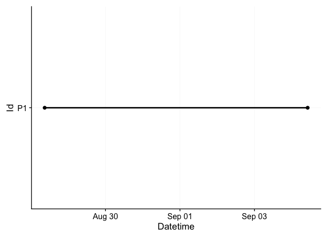
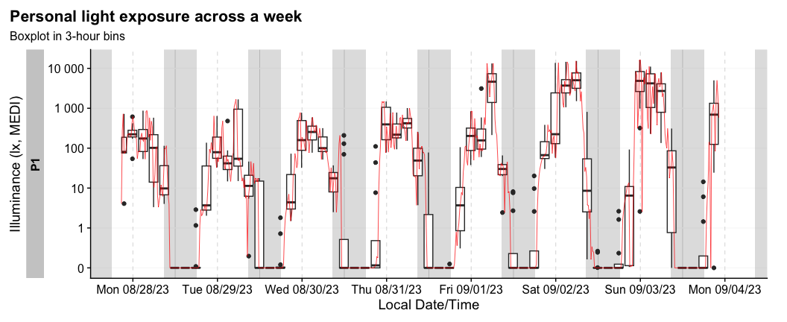

<!-- README.md is generated from README.Rmd. Please edit that file -->

# LightLogR 

<!-- badges: start -->

[](https://github.com/tscnlab/LightLogR/actions/workflows/R-CMD-check.yaml)

<!-- badges: end -->

Personalized luminous exposure data is progressively gaining importance
in various sectors, including research, occupational affairs, and
fitness tracking. Data are collected through a proliferating selection
of wearable loggers and dosimeters, varying in size, shape,
functionality, and output format. Despite or maybe because of numerous
use cases, the field lacks a unified framework for collecting,
validating, and analyzing the accumulated data. This issue increases the
time and expertise necessary to handle such data and also compromises
the FAIRness (Findability, Accessibility, Interoperability, Reusability)
of the results, especially in meta-analyses.

##### Please note that LightLogR is work in progress! If you are interested in the project and want to know more, please give us a [message](mailto:johannes.zauner@tum.de)

**LightLogR** is a package under development as part of the
[*MeLiDos*](https://www.melidos.eu) project to address these issues.
MeLiDos is a joint, [EURAMET](https://www.euramet.org)-funded project
involving sixteen partners across Europe, aimed at developing a
metrology and a standard workflow for wearable light logger data and
optical radiation dosimeters. Its primary contributions towards
fostering FAIR data include the development of a common file format,
robust metadata descriptors, and an accompanying open-source software
ecosystem. **LightLogR** aims to provide tools for:

- Generation of data and metadata files

- Conversion of popular file formats

- Validation of light logging data

- Verification of crucial metadata

- Calculation of common parameters

- Semi-automated analysis and visualization (both command-line and
  GUI-based)

- Integration of data into a unified database for cross-study analyses

**LightLogR** is developed by the [*Translational Sensory & Circadian
Neuroscience*](https://www.tscnlab.org) lab, a joint group from the
[Technical University of Munich](https://www.tum.de/en/) and the [Max
Planck Institute for Biological
Cybernetics](https://www.mpg.de/152075/biological-cybernetics).

## Installation

You can install the development version of LightLogR from
[GitHub](https://github.com/) with:

``` r
# install.packages("devtools")
devtools::install_github("tscnlab/LightLogR")
```

## Example

Here is a quick starter on how do use **LightLogR**.

``` r
library(LightLogR)
#these packages are just needed for the examples as shown.
library(flextable)
library(dplyr)
library(ggplot2)
```

### Import

You can import a light logger dataset with ease. The import functions
give quick, helpful feedback about the dataset.

``` r
filename <- system.file("extdata/sample_data_LYS.csv", package = "LightLogR")
dataset <- import.LYS(filename, tz = "Europe/Berlin")
#> Successfully read in 11422 observations from LYS-file
#> Timezone set is Europe/Berlin.
#> Start: 2023-06-21 00:00:12
#> End: 2023-06-22 23:59:48
#> Timespan: 2 days
#> Observation intervals: 
#>   interval.time     n pct    
#> 1 15 secs       10015 87.689%
#> 2 16 secs        1367 11.969%
#> 3 17 secs          23 0.201% 
#> 4 18 secs          16 0.140%

dataset %>% select(Datetime, lux, kelvin, MEDI) %>%  slice(8000:8005) %>% 
  flextable() %>% autofit()
#> Adding missing grouping variables: `Id`
```



### Visualize

Once imported, **LightLogR** allows you conveniently visualize the data.

``` r
dataset %>% gg_day()
#> Warning: Transformation introduced infinite values in continuous y-axis
```


There is a wide range of options to the `gg_day()` function to customize
the output. Have a look at the reference page (`?gg_day`) to see all
options. You can also override most of the defaults, e.g., for different
`color`, `facetting`, `theme` options.

``` r
dataset %>% 
  gg_day(col = MEDI >= 250, scales = "fixed", size = 0.5) + 
  scale_color_discrete(type = c("orange", "skyblue"))
#> Scale for colour is already present.
#> Adding another scale for colour, which will replace the existing scale.
#> Warning: Transformation introduced infinite values in continuous y-axis
```



### More than one dataset

The built-in dataset `sample.data.environment` shows a combined dataset
of light logger data and a second set of data - in this case
unobstructed outdoor light measurements. Combined datasets can be easily
visualized with `gg_day()`. The `col` parameter used on the `Source`
column of the dataset allows for a color separation.

``` r
sample.data.environment %>% 
  gg_day(
    start.date = "2023-08-18",
    y.axis = `MELANOPIC EDI`,
    col = Source,
    scales = "fixed",
    geom = "line")
#> Only Dates will be used from start.date and end.date input. If you also want to set Datetimes or Times, consider using the `filter_Datetime()` function instead.
#> Warning: Transformation introduced infinite values in continuous y-axis
```

 With
the `cut_Datetime()` function, the data can further be broken up into
arbitrary time intervals. This can be used to easily compare different
datasets. Just put the function in between the dataset and `gg_day()`.
This makes a new variable available for plotting: `Datetime.rounded`.
Just make sure, that the `geom` parameter is set to *boxplot* and the
`group` parameter uses both the info from the rounded time interval
(`Datetime.rounded`) and the different datasets (`Source`). The
`interaction` function can easily combine them. The default interval for
`cut_Datetime()` is 3 hours.

``` r
sample.data.environment %>% 
  cut_Datetime() %>% 
  gg_day(
    end.date = "2023-08-15",
    y.axis = `MELANOPIC EDI`,
    col = Source,
    scales = "fixed",
    geom = "boxplot",
    group = interaction(Source, Datetime.rounded)) + 
  theme(legend.position = "bottom")
#> Only Dates will be used from start.date and end.date input. If you also want to set Datetimes or Times, consider using the `filter_Datetime()` function instead.
#> Warning: Transformation introduced infinite values in continuous y-axis
#> Warning: Removed 3429 rows containing non-finite values (`stat_boxplot()`).
```


