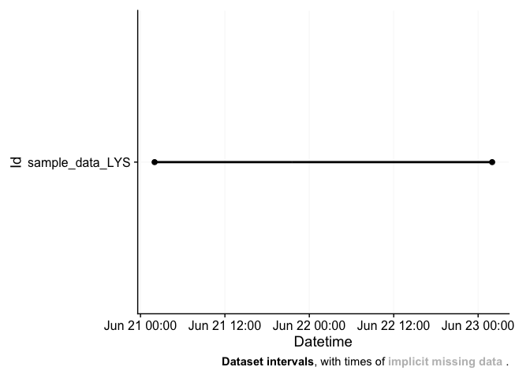
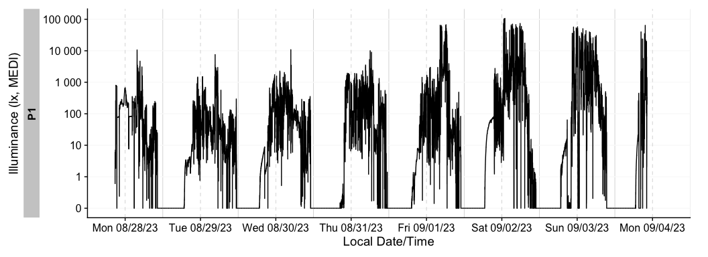
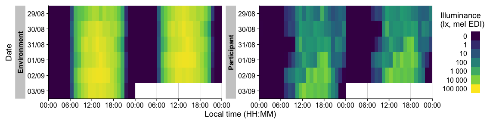

<!-- README.md is generated from README.Rmd. Please edit that file -->

# LightLogR 

<!-- badges: start -->

[](https://github.com/tscnlab/LightLogR/actions/workflows/R-CMD-check.yaml)
[](https://doi.org/10.5281/zenodo.11562600)
[](https://CRAN.R-project.org/package=LightLogR)
[](https://joss.theoj.org/papers/3a1057dccd315b7eb8683c1b969402e2)

<!-- badges: end -->

Personalized luminous exposure data is progressively gaining importance
in various sectors, including research, occupational affairs, and
fitness tracking. Data are collected through a proliferating selection
of wearable loggers and dosimeters, varying in size, shape,
functionality, and output format. Despite or maybe because of numerous
use cases, the field lacks a unified framework for collecting,
validating, and analyzing the accumulated data. This issue increases the
time and expertise necessary to handle such data and also compromises
the FAIRness (Findability, Accessibility, Interoperability, Reusability)
of the results, especially in meta-analyses.

<div style="text-align:center">

<figure>

<figcaption aria-hidden="true">Light logger data can powerfully convey
insights into personal light exposure</figcaption>
</figure>

</div>

**LightLogR** is a package under development as part of the
[*MeLiDos*](https://www.melidos.eu) project to address these issues. The
package aims to provide tools for:

- import from common measurement devices (see below for a list of
  supported devices)

- Validation and processing of light logging data

- Visualization of light exposure data, both exploratory and publication
  ready

- Calculation of common analysis parameters (see below for a list of
  metrics)

To come:

- Import, creation, and verification of crucial metadata

- Semi-automated analysis and visualization (both command-line and
  GUI-based)

- Integration of data into a unified database for cross-study analyses

##### Please note that LightLogR is work in progress! If you are interested in the project and want to know more, you can subscribe to the [LightLogR mailing list](https://www.tscnlab.org/software). If you find a bug or would like to see new or improved features, please open an issue on the [GitHub repository](https://github.com/tscnlab/LightLogR/issues).

Have a look at the **Example** section down below to get started, or
dive into the
[Articles](https://tscnlab.github.io/LightLogR/articles/index.html) to
get more in depth information about how to work with the package and
generate images such as the one above, import data, visualization, and
metric calculation.

## Supported devices

At present, these are the devices we support in LightLogR:

- Actiwatch_Spectrum

- Actiwatch_Spectrum_de

- ActLumus

- ActTrust

- Circadian_Eye

- DeLux

- GENEActiv_GGIR

- Kronowise

- LiDo

- LightWatcher

- LIMO

- LYS

- MotionWatch8

- nanoLambda

- OcuWEAR

- Speccy

- SpectraWear

- VEET

More Information on these devices can be found in the reference for
`import_Dataset()`. If you want to know how to import data from these
devices, have a look at our article on [Import &
Cleaning](https://tscnlab.github.io/LightLogR/articles/Import.html).

If you are using a device that is currently not supported, please
contact the developers. We are always looking to expand the range of
supported devices. The easiest and most trackable way to get in contact
is by opening a new issue on our [Github
repository](https://github.com/tscnlab/LightLogR/issues). Please also
provide a sample file of your data, so we can test the import function.

## Metrics

LightLogR supports a wide range of metrics across different metric
families. You can find the full documentation of metrics functions in
the [reference
section](https://tscnlab.github.io/LightLogR/reference/index.html#metrics).
There is also an overview article on how to use
[Metrics](https://tscnlab.github.io/LightLogR/articles/Metrics.html).

| Metric Family | Submetrics | Note | Documentation |
|----|----|----|----|
| Barroso | 7 |  | `barroso_lighting_metrics()` |
| Bright-dark period | 4x2 | bright / dark | `bright_dark_period()` |
| Centroid of light exposure | 1 |  | `centroidLE()` |
| Disparity index | 1 |  | `disparity_index()` |
| Duration above threshold | 3 | above, below, within | `duration_above_threshold()` |
| Exponential moving average (EMA) | 1 |  | `exponential_moving_average()` |
| Frequency crossing threshold | 1 |  | `frequency_crossing_threshold()` |
| Intradaily Variance (IV) | 1 |  | `intradaily_variability()` |
| Interdaily Stability (IS) | 1 |  | `interdaily_stability()` |
| Midpoint CE (Cumulative Exposure) | 1 |  | `midpointCE()` |
| nvRC (Non-visual circadian response) | 4 |  | `nvRC()`, `nvRC_circadianDisturbance()`, `nvRC_circadianBias()`, `nvRC_relativeAmplitudeError()` |
| nvRD (Non-visual direct response) | 2 |  | `nvRD()`, `nvRD_cumulative_response()` |
| Period above threshold | 3 | above, below, within | `period_above_threshold()` |
| Pulses above threshold | 7x3 | above, below, within | `pulses_above_threshold()` |
| Threshold for duration | 2 | above, below | `threshold_for_duration()` |
| Timing above threshold | 3 | above, below, within | `timing_above_threshold()` |
| **Total:** |  |  |  |
| **17 families** | **61 metrics** |  |  |

If you would like to use a metric you don’t find represented in
LightLogR, please contact the developers. The easiest and most trackable
way to get in contact is by opening a new issue on our [Github
repository](https://github.com/tscnlab/LightLogR/issues).

## About the creation and funding of LightLogR

**LightLogR** is developed by the [*Translational Sensory & Circadian
Neuroscience*](https://www.tscnlab.org) lab, a joint group from the
[Technical University of Munich](https://www.tum.de/en/) and the [Max
Planck Institute for Biological Neuroscience Unit
(MPS/TUM/TUMCREATE)\*](https://www.tscnlab.org), a joint group based at
the [Technical University of Munich](https://www.tum.de/en/),
[TUMCREATE](https://www.tum-create.edu.sg/), the [Max Planck Institute
for Biological
Cybernetics](https://www.mpg.de/152075/biological-cybernetics).

[*MeLiDos*](https://www.melidos.eu) is a joint,
[EURAMET](https://www.euramet.org)-funded project involving sixteen
partners across Europe, aimed at developing a metrology and a standard
workflow for wearable light logger data and optical radiation
dosimeters. Its primary contributions towards fostering FAIR data
include the development of a common file format, robust metadata
descriptors, and an accompanying open-source software ecosystem.

[](https://www.euramet.org)


The project (22NRM05 MeLiDos) has received funding from the European
Partnership on Metrology, co-financed from the European Union’s Horizon
Europe Research and Innovation Programme and by the Participating
States. Views and opinions expressed are however those of the author(s)
only and do not necessarily reflect those of the European Union or
EURAMET. Neither the European Union nor the granting authority can be
held responsible for them.

## Installation

You can install LightLogR from [CRAN](https://CRAN.R-project.org) with:

``` r
install.packages("LightLogR")
```

You can install the latest development version of LightLogR from
[GitHub](https://github.com/) with:

``` r
# install.packages("devtools")
devtools::install_github("tscnlab/LightLogR")
```

## Example

Here is a quick starter on how do use **LightLogR**.

``` r
library(LightLogR)
#these packages are needed for the examples as shown below.
library(flextable)
library(dplyr)
library(ggplot2)
```

### Import

You can import a light logger dataset with ease. The import functions
give quick, helpful feedback about the dataset.

``` r
filename <- system.file("extdata/sample_data_LYS.csv", package = "LightLogR")
dataset <- import$LYS(filename, tz = "Europe/Berlin")
#> 
#> Successfully read in 11'422 observations across 1 Ids from 1 LYS-file(s).
#> Timezone set is Europe/Berlin.
#> 
#> First Observation: 2023-06-21 02:00:12
#> Last Observation: 2023-06-23 01:59:48
#> Timespan: 2 days
#> 
#> Observation intervals: 
#>   Id              interval.time     n pct    
#> 1 sample_data_LYS 15s           10015 87.689%
#> 2 sample_data_LYS 16s            1367 11.969%
#> 3 sample_data_LYS 17s              23 0.201% 
#> 4 sample_data_LYS 18s              16 0.140%
```



``` r

dataset %>% ungroup() %>% select(Datetime, lux, kelvin, MEDI) %>%  
  slice(8000:8005) %>% flextable() %>% autofit()
```


<div style="color: white">

.

</div>

For more complex data, there is the useful `gg_overview()` function to
get an immediate grasp of your data. It was automatically called during
import (set `auto.plot = FALSE` to suppress this), but really shines for
datasets with multiple participants. It also indicates where data is
missing, based on the measurement epochs found in the data.

<div style="text-align:center">

<figure>

<figcaption aria-hidden="true">Example for <code>gg_overview()</code>
from a large data collection effort over many months</figcaption>
</figure>

</div>

*note:* the above example image requires a large dataset not included in
the package. It is available, however, in the article on [Import &
cleaning](https://tscnlab.github.io/LightLogR/articles/Import.html).

    #example code, on how to use gg_overview():
    dataset %>% gg_overview()

### Visualize

Once imported, **LightLogR** allows you conveniently visualize the data.

``` r
dataset %>% gg_day()
```



There is a wide range of options to the `gg_day()` function to customize
the output. Have a look at the reference page (`?gg_day`) to see all
options. You can also override most of the defaults, e.g., for different
`color`, `facetting`, `theme` options.

``` r
dataset %>% 
  gg_day(aes_col = MEDI < 250, size = 0.75) + 
  theme(legend.position = "bottom")
```


### More than one dataset

The built-in dataset `sample.data.environment` shows a combined dataset
of light logger data and a second set of data - in this case
unobstructed outdoor light measurements. Combined datasets can be easily
visualized with `gg_day()`. The `col` parameter used on the `Id` column
of the dataset allows for a color separation.

``` r
sample.data.environment %>% 
  gg_day(
    start.date = "2023-09-01",
    aes_col = Id,
    scales = "fixed",
    geom = "line") + theme(legend.position = "bottom")
#> Only Dates will be used from start.date and end.date input. If you also want to set Datetimes or Times, consider using the `filter_Datetime()` function instead.
```


If you want to get a feeling for the data over the course of multiple
days, the `gg_days()` function comes in handy. It works similar to
`gg_day()`. It is also opinionated in terms of the scaling and
linebreaks to only show whole days, all of which can be adjusted.

``` r
sample.data.environment %>% 
  gg_days(geom = "ribbon", alpha = 0.25, col = "black")
```


With the `cut_Datetime()` function, the data can further be broken up
into arbitrary time intervals. This can be used to easily compare
different datasets. Just put the function in between the dataset and
`gg_day()`. This makes a new variable available for plotting:
`Datetime.rounded`. Just make sure, that the `geom` parameter is set to
*boxplot* and the `group` parameter uses both the info from the rounded
time interval (`Datetime.rounded`) and the different datasets
(`Source`). The `base::interaction()` function can easily combine them.
The default interval for `cut_Datetime()` is 3 hours.

``` r
sample.data.environment %>% 
  cut_Datetime() %>% 
  gg_day(
    end.date = "2023-08-29",
    aes_col = Id,
    scales = "fixed",
    geom = "boxplot",
    group = interaction(Id, Datetime.rounded)) + 
  theme(legend.position = "bottom")
#> Only Dates will be used from start.date and end.date input. If you also want to set Datetimes or Times, consider using the `filter_Datetime()` function instead.
```



### Insights, Validation, and Processing

**LightLogR** provides a range of functions to get insight into your
light logger data. Most importantly, you can search for and eliminate
implicit gaps.

``` r
dataset %>% gap_finder()
#> Found 10758 gaps. 761 Datetimes fall into the regular sequence.
```

The huge amount of gaps comes from the fact that the measurement
intervals are somewhat irregular between 15 and 18 seconds in this case.
This leaves very little intervals to start regularly. We got this
information after import, but can still get to this info through
`count_difftime()`.

``` r
dataset %>% ungroup() %>% count_difftime()
#> # A tibble: 4 × 2
#>   difftime       n
#>   <Duration> <int>
#> 1 15s        10015
#> 2 16s         1367
#> 3 17s           23
#> 4 18s           16
```

We can eliminate this through the `gap_handler()` function. This
function will automatically fill in the gaps with NA values. As the most
dominant interval in the dataset is now not 15 seconds anymore (because
intermediate datapoints have been added), we need to specify the epoch
for `gap_finder()`.

``` r
dataset %>% gap_handler() %>% gap_finder(epoch = "15 sec")
#> No gaps found
```

If we want to force the data to be regular, we can use the
`aggregate_Datetime()` function. This will aggregate the data to the
specified epoch. There are sensible defaults on how to aggregate
numeric, categorical, and logical data. You can also specify your own
aggregation functions.

``` r
dataset %>% aggregate_Datetime(unit = "15 sec") %>% gap_finder()
#> Found 97 gaps. 11422 Datetimes fall into the regular sequence.
```

Now, very few gaps are left (every time the the lagged epochs lead to a
completely skipped regular epoch). The function can also be used to
conveniently change the interval to arbitrary values, e.g., `"5 mins"`,
or `"1 hour"`.

# I Want To Contribute

All types of contributions are encouraged and valued. See the
[CONTRIBUTING](https://tscnlab.github.io/LightLogR/CONTRIBUTING.html)
section for different ways to help and details about how this project
handles them. This project and everyone participating in it is governed
by the [LightLogR Code of
Conduct](https://tscnlab.github.io/LightLogR/CODE_OF_CONDUCT.html).
