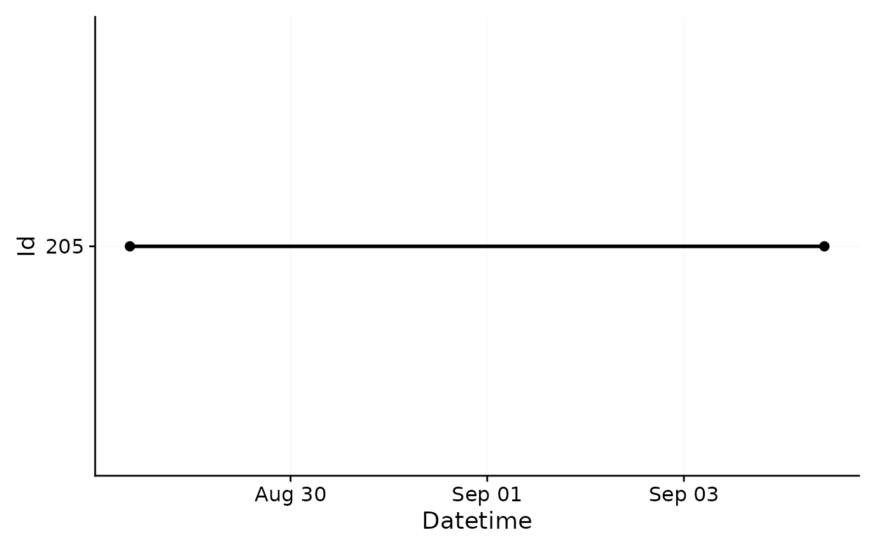
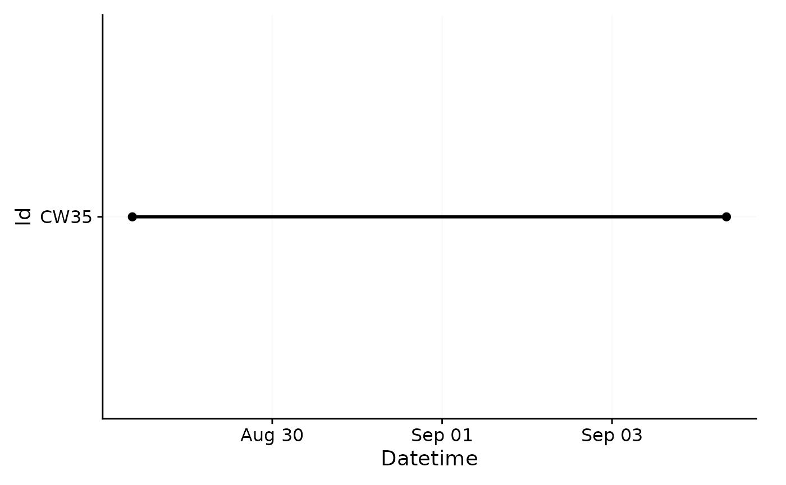
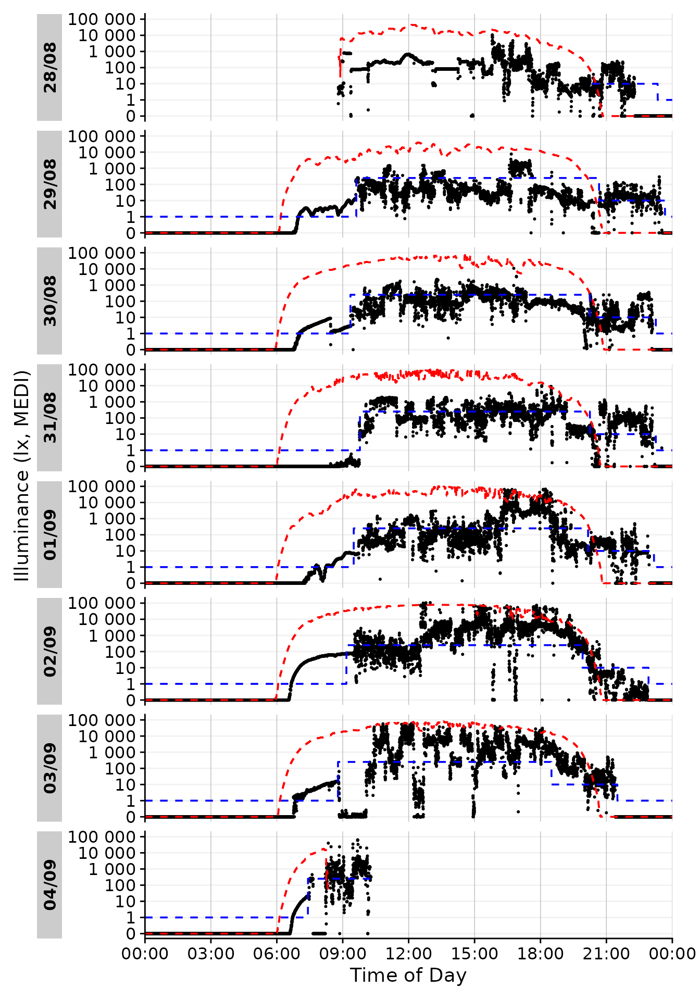
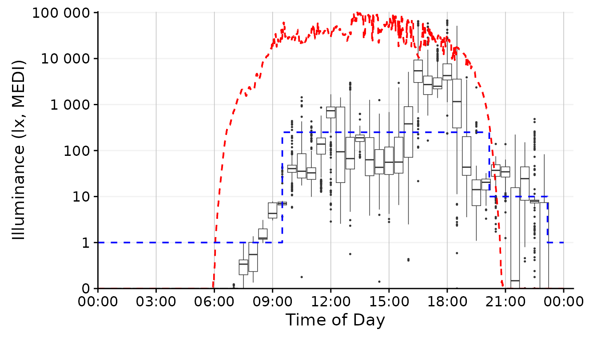
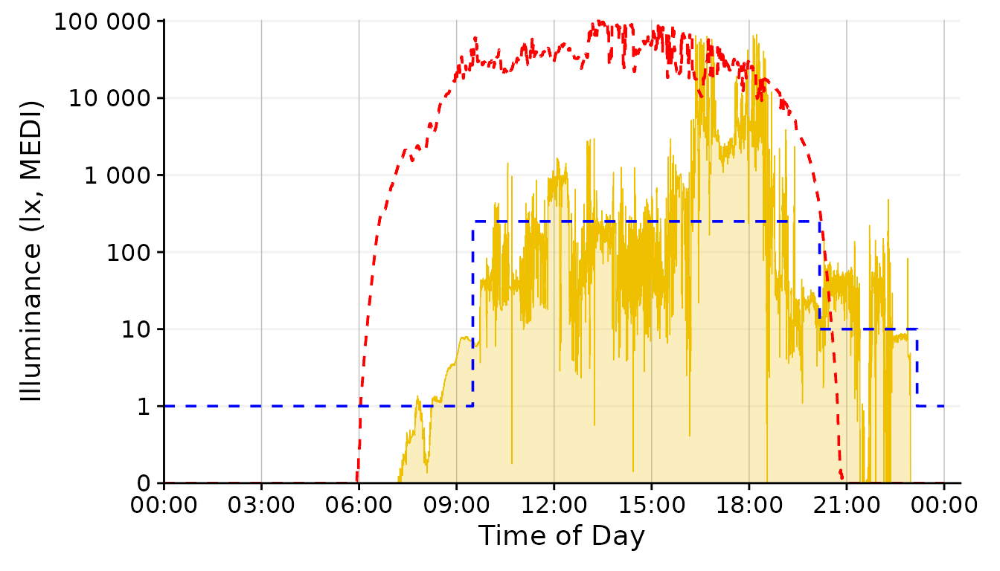
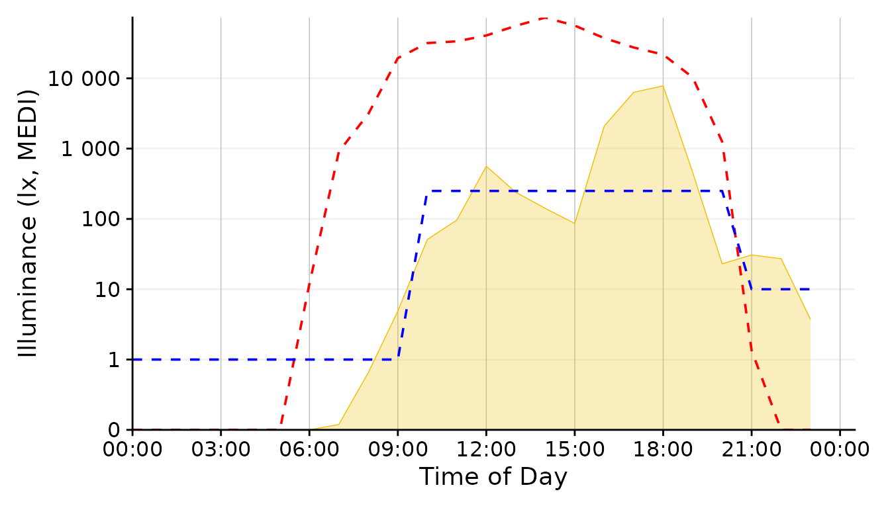
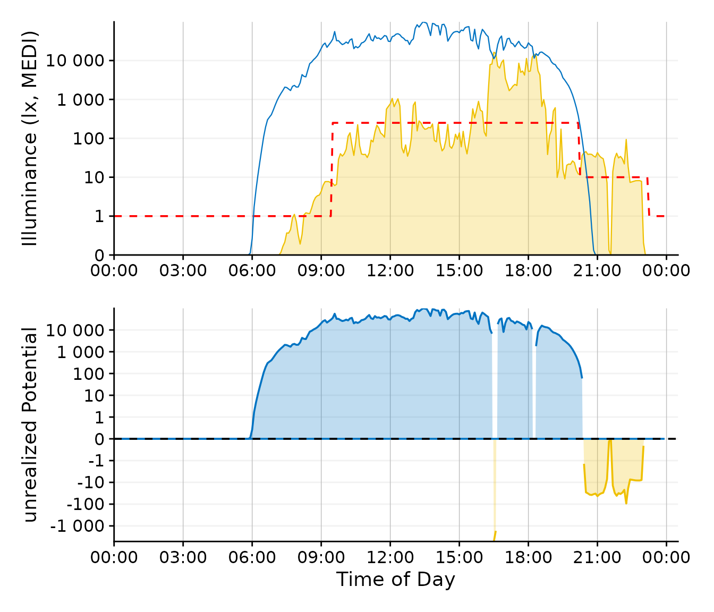
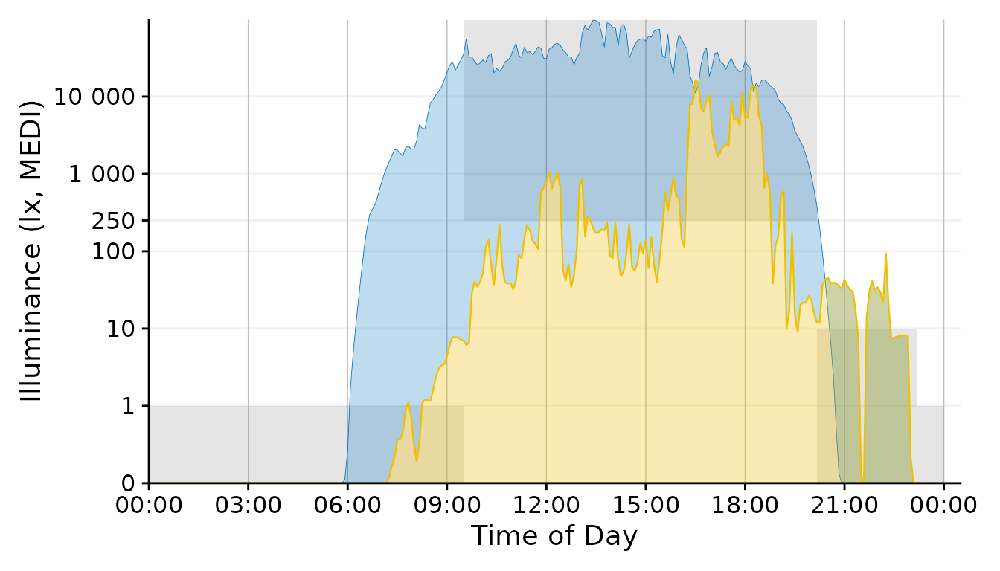

# The whole game


You are tasked with visualizing a day of light logger data, worn by a
participant over the course of one week. You´re supposed to show the
data in comparison with what is available outside in unobstructed
daylight. And, to make matters slightly more complex, you also want to
show how the participant´s luminous exposure compares to the current
recommendations of [healthy daytime, evening, and nighttime light
exporsure](https://journals.plos.org/plosbiology/article?id=10.1371/journal.pbio.3001571).
While the figure is nothing special in itself, working with light logger
data to get the data ready for plotting is fraught with many hurdles,
beginning with various raw data structures depending on the device
manufacturer, varying temporal resolutions, implicit missing data,
irregular data, working with Datetimes, and so forth. **LightLogR** aims
to make this process easier by providing a holistic workflow for the
data from import over validation up to and including figure generation
and metric calculation.

This article guides you through the process of

- importing Light Logger data from a participant as well as the
  environment, and sleep data about the same participant

- creating exploratory visualizations to select a good day for the
  figure

- connecting the datasets to a coherent whole and setting recommended
  light levels based on the sleep data

- creating an appealing visualization with various styles to finish the
  task

Let´s head right in by loading the package! We will also work a bit with
data manipulation, display the odd table, and enroll the help of several
plotting aids from the `ggplot2` package, so we will also need the
`tidyverse` and the `gt` package. Later on, we want to combine plots,
this is where `patchwork` will come in. The `here` package is used to
make sure that the paths to the data are correct.

``` r
library(LightLogR)
library(tidyverse)
library(gt)
library(patchwork)
```

> Please note that this article uses the base pipe operator `|>`. You
> need an R version equal to or greater than 4.1.0 to use it. If you are
> using an older version, you can replace it with the `magrittr` pipe
> operator `%>%`.

## Importing Data

The data we need are part of the `LightLogR` package. They are
unprocessed (after device export) data from light loggers (and a diary
app for capturing sleep times). All data is anonymous, and we can access
it through the following paths:

``` r
path <- system.file("extdata", 
              package = "LightLogR")

file.LL <- "205_actlumus_Log_1020_20230904101707532.txt.zip"
file.env <- "cyepiamb_CW35_Log_1431_20230904081953614.txt.zip"
file.sleep <- "205_sleepdiary_all_20230904.csv"
```

### Participant Light Logger Data

`LightLogR` provides convenient import functions for a range of
supported devices (use the command
[`supported_devices()`](https://tscnlab.github.io/LightLogR/reference/supported_devices.md)
if you want to see what devices are supported at present). Because
`LightLogR` knows how the files from these devices are structured, it
needs very little input. In fact, the mere filepath would suffice. It
is, however, a good idea to also provide the timezone argument `tz` to
specify that these measurements were made in the `Europe/Berlin`
timezone. This makes your data future-proof for when it is used in
comparison with other geolocations.

Every light logger dataset needs an `Id` to connect or separate
observations from the same or different participant/device/study/etc. If
we don´t provide an `Id` to the import function (or the dataset doesn´t
contain an `Id` column), the filename will be used as an `Id`. As this
would be rather cumbersome in our case, we will use a `regex` to extract
the first three digits from the filename, which serve this purpose here.

``` r
tz <- "Europe/Berlin"
dataset.LL <- import$ActLumus(file.LL, path, auto.id = "^(\\d{3})", tz = tz)
#> Multiple files in zip: reading '205_actlumus_Log_1020_20230904101707532.txt'
#> 
#> Successfully read in 61'016 observations across 1 Ids from 1 ActLumus-file(s).
#> Timezone set is Europe/Berlin.
#> The system timezone is UTC. Please correct if necessary!
#> 
#> First Observation: 2023-08-28 08:47:54
#> Last Observation: 2023-09-04 10:17:04
#> Timespan: 7.1 days
#> 
#> Observation intervals: 
#>   Id    interval.time     n pct  
#> 1 205   10s           61015 100%
```



As you can see, the import is accompanied by a (hopefully) helpful
message about the imported data. It contains the number ob measurements,
the timezone, start- and enddate, the timespan, and all observation
intervals. In this case, the measurements all follow a *10 second*
epoch. We also get a plotted overview of the data. In our case, this is
not particularly helpful, but quickly helps to assess how different
datasets compare to one another on the timeline. We could deactivate
this plot by setting `auto.plot = FALSE` during import, or create it
separately with the
[`gg_overview()`](https://tscnlab.github.io/LightLogR/reference/gg_overview.md)
function.

Because we have no missing values that we would have to deal with first,
this dataset is already good to go. If you, e.g., want to know the range
of melanopic EDI (a measure of stimulus strength for the nonvisual
system) for every day in the dataset, you can do that:

``` r
dataset.LL |> 
  group_by(Date = as_date(Datetime)) |> 
  summarize(
    range.MEDI = range(MEDI) |> str_flatten(" - ")
    ) |> 
  gt()
```

| Date       | range.MEDI    |
|------------|---------------|
| 2023-08-28 | 0 - 10647.22  |
| 2023-08-29 | 0 - 7591.5    |
| 2023-08-30 | 0 - 10863.57  |
| 2023-08-31 | 0 - 10057.08  |
| 2023-09-01 | 0 - 67272.17  |
| 2023-09-02 | 0 - 106835.71 |
| 2023-09-03 | 0 - 57757.9   |
| 2023-09-04 | 0 - 64323.52  |

Same goes for visualization - it is always helpful to get a good look at
data immediately after import. The
[`gg_day()`](https://tscnlab.github.io/LightLogR/reference/gg_day.md)
function creates a simple `ggplot` of the data, stacked vertically by
Days. The function needs very little input beyond the dataset (in fact,
it would even work without the `size` input, which just makes the
default point size smaller, and the `interactive` command sends the
output to `plotly` to facilitate data exploration).
[`gg_day()`](https://tscnlab.github.io/LightLogR/reference/gg_day.md)
features a lot of flexibility, and can be adapted and extended to fit
various needs, as we will see shortly.

``` r
dataset.LL |> gg_day(size = 0.25, interactive = TRUE)
```

We can already see some patterns and features in the luminous exposure
across the days. In general, the participant seems to have woken (or at
least started wearing the light logger) after 9:00 and went to bed (or,
again, stopped wearing the device) at around 23:00.

### Environmental Light Data

On to our next dataset. This one contains measurement data from the same
type of device, but recorded on a rooftop position of unobstructed
daylight in roughly the same location as the participant data. As the
device type is the same, import is the same as well. But since the
filename does not contain the participant´s `ID` this time, we will give
it a manual id: `"CW35"`.

``` r
dataset.env <- import$ActLumus(file.env, path, manual.id = "CW35", tz = tz)
#> Multiple files in zip: reading 'cyepiamb_CW35_Log_1431_20230904081953614.txt'
#> 
#> Successfully read in 20'143 observations across 1 Ids from 1 ActLumus-file(s).
#> Timezone set is Europe/Berlin.
#> The system timezone is UTC. Please correct if necessary!
#> 
#> First Observation: 2023-08-28 08:28:39
#> Last Observation: 2023-09-04 08:19:38
#> Timespan: 7 days
#> 
#> Observation intervals: 
#>   Id    interval.time     n pct  
#> 1 CW35  29s               1 0%   
#> 2 CW35  30s           20141 100%
```



Here you can see that we follow roughly the same time span, but the
measurement epoch is *30 seconds*, with one odd interval which is one
second shorter.

### Participant Sleep Data

Our last dataset is a sleep diary that contains, among other things, a
column for `Id` and a column for *sleep* and for *wake* (called
*offset*). Because sleep diaries and other event datasets can vary
widely in their structure, we must manually set a few arguments.
Importantly, we need to specify how the Datetimes are structured. In
this case, we have values like *28-08-2023 23:20*, which give a
structure of `dmyHM`.

What we need after import is a coherent table that contains a column
with a `Datetime` besides a column with the `State` that starts at that
point in time.
[`import_Statechanges()`](https://tscnlab.github.io/LightLogR/reference/import_Statechanges.md)
facilitates this, because we can provide a `vector` of column names that
form a continuous indicator of a given state - in this case `Sleep`.

``` r
dataset.sleep <- 
  import_Statechanges(file.sleep, path, 
                      Datetime.format = "dmyHM",
                      State.colnames = c("sleep", "offset"),
                      State.encoding = c("sleep", "wake"),
                      Id.colname = record_id,
                      sep = ";",
                      dec = ",",
                      tz = tz)
#> 
#> Successfully read in 14 observations across 1 Ids from 1 Statechanges-file(s).
#> Timezone set is Europe/Berlin.
#> The system timezone is UTC. Please correct if necessary!
#> 
#> First Observation: 2023-08-28 23:20:00
#> Last Observation: 2023-09-04 07:25:00
#> Timespan: 6.3 days
#> 
#> Observation intervals: 
#>    Id    interval.time             n pct  
#>  1 205   34860s (~9.68 hours)      1 8%   
#>  2 205   35520s (~9.87 hours)      1 8%   
#>  3 205   35700s (~9.92 hours)      1 8%   
#>  4 205   36000s (~10 hours)        1 8%   
#>  5 205   36900s (~10.25 hours)     1 8%   
#>  6 205   37020s (~10.28 hours)     1 8%   
#>  7 205   37920s (~10.53 hours)     1 8%   
#>  8 205   45780s (~12.72 hours)     1 8%   
#>  9 205   48480s (~13.47 hours)     1 8%   
#> 10 205   49200s (~13.67 hours)     1 8%   
#> # ℹ 3 more rows

dataset.sleep |> 
  head() |> 
  gt()
```

| State | Datetime            |
|-------|---------------------|
| 205   |                     |
| sleep | 2023-08-28 23:20:00 |
| wake  | 2023-08-29 09:37:00 |
| sleep | 2023-08-29 23:40:00 |
| wake  | 2023-08-30 09:21:00 |
| sleep | 2023-08-30 23:15:00 |
| wake  | 2023-08-31 09:47:00 |

Now that we have imported all of our data, we need to combine it
sensibly, which we will get to in the next section.

## Connecting Data

Connecting the data, in this case, means giving context to our
participant’s luminous exposure data. There are a number of hurdles
attached to connecting time series data, because data from different
sets rarely align perfectly. Often their measurements are off by at
least some seconds, or even use different measurement epochs.

Also, we have the sleep data, which only has time stamps whenever there
is a change in status. Also - and this is crucial - it might have
missing entries! `LightLogR` provides a few helpful functions however,
to deal with these topics without resorting to rounding or averaging
data to a common multiple.

### Solar Potential

Let us start with the environmental measurements of unobstructed
daylight. These can be seen as a natural potential of luminous exposure
and thus serve as a reference for our participant´s luminous exposure.

With the
[`data2reference()`](https://tscnlab.github.io/LightLogR/reference/data2reference.md)
function, we will create this reference. This function is
extraordinarily powerful in that it can create a reference tailored to
the light logger data from any source that has the wanted `Reference`
column (in this case the MEDI column, which is the default), a
`Datetime` column, and the same grouping structure (`Id`) as the light
logger data set.

[`data2reference()`](https://tscnlab.github.io/LightLogR/reference/data2reference.md)
can even create a reference from a subset of the data itself. For
example this makes it possible to have the first (or second, etc.) day
of the data as reference for all other days. It can further apply one
participant as the reference for all other participants, even when their
measurements are on different times. In our case it is only necessary to
specify the argument `across.id = TRUE`, as we want the reference
`Id`(“CW35”) to be applied across the `Id` from the participant (“205”).

``` r
dataset.LL <- 
  dataset.LL |> 
    data2reference(Reference.data = dataset.env, across.id = TRUE)

dataset.LL <- 
  dataset.LL |> 
    select(Id, Datetime, MEDI, Reference)

dataset.LL |> 
  head() |> 
  gt()
```

| Datetime            | MEDI | Reference |
|---------------------|------|-----------|
| 205                 |      |           |
| 2023-08-28 08:47:54 | 0.77 | 403.32    |
| 2023-08-28 08:48:04 | 2.33 | 403.32    |
| 2023-08-28 08:48:14 | 5.63 | 403.32    |
| 2023-08-28 08:48:24 | 6.03 | 454.96    |
| 2023-08-28 08:48:34 | 5.86 | 454.96    |
| 2023-08-28 08:48:44 | 6.04 | 454.96    |

For the sake of this example, we have also removed unnecessary data
columns, which makes the further code examples simpler. We can already
see in the table above that the reference at the start of the
measurements is quite a bit higher than the luminous exposure at the
participant´s light logger. We also see that the same reference value is
applied to three participant values. This mirrors the fact that for
every three measurements taken with the participant device, one
measurement epoch for the environmental sensor passes.

To visualize this newly reached reference data, we can easily extend
[`gg_day()`](https://tscnlab.github.io/LightLogR/reference/gg_day.md)
with a dashed red reference line. Keep in mind that this visualization
is still exploratory, so we are not investing heavily in styling.

``` r
dataset.LL |> 
  gg_day(size = 0.25) + 
  geom_line(aes(y=Reference), lty = 2, col = "red")
#> Warning: Removed 707 rows containing missing values or values outside the scale range
#> (`geom_line()`).
```


Here, a warning about missing values was added. This is simply due to
the fact that not every data point on the x-axis has a corresponding
y-axis-value. The two datasets largely align, but at the fringes,
especially the last day, there is some non-overlap. When we perform
calculations based on the light logger data and the reference, we have
to keep in mind that only timesteps where *both* are present will give
non `NA` results.

While basic, the graph already shows valuable information about the
potential light stimulus compared to actual exposure. In the morning
hours, this participant never reached a significant light dose, while
luminous exposure in the evening regularly was on par with daytime
levels, especially on the 29th. Let us see how these measurements
compare to recommendations for luminous exposure.

### Recommended Light levels

Brown et al.(2022)[¹](#fn1) provide guidance for healthy, daytime
dependent light stimuli, measured in melanopic EDI:

> Throughout the daytime, the recommended minimum melanopic EDI is 250
> lux at the eye measured in the vertical plane at approximately 1.2 m
> height (i.e., vertical illuminance at eye level when seated). If
> available, daylight should be used in the first instance to meet these
> levels. If additional electric lighting is required, the polychromatic
> white light should ideally have a spectrum that, like natural
> daylight, is enriched in shorter wavelengths close to the peak of the
> melanopic action spectrum.

> During the evening, starting at least 3 hours before bedtime, the
> recommended maximum melanopic EDI is 10 lux measured at the eye in the
> vertical plane approximately 1.2 m height. To help achieve this, where
> possible, the white light should have a spectrum depleted in short
> wavelengths close to the peak of the melanopic action spectrum.

> The sleep environment should be as dark as possible. The recommended
> maximum ambient melanopic EDI is 1 lux measured at the eye. In case
> certain activities during the nighttime require vision, the
> recommended maximum melanopic EDI is 10 lux measured at the eye in the
> vertical plane at approximately 1.2 m height.

We can see that bedtime is an important factor when determining the
timepoints these three stages go into effect. Luckily we just so happen
to have the sleep/wake data from the sleep diary at hand. In a first
step, we will convert the timepoints where a state changes into
intervals during which the participant is awake or asleep. The
[`sc2interval()`](https://tscnlab.github.io/LightLogR/reference/sc2interval.md)
function provides this readily.

In our case the first entry is sleep, so we can safely assume, that on
that day prior the participant was awake. We could take this into
account through the `starting.state = "wake"` argument setting, but then
it would be implied that the participant was awake from midnight on. As
the first day of data is only partial anyways, we will disregard this.
There are other arguments to
[`sc2interval()`](https://tscnlab.github.io/LightLogR/reference/sc2interval.md)
to further refine the interval creation. Probably the most important is
`length.restriction`, that sets the maximum length of an interval, the
default being 24 hours. This avoids implausibly long intervals with one
state that is highly likely caused by implicit missing data or
misentries.

``` r
dataset.sleep <- 
  dataset.sleep |> 
  sc2interval()

dataset.sleep |> 
  head() |> 
  gt()
```

| State | Interval                                           |
|-------|----------------------------------------------------|
| 205   |                                                    |
| NA    | 2023-08-28 00:00:00 CEST--2023-08-28 23:20:00 CEST |
| sleep | 2023-08-28 23:20:00 CEST--2023-08-29 09:37:00 CEST |
| wake  | 2023-08-29 09:37:00 CEST--2023-08-29 23:40:00 CEST |
| sleep | 2023-08-29 23:40:00 CEST--2023-08-30 09:21:00 CEST |
| wake  | 2023-08-30 09:21:00 CEST--2023-08-30 23:15:00 CEST |
| sleep | 2023-08-30 23:15:00 CEST--2023-08-31 09:47:00 CEST |

Now we can transform these sleep/wake intervals to intervals for the
Brown recommendations. The
[`sleep_int2Brown()`](https://tscnlab.github.io/LightLogR/reference/sleep_int2Brown.md)
function facilitates this.

``` r
Brown.intervals <- 
  dataset.sleep |> 
  sleep_int2Brown()
#> Adding missing grouping variables: `Id`

Brown.intervals |> 
  head() |> 
  gt()
```

| State.Brown | Interval                                           |
|-------------|----------------------------------------------------|
| 205         |                                                    |
| NA          | 2023-08-28 00:00:00 CEST--2023-08-28 20:20:00 CEST |
| evening     | 2023-08-28 20:20:00 CEST--2023-08-28 23:20:00 CEST |
| night       | 2023-08-28 23:20:00 CEST--2023-08-29 09:37:00 CEST |
| day         | 2023-08-29 09:37:00 CEST--2023-08-29 20:40:00 CEST |
| evening     | 2023-08-29 20:40:00 CEST--2023-08-29 23:40:00 CEST |
| night       | 2023-08-29 23:40:00 CEST--2023-08-30 09:21:00 CEST |

We can see that the function fit a 3 hour interval in-between every
sleep and wake phase, and also recoded the states. This data can now be
applied to our light logger dataset. This is done through the
[`interval2state()`](https://tscnlab.github.io/LightLogR/reference/interval2state.md)
function[²](#fn2). We already used this function unknowingly, because it
(alongside
[`sc2interval()`](https://tscnlab.github.io/LightLogR/reference/sc2interval.md))
is under the hood of
[`data2reference()`](https://tscnlab.github.io/LightLogR/reference/data2reference.md),
making sure that data in the reference set is spread out accordingly.

``` r
dataset.LL <- 
  dataset.LL |> 
    interval2state(
      State.interval.dataset = Brown.intervals, State.colname = State.Brown
      )

dataset.LL |> 
  tail() |> 
  gt()
```

| Datetime            | MEDI   | Reference | State.Brown |
|---------------------|--------|-----------|-------------|
| 205                 |        |           |             |
| 2023-09-04 10:16:14 | 321.10 | NA        | day         |
| 2023-09-04 10:16:24 | 310.92 | NA        | day         |
| 2023-09-04 10:16:34 | 309.07 | NA        | day         |
| 2023-09-04 10:16:44 | 319.95 | NA        | day         |
| 2023-09-04 10:16:54 | 326.11 | NA        | day         |
| 2023-09-04 10:17:04 | 324.52 | NA        | day         |

Now we have a column in our light logger dataset that declares all the
three state for the Brown et al. recommendation. With another function,
[`Brown2reference()`](https://tscnlab.github.io/LightLogR/reference/Brown2reference.md),
we can in one swoop add the threshhold accompanied to these states and
check whether our participant is within the recommendations or not. The
only thing the function needs is a name where to put the recommended
values - by default these would go to `Reference`, which is already used
for the Solar exposition, which is why we put it in `Reference.Brown`.

``` r
dataset.LL <- 
  dataset.LL |> 
    Brown2reference(Brown.rec.colname = Reference.Brown)

dataset.LL |> 
  select(!Reference.Brown.label, !Reference.Brown.difference) |> 
  tail() |> 
  gt()
```

| Datetime            | MEDI   | Reference | State.Brown | Reference.Brown | Reference.Brown.check | Reference.Brown.difference | Reference.Brown.label |
|---------------------|--------|-----------|-------------|-----------------|-----------------------|----------------------------|-----------------------|
| 205                 |        |           |             |                 |                       |                            |                       |
| 2023-09-04 10:16:14 | 321.10 | NA        | day         | 250             | TRUE                  | 71.10                      | Brown et al. (2022)   |
| 2023-09-04 10:16:24 | 310.92 | NA        | day         | 250             | TRUE                  | 60.92                      | Brown et al. (2022)   |
| 2023-09-04 10:16:34 | 309.07 | NA        | day         | 250             | TRUE                  | 59.07                      | Brown et al. (2022)   |
| 2023-09-04 10:16:44 | 319.95 | NA        | day         | 250             | TRUE                  | 69.95                      | Brown et al. (2022)   |
| 2023-09-04 10:16:54 | 326.11 | NA        | day         | 250             | TRUE                  | 76.11                      | Brown et al. (2022)   |
| 2023-09-04 10:17:04 | 324.52 | NA        | day         | 250             | TRUE                  | 74.52                      | Brown et al. (2022)   |

[`Brown2reference()`](https://tscnlab.github.io/LightLogR/reference/Brown2reference.md)
added four columns, two of which are shown in the table above. A third
column contains a text label about the type of reference, sth. we could
also have added for the solar exposition and the fourth column contains
the difference between actual mel EDI and the recommendations. Now let´s
have a quick look at the result in the plot overview

``` r
dataset.LL |> #dataset
  gg_day(size = 0.25) + #base plot
  geom_line(aes(y=Reference), lty = 2, col = "red") + #solar reference
  geom_line(aes(y=Reference.Brown), lty = 2, col = "blue") #Brown reference
#> Warning: Removed 707 rows containing missing values or values outside the scale range
#> (`geom_line()`).
#> Warning: Removed 4153 rows containing missing values or values outside the scale range
#> (`geom_line()`).
```



Looking good so far! In the next section, let us focus on picking out
one day and get more into styling. Based on the available data I think
**01/09** looks promising, as there is some variation during the day
with some timeframes outside in the afternoon and a varied but typical
luminous exposure in the evening.

We can use the
[`filter_Date()`](https://tscnlab.github.io/LightLogR/reference/filter_Datetime.md)
function to easily cut this specific chunk out from the data. We also
deactivate the facetting function from
[`gg_day()`](https://tscnlab.github.io/LightLogR/reference/gg_day.md),
as we only have one day.

``` r
dataset.LL.partial <- 
dataset.LL |> #dataset
  filter_Date(start = "2023-09-01", length = days(1)) #use only one day

solar.reference <- geom_line(aes(y=Reference), lty = 2, col = "red") #solar reference
brown.reference <- geom_line(aes(y=Reference.Brown), lty = 2, col = "blue") #Brown reference

dataset.LL.partial  |> 
  gg_day(size = 0.25, facetting = FALSE, y.scale = symlog_trans()) + #base plot
  solar.reference + brown.reference
```


## Styling Data

Let us finish our task by exploring some styling options for our graph.
All of these are built on the dataset we ended up with in the last
section. We had to use several functions as processing steps, but it has
to be noted that we rarely had to specify arguments in functions. This
is due to the workflow `LightLogR` provides start to finish. Most of the
techniques in this section are not specific to `LightLogR`, but rather
show that you can readily use data processed with the package to work
with standard plotting function.

Firstly, though, let us slightly tweak the y-axis.

``` r
scale.correction <- coord_cartesian(
  xlim = c(0, 24.5*60*60), #make sure the x axis covers 24 hours (+a bit for the label)
  expand = FALSE #set the axis limits exactly at ylim and xlim
  )  
```

### Participants luminous exposure

By default,
[`gg_day()`](https://tscnlab.github.io/LightLogR/reference/gg_day.md)
uses a point geom for the data display. We can, however, play around
with other geoms.

- `geom_point`
- `geom_line`
- `geom_ribbon`
- `geom_boxplot`
- `geom_bin2d`

``` r
dataset.LL.partial  |> 
  gg_day(
    size = 0.25, geom = "point", facetting = FALSE) + #base plot
  solar.reference + 
  brown.reference + 
  scale.correction
```


This is the standard behavior of
[`gg_day()`](https://tscnlab.github.io/LightLogR/reference/gg_day.md).
We would not have to specify the `geom = "point"` in this case, but
being verbose should communicate that we specify this argument.

``` r
dataset.LL.partial  |> 
  gg_day(
    size = 0.25, facetting = FALSE, geom = "line") + #base plot
  solar.reference + 
  brown.reference + 
  scale.correction
```


The line geom shows changes in luminous exposure a bit better and might
be a better choice in this case.

``` r
dataset.LL.partial  |> 
  gg_day(facetting = FALSE, geom = "ribbon", alpha = 0.25, size = 0.25,
         fill = "#EFC000", color = "#EFC000") + #base plot
  solar.reference + 
  brown.reference + 
  scale.correction
```


The `geom_area` fills an area from 0 up to the given value. For some
reason, however, this is very slow and unfortunately doesn´t work nicely
with purely logarithmic plots (where 10^0 = 1, so it would start at
1[³](#fn3)). We can, however, disable any geom in
[`gg_day()`](https://tscnlab.github.io/LightLogR/reference/gg_day.md)
with `geom = "blank"` and instead add a `geom_ribbon` that can be
force-based to zero with `ymin = 0`. Setting `geom = "ribbon"` does this
automatically behind the scenes and is very fast.

``` r
dataset.LL.partial  |> 
  cut_Datetime(unit = "30 minutes") |> #provide an interval for the boxplot
  gg_day(size = 0.25, facetting = FALSE, geom = "boxplot", group = Datetime.rounded) + #base plot
  solar.reference + 
  brown.reference + 
  scale.correction
```



To create a boxplot representation, we not only need to specify the geom
but also what time interval we want the boxplot to span. Here the
[`cut_Datetime()`](https://tscnlab.github.io/LightLogR/reference/cut_Datetime.md)
function from **LightLogR** comes to the rescue. It will round the
datetimes to the desired interval, which then can be specified as the
`group` argument of
[`gg_day()`](https://tscnlab.github.io/LightLogR/reference/gg_day.md).
While this can be a nice representation, I don´t think it fits our goal
for the overall figure in our specific case.

``` r
dataset.LL.partial  |> 
  gg_day(
    size = 0.25, facetting = FALSE, geom = "bin2d", 
    jco_color = FALSE, bins = 24, aes_fill = stat(count)) + #base plot
  solar.reference + 
  brown.reference + 
  scale.correction
```


The geom family of `hex`, `bin2d`, or `density_2d` is particularly well
suited if you have many, possibly overlaying observations. It reduces
complexity by cutting the x- and y-axis into bins and counts how many
observations fall within this bin. By choosing 24 bins, we see dominant
values for every hour of the day. The `jco_color = FALSE` argument is
necessary to disable the default discrete color scheme of
[`gg_day()`](https://tscnlab.github.io/LightLogR/reference/gg_day.md),
because a continuous scale is necessary for counts or densities.
Finally, we have to use the `aes_fill = stat(count)` argument to color
the bins according to the number of observations in the bin[⁴](#fn4).

### 

**Conclusion:** The `line` or `ribbon` geom seem like a good choice for
our task. However, The high resolution of the data (*10 seconds*) makes
the line very noisy. Sometimes this level of detail is good, but our
figure should give more of a general representation of luminous
exposure, so we should aggregate the data somewhat. We can use a similar
function as for the boxplot,
[`aggregate_Datetime()`](https://tscnlab.github.io/LightLogR/reference/aggregate_Datetime.md)
and use this to aggregate our data to the desired resolution. It has
sensible defaults to handle numeric (mean), logical and character (most
represented) data, that can be adjusted. For the sake of this example,
let´s wrap the aggregate function with some additional code to
recalculate the `Brown_recommendations`, because while the default
numeric aggregation is fine for measurement data, it does not make sense
for the `Brown_recommendations` column.

``` r
aggregate_Datetime2 <- function(...) {
  aggregate_Datetime(...) |> #aggregate the data
  select(-Reference.Brown) |> #remove the rounded 
  Brown2reference(Brown.rec.colname = Reference.Brown) #recalculate the brown times
    }
```

### Data aggregation

With the new aggregate function, let us taste some variants:

- None
- 1 Minute
- 5 Minutes
- 30 Minutes
- 1 Hour

``` r
dataset.LL.partial  |> 
  gg_day(facetting = FALSE, geom = "ribbon", alpha = 0.25, size = 0.25,
         fill = "#EFC000", color = "#EFC000") + #base plot
  solar.reference +  
  brown.reference + 
  scale.correction
```



``` r
dataset.LL.partial |> 
  aggregate_Datetime2(unit = "1 min")  |> 
  gg_day(facetting = FALSE, geom = "ribbon", alpha = 0.25, size = 0.25,
         fill = "#EFC000", color = "#EFC000") + #base plot
  solar.reference + 
  brown.reference + 
  scale.correction
```


``` r
dataset.LL.partial |> 
  aggregate_Datetime2(unit = "5 mins")  |> 
  gg_day(facetting = FALSE, geom = "ribbon", alpha = 0.25, size = 0.25,
         fill = "#EFC000", color = "#EFC000") + #base plot
  solar.reference + 
  brown.reference + 
  scale.correction
```


``` r
dataset.LL.partial |> 
  aggregate_Datetime2(unit = "30 mins") |> 
  gg_day(facetting = FALSE, geom = "ribbon", alpha = 0.25, size = 0.25,
         fill = "#EFC000", color = "#EFC000") + #base plot
  solar.reference + 
  brown.reference + 
  scale.correction
```


``` r
dataset.LL.partial |> 
  aggregate_Datetime2(unit = "1 hour")  |> 
  gg_day(facetting = FALSE, geom = "ribbon", alpha = 0.25, size = 0.25,
         fill = "#EFC000", color = "#EFC000") + #base plot
  solar.reference + 
  brown.reference + 
  scale.correction
```



### 

**Conclusion:** The *1 minute* aggregate still is pretty noisy, whereas
the *30 minutes* and *1 hour* steps are to rough. *5 Minutes* seem a
good balance.

``` r
Plot <- 
dataset.LL.partial |> 
  aggregate_Datetime2(unit = "5 mins")  |> 
  gg_day(facetting = FALSE, geom = "ribbon", alpha = 0.25, size = 0.25,
         fill = "#EFC000", color = "#EFC000") + #base plot
  brown.reference + 
  scale.correction
```

### Solar Potential

Let us focus next on the solar potential that is not harnessed by the
participant. We have several choices in how to represent this.

- `geom_line`
- `geom_ribbon`
- `second plot`

``` r
Plot + 
  geom_line(aes(y=Reference), lty = 2, col = "red") #solar reference
```


This was our base representation for the solar exposure. And it is not a
bad one at that. Let’s keep it in the run for know.

``` r
Plot + 
  geom_ribbon(aes(ymin = MEDI, ymax=Reference), alpha = 0.25, fill = "#0073C2FF") #solar reference
```


This is a ribbon that shows the missed - and at night exceeded -
potential due to daylight.

``` r
#Note: This will become a function of its own in LightLogR at some point in the future

Plot_upper <- 
dataset.LL.partial |> 
  aggregate_Datetime2(unit = "5 mins") |> 
  gg_day(facetting = FALSE, geom = "ribbon", alpha = 0.25, size = 0.4,
         fill = "#EFC000", color = "#EFC000") + #base plot
  geom_line(aes(y=Reference.Brown), lty = 2, col = "red") + #Brown reference
  geom_line(aes(y=Reference), col = "#0073C2FF", size = 0.4) + #solar reference
  labs(x = NULL) +  #remove the x-axis label
  scale.correction

Plot_lower <- 
dataset.LL.partial |> 
  aggregate_Datetime2(unit = "5 mins") |> 
  gg_day(facetting = FALSE, geom = "blank", y.axis.label = "unrealized Potential") + #base plot
  geom_area(
    aes(y = Reference - MEDI, 
        group = consecutive_id((Reference - MEDI) >= 0), 
        fill = (Reference - MEDI) >= 0, 
        col = (Reference - MEDI) >= 0), 
    alpha = 0.25, outline.type = "upper") + 
  guides(fill = "none", col = "none") + 
  geom_hline(aes(yintercept = 0), lty = 2) + 
    scale_fill_manual(values = c("#EFC000", "#0073C2")) + 
    scale_color_manual(values = c("#EFC000", "#0073C2")) + 
  scale.correction
#> Scale for fill is already present.
#> Adding another scale for fill, which will replace the existing scale.
#> Scale for colour is already present.
#> Adding another scale for colour, which will replace the existing scale.

Plot_upper / Plot_lower #set up the two plots
```



This plot requires a bit of preparation, but it focuses nicely on the
unrealized daylight potential. For reasons of clarity, the line color
for the Brown recommendation was changed from blue to red.

### 

**Conclusion:** While the `second plot` option is nice, it focuses on
one aspect - the missed or unrealized potential. The `geom_ribbon`
variant still includes this information, but is more general, which is
exactly what we want here.

``` r
Day.end <- as_datetime("2023-09-01 23:59:59", tz = tz)
Plot <- 
dataset.LL.partial |> 
  aggregate_Datetime2(unit = "5 mins") |> 
  filter_Datetime(end = Day.end) |> 
  gg_day(facetting = FALSE, geom = "blank", y.axis.breaks = c(0, 10^(0:5), 250)) + #base plot
    geom_ribbon(aes(ymin = MEDI, ymax=Reference), 
              alpha = 0.25, fill = "#0073C2FF",
              outline.type = "upper", col = "#0073C2FF", size = 0.15) + #solar reference
  geom_ribbon(aes(ymin = 0, ymax = MEDI), alpha = 0.30, fill = "#EFC000", 
              outline.type = "upper", col = "#EFC000", size = 0.4) + #ribbon geom
  scale.correction
```

### Brown Recommendations

The Brown recommendations add a layer of complexity, as they specify a
threshold that should not be reached or that should be exceeded,
depending on the time of day. We can tackle this aspect in several ways.
In any case, the y-axis should reflect the datime threshhold value of
250 lx. This is already considered through the `y.axis.breaks` argument
in the code chunk above.

- `geom_line`
- `geom_rect`
- `geom_point`

``` r
Plot + 
  geom_line(aes(y=Reference.Brown), lty = 2, size = 0.4, col = "grey15") #Brown reference
```


This is a variant of the representation used throught the document.
Since the luminous exposure and daylight levels are very distinct in
terms of color, however, the line could stay black.

``` r
#This section will be integrated into a LightLogR function in the future
Day.start <- as_datetime("2023-09-01 00:00:00", tz = tz)
Day.end <- as_datetime("2023-09-01 23:59:59", tz = tz)
Interval <- lubridate::interval(start = Day.start, end = Day.end, tzone = tz)
Brown.times <- 
  Brown.intervals |> 
  filter(Interval |> int_overlaps(.env$Interval)) |> 
  mutate(ymin = case_match(State.Brown,
                           "night"  ~ 0,
                           "day" ~ 250,
                           "evening" ~ 0),
         ymax = case_match(State.Brown,
                           "night"  ~ 1,
                           "day" ~ Inf,
                           "evening" ~ 10),
         xmin = int_start(Interval),
         xmax = int_end(Interval),
         xmin = if_else(xmin < Day.start, Day.start, xmin)  |> hms::as_hms(),
         xmax = if_else(xmax > Day.end, Day.end, xmax) |> hms::as_hms()
         )

recommendations <- 
  geom_rect(
    data = Brown.times, 
    aes(xmin= xmin, xmax = xmax, ymin = ymin, ymax = ymax), 
    inherit.aes = FALSE,
    alpha = 0.15,
    fill = "grey35")

Plot2 <- Plot
Plot2$layers <- c(recommendations, Plot2$layers)
Plot2 
```



``` r
Plot2+geom_line(aes(y=Reference.Brown), lty = 2, size = 0.4, col = "grey35") 
```


With the `geom_area` function we can draw target areas for our values.

``` r
Plot + 
  geom_point(aes(col = Reference.Brown.check), size = 0.5)+
  geom_line(aes(y=Reference.Brown), lty = 2, size = 0.4, col = "grey60") + #Brown reference
  scale_color_manual(values = c("grey50", "#EFC000"))+
  guides(color = "none")
#> Scale for colour is already present.
#> Adding another scale for colour, which will replace the existing scale.
```


This approach uses a conditional coloration of points, depending on
whether or not the personal luminous exposure is within the recommended
limits.

### 

**Conclusion:** The `geom_point` solution combines a lot of information
in a designwise slim figure that only uses two colors (+grey) to get
many points across.

``` r
Plot <- 
Plot + 
  geom_point(aes(col = Reference.Brown.check), size = 0.5)+
  geom_line(aes(y=Reference.Brown, 
                # group = consecutive_id(State.Brown)
                ), 
            col = "grey40",
            lty = 2, size = 0.4) + #Brown reference
  scale_color_manual(values = c("grey50", "#EFC000"))+
  guides(color = "none")
```

### Final Touches

Our figure needs some final touches before we can use it, namely labels.
Automatic guides and labels work well when we use color palettes. Here,
we mostly specified the coloring ourselves. Thus we disabled automatic
guides. Instead we will solve this trough `annotations`.

``` r
x <- 900

Brown.times <- 
  Brown.times |> 
  mutate(xmean = (xmax - xmin)/2 + xmin,
         label.Brown = case_match(State.Brown,
                                  "night" ~ "sleep",
                                  "evening" ~ "pre-bed",
                                  .default = State.Brown))

Plot + 
  # geom_vline(data = Brown.times[-1,],
  #            aes(xintercept = xmin), lty = 2, col = "grey40", size = 0.4) + #adding vertical lines
  geom_label(data = Brown.times[-4,], 
             aes(x = xmean, y = 0.3, label = label.Brown), 
             col = "grey40", alpha = 0.75) + #adding labels
  annotate("rect", fill = "white", xmin = 0, xmax = 7.5*60*60, 
           ymin = 2500, ymax = 60000)+
  annotate("text", x=x, y = 1.7, label = "Brown et al. (2022)", 
           hjust = 0, col = "grey25")+
  annotate("text", x=x, y = 40000, label = "- Exposure within", 
           hjust = 0, col = "#EFC000")+
  annotate("text", x=x, y = 19500, label = "  recommended levels or", 
           hjust = 0, col = "black")+
  annotate("text", x=x, y = 10000, label = "  outside", 
           hjust = 0, col = "grey50")+
  annotate("text", x=x, y = 4000, label = "- Daylight Potential", 
           hjust = 0, col = "#0073C2DD")
```


``` r

#create folder images if necessary
if (!dir.exists("images")) dir.create("images")
#save image
ggplot2::ggsave("images/Day.png", width = 7, height = 4, dpi = 600)
```

This concludes our task. We have gone from importing multiple source
files to a final figure that is ready to be used in a publication.
**LightLogR** facilitated the importing and processing steps in between
and also enabled us to test various decisions, like the choice of `geom`
or `time.aggregation`.

------------------------------------------------------------------------

1.  Brown, T. M., Brainard, G. C., Cajochen, C., Czeisler, C. A.,
    Hanifin, J. P., Lockley, S. W., Lucas, R. J., Munch, M., O’Hagan, J.
    B., Peirson, S. N., Price, L. L. A., Roenneberg, T.,
    Schlangen, L. J. M., Skene, D. J., Spitschan, M., Vetter, C.,
    Zee, P. C., & Wright, K. P., Jr. (2022). Recommendations for
    daytime, evening, and nighttime indoor light exposure to best
    support physiology, sleep, and wakefulness in healthy adults. PLoS
    Biol, 20(3), e3001571.
    <https://doi.org/10.1371/journal.pbio.3001571>

2.  Why go the extra mile to convert statechanges to intervals and those
    intervals back to states in a dataset? It surely could be done in
    one step? Well, it´s complicated… If there are no missing data or
    errors in the datasets, this would indeed be possible. But dividing
    the pipeline in two steps allows for validation steps and also
    greatly facilitates changes based on those states, as with the Brown
    recommendation

3.  [`gg_day()`](https://tscnlab.github.io/LightLogR/reference/gg_day.md)
    works with `geom_area`, however, because it uses the `symlog` scale
    by default that doesn´t transform data between -1 and 1 (or between
    a given threshold, set in the
    [`symlog_trans()`](https://tscnlab.github.io/LightLogR/reference/symlog_trans.md)
    function).

4.  Normally, using
    [`ggplot2::geom_bin2d()`](https://ggplot2.tidyverse.org/reference/geom_bin_2d.html)
    would automatically use the fill aesthetic for this, but
    [`gg_day()`](https://tscnlab.github.io/LightLogR/reference/gg_day.md)
    has certain defaults that are favorable in most cases, but result in
    a bit more work here.
