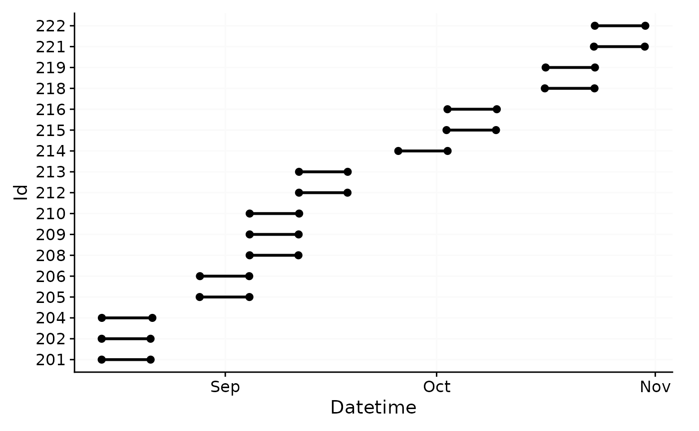

# Import & cleaning

This article focuses on the import from multiple files and participants,
as well as the cleaning of the data. We need these packages:

``` r
library(LightLogR)
library(tidyverse)
library(gghighlight)
```

> Please note that this article uses the base pipe operator `|>`. You
> need an R version equal to or greater than 4.1.0 to use it. If you are
> using an older version, you can replace it with the `magrittr` pipe
> operator `%>%`.

## From which devices can I import data?

LightLogR aims to provide standard import routines for all devices used
in research on personal light exposure. Currently, the following devices
are supported:

``` r
supported_devices()
#>  [1] "Actiwatch_Spectrum" "ActLumus"           "ActTrust"          
#>  [4] "Circadian_Eye"      "Clouclip"           "DeLux"             
#>  [7] "GENEActiv_GGIR"     "Kronowise"          "LiDo"              
#> [10] "LightWatcher"       "LIMO"               "LYS"               
#> [13] "MiEye"              "MotionWatch8"       "nanoLambda"        
#> [16] "OcuWEAR"            "Speccy"             "SpectraWear"       
#> [19] "VEET"
```

More Information on these devices can be found in the reference for
[`import_Dataset()`](https://tscnlab.github.io/LightLogR/reference/import_Dataset.md).

### What if my device is not listed?

If you are using a device that is currently not supported, please
contact the developers. We are always looking to expand the range of
supported devices. The easiest and most trackable way to get in contact
is by opening a new issue on our [Github
repository](https://github.com/tscnlab/LightLogR/issues). Please see the
[CONTRIBUTING](https://tscnlab.github.io/LightLogR/CONTRIBUTING.html)
section for different ways to help and details about how this project
handles them.

### What if my device is listed but the import does not work as expected?

We regularly find that files exported from the same device model can
differ in structure. This may be due to different settings, software or
hardware updates. If you encounter problems with the import, please get
in contact with us, e.g. by opening an issue on our [Github
repository](https://github.com/tscnlab/LightLogR/issues). Please see the
[CONTRIBUTING](https://tscnlab.github.io/LightLogR/CONTRIBUTING.html)
section for different ways to help and details about how this project
handles them.

### Are there other ways to import data?

Yes. `LightLogR` simply requires a `data.frame` with a column containing
`datetime` formatted data. Even a `light` data column is not strictly
necessary, as `LightLogR` is optimized for, but not restricted to, light
data. Further, an `Id` column is used in some functions to distinguish
between different participants.

To make life easier when using functions in `LightLogR`, the datetime
column should be named `Datetime`, the id column `Id`, and, if present,
the melanopic EDI light information `MEDI`.

Lastly, you can modify or add import functions that build upon
`LightLogR`s import functionality. See the last chapter in this article
for more information on that.

## Importing data

The first step in every analysis is data import. We will work with data
collected as part of the Master Thesis *Insights into real-world human
light exposure: relating self-report with eye-level light logging* by
Carolina Guidolin (2023). The data is stored in 17 text files in the
*data/* folder. You can access the data yourself through the [LightLogR
GitHub
repository](https://github.com/tscnlab/LightLogR/tree/main/vignettes/articles/data).

``` r
#this assumes that you downloaded the files into a folder called "data" in the working directory
path <- "data"
files <- list.files(path, full.names = TRUE)
#show how many files are listes
length(files)
#> [1] 17
```

Next we require a time zone of data collection. If uncertain which time
zones are valid, use the
[`OlsonNames()`](https://rdrr.io/r/base/timezones.html) function. Our
data was collected in the “Europe/Berlin” time zone.

``` r
#first six time zones from OlsonNames()
head(OlsonNames())
#> [1] "Africa/Abidjan"     "Africa/Accra"       "Africa/Addis_Ababa"
#> [4] "Africa/Algiers"     "Africa/Asmara"      "Africa/Asmera"

#our time zone
tz <- "Europe/Berlin"
```

Lastly, the participant Ids are stored in the file names. We will
extract them and store them in a column called `Id`. The following code
defines the pattern as a *regular expression*, which will extract the
first three digits from the file name.

``` r
pattern <- "^(\\d{3})"
```

Now we can import the data. Data were collected with the ActLumus device
by Condor Instruments. The right way to specify this is through the
`import` function.

``` r
data <- import$ActLumus(files, tz = tz, auto.id = pattern, print_n=33)
#> 
#> Successfully read in 1'034'650 observations across 17 Ids from 17 ActLumus-file(s).
#> Timezone set is Europe/Berlin.
#> The system timezone is UTC. Please correct if necessary!
#> Observations in the following 2 file(s) and 2 Id(s) cross to or from daylight savings time (DST): 
#> File: 221_actlumus_Log_1607_20231030121531432, Group:221
#> File: 222_actlumus_Log_1020_20231030140039534, Group:222
#> Please make sure that the timestamps in the source files correctly reflect these changes from DST<>ST. 
#> To adjust datetimes after a jump, set `dst_adjustment = TRUE` or see `?dst_change_handler` for manual adjustment.
#> 
#> First Observation: 2023-08-14 10:55:21
#> Last Observation: 2023-10-30 15:00:32
#> Timespan: 77 days
#> 
#> Observation intervals: 
#>    Id    interval.time              n pct  
#>  1 201   10s                    60042 100% 
#>  2 202   10s                    59957 100% 
#>  3 204   10s                    61980 100% 
#>  4 205   10s                    61015 100% 
#>  5 206   10s                    60691 100% 
#>  6 206   23s                        1 0%   
#>  7 206   59575s (~16.55 hours)      1 0%   
#>  8 208   10s                    59853 100% 
#>  9 209   10s                    60084 100% 
#> 10 210   10s                    60701 100% 
#> 11 212   10s                    59478 100% 
#> 12 213   10s                    59720 100% 
#> 13 214   10s                    61836 100% 
#> 14 214   16s                        1 0%   
#> 15 214   1197207s (~1.98 weeks)     1 0%   
#> 16 215   7s                         1 0%   
#> 17 215   10s                    60707 100% 
#> 18 216   10s                    61760 100% 
#> 19 216   19s                        1 0%   
#> 20 216   240718s (~2.79 days)       1 0%   
#> 21 218   8s                         1 0%   
#> 22 218   10s                    60929 100% 
#> 23 218   11s                        1 0%   
#> 24 219   9s                         1 0%   
#> 25 219   10s                    61634 100% 
#> 26 219   16s                        1 0%   
#> 27 219   583386s (~6.75 days)       1 0%   
#> 28 221   9s                         1 0%   
#> 29 221   10s                    62340 100% 
#> 30 221   19s                        1 0%   
#> 31 221   3610s (~1 hours)           1 0%   
#> 32 222   10s                    61890 100% 
#> 33 222   3610s (~1 hours)           1 0%
```


### My import is slow. Why is that and can I speed it up?

There are several possibilities, why the import is slow. The most common
reasons are:

- The data files are simply large. With short measurement intervals,
  many participants, and long measurement periods, files for a single
  study can easily reach several gigabytes. This takes some time to
  import and is ok.

- The data files contain many gaps. During import, `LightLogR` checks
  for and visualizes gaps in the data. Especially large datasets with
  small intervals contain many gaps, which can slow down the import
  process.

- The device model you are importing from has non-consistent data
  structures. Some devices have a varying number of rows before the
  actual data starts. This means a small portion of every file has to be
  read in and the correct starting row has to be found. This can slow
  down the import process if you have many files.

If you are experiencing slow imports, you can try the following:

- Only read in part of your datasets, or split your dataset into several
  pieces, that each gets loaded in separately. You can combine them
  afterwards with
  [`join_datasets()`](https://tscnlab.github.io/LightLogR/reference/join_datasets.md).

- If you have many gaps in your data, you can set `auto.plot = FALSE` in
  the import function. This will eliminate the call to
  [`gg_overview()`](https://tscnlab.github.io/LightLogR/reference/gg_overview.md),
  which calculates and visualizes the gaps in the data.

## Finding and handling gaps and irregular data

Before we can dive into the analysis part, we need to make sure we have
a clean dataset. The import summary shows us two problems with the data:

- two files have data that crosses daylight saving time (DST) changes.
  Because the ActLumus device does not adjust for DST, we need to
  correct for this.

- Multiple Ids have single datapoints at the beginning of the dataset
  with gaps before actual data collection starts. These are test
  measurements to check equipment, but must be removed from the dataset.

Let us first deal with the DST change. LightLogR has an in-built
function to correct for this during import. We thus will re-import the
data, but make the import silent as to not clutter the output.

``` r
data <- 
  import$ActLumus(files, tz = tz, auto.id = pattern, dst_adjustment = TRUE, silent = TRUE)
```

The second problem requires the filtering of certain Ids. The
[`filter_Datetime_multiple()`](https://tscnlab.github.io/LightLogR/reference/filter_Datetime_multiple.md)
function is ideal for this. We can provide a length (1 week), starting
from the end of data collection and backwards. The variable `arguments`
provide variable arguments to the filter function, they have to be
provided in list form and expressions have to be quoted
through[`quote()`](https://rdrr.io/r/base/substitute.html). Fixed
arguments, like the length and`length_from_start\` are provided as named
arguments and only have to be specified once, as they are the same for
all Ids.

``` r
data <- 
  data |> 
  filter_Datetime_multiple(
    arguments = list(
      list(only_Id = quote(Id == 216)),
      list(only_Id = quote(Id == 219)),
      list(only_Id = quote(Id == 214)),
      list(only_Id = quote(Id == 206))
    ), 
    length = "1 week", length_from_start = FALSE)
#> Warning: There were 16 warnings in `dplyr::filter()`.
#> The first warning was:
#> ℹ In argument: `switch(...)`.
#> ℹ In group 1: `Id = 201`.
#> Caused by warning in `max.default()`:
#> ! no non-missing arguments to max; returning -Inf
#> ℹ Run `dplyr::last_dplyr_warnings()` to see the 15 remaining warnings.
#> There were 16 warnings in `dplyr::filter()`.
#> The first warning was:
#> ℹ In argument: `switch(...)`.
#> ℹ In group 1: `Id = 201`.
#> Caused by warning in `max.default()`:
#> ! no non-missing arguments to max; returning -Inf
#> ℹ Run `dplyr::last_dplyr_warnings()` to see the 15 remaining warnings.
#> There were 16 warnings in `dplyr::filter()`.
#> The first warning was:
#> ℹ In argument: `switch(...)`.
#> ℹ In group 1: `Id = 201`.
#> Caused by warning in `max.default()`:
#> ! no non-missing arguments to max; returning -Inf
#> ℹ Run `dplyr::last_dplyr_warnings()` to see the 15 remaining warnings.
#> There were 16 warnings in `dplyr::filter()`.
#> The first warning was:
#> ℹ In argument: `switch(...)`.
#> ℹ In group 1: `Id = 201`.
#> Caused by warning in `max.default()`:
#> ! no non-missing arguments to max; returning -Inf
#> ℹ Run `dplyr::last_dplyr_warnings()` to see the 15 remaining warnings.
```

Let’s have a look at the data again with the
[`gg_overview()`](https://tscnlab.github.io/LightLogR/reference/gg_overview.md)
function.

``` r
data |> gg_overview()
```



Looks much better now. Also, because there is no longer a hint about
gaps in the lower right corner, we can be sure that all gaps have been
removed. The function
[`has_irregulars()`](https://tscnlab.github.io/LightLogR/reference/has_irregulars.md)
shows us, however, that there are still irregularities in the data and
the function
[`gap_table()`](https://tscnlab.github.io/LightLogR/reference/gap_table.md)
reveals where they are.

``` r
data |> 
  has_irregulars()
#> [1] TRUE
```

Having irregular data in a dataset can be very problematic, as it messes
up many functions that require constant spacing of observations. Also,
it can seriously slow down computational performance. Let us first check
out where the irregular data happen, with the function
[`gap_table()`](https://tscnlab.github.io/LightLogR/reference/gap_table.md).
It is important to set `include.implicit.gaps = FALSE`, or it will be
computationally very costly

``` r
data |> 
  gap_table(include.implicit.gaps = FALSE)
#> Warning: There are implicit gaps in the dataset that will not be part of the
#> extracted summary, due to `include.implicit.gaps = FALSE`.
#> No gaps found
```

[TABLE]

This means we have to look at and take care of the irregularities for
the Ids 215, 218, and 221. Let us first visualize where the
irregularities are. We can use
[`gg_gaps()`](https://tscnlab.github.io/LightLogR/reference/gg_gaps.md)
for that. We will use `include.implicit.gaps = FALSE` again to save
computational cost, and also `group.by.days = TRUE`, wich will give us
results by day.

``` r
data |> gg_gaps(include.implicit.gaps = FALSE, group.by.days = TRUE, show.irregulars = TRUE)
```


The first instances seem fine, but then right after the start all data
appear shifted. As the first half of the day is missing anyways, this is
likely not a day we will be using. This is also the case with all the
other participants, anyways, which we can show by selecting a sample and
extract the gaps they have.

``` r
data |> 
  filter(Id %in% 208:210) |> 
  gg_gaps(MEDI, x.axis.format = "%a")
#> Warning: Removed 26719 rows containing missing values or values outside the scale range
#> (`geom_line()`).
```


``` r

data |> 
  filter(Id %in% 208:210) |> 
  extract_gaps()
#> # A tibble: 6 × 6
#> # Groups:   Id [3]
#>   Id    gap.id epoch start               end                
#>   <fct>  <int> <dbl> <dttm>              <dttm>             
#> 1 208        1    10 2023-09-04 00:00:04 2023-09-04 11:01:44
#> 2 208        2    10 2023-09-11 09:17:24 2023-09-12 00:00:04
#> 3 209        1    10 2023-09-03 23:59:57 2023-09-04 11:03:17
#> 4 209        2    10 2023-09-11 09:57:27 2023-09-11 23:59:57
#> 5 210        1    10 2023-09-04 00:00:00 2023-09-04 11:07:00
#> 6 210        2    10 2023-09-11 11:44:00 2023-09-12 00:00:00
#> # ℹ 1 more variable: duration <Duration>
```

We can remove these partial days via
[`remove_partial_data()`](https://tscnlab.github.io/LightLogR/reference/remove_partial_data.md).
We want to make sure to apply this filter `by.date`, as it otherwise
would outright remove participants, but we want to simply remove single
days. Before we remove these days we can check which days are going to
be removed.

``` r

data |> 
  remove_partial_data(
    handle.gaps = TRUE, MEDI, by.date = TRUE, threshold.missing = "2 hours",
    show.result = TRUE
    ) |> 
  filter(marked.for.removal)
#> # A tibble: 34 × 9
#> # Groups:   Id, .date [34]
#>    marked.for.removal Id    .date      duration             
#>    <lgl>              <fct> <date>     <Duration>           
#>  1 TRUE               201   2023-08-14 47080s (~13.08 hours)
#>  2 TRUE               201   2023-08-21 34950s (~9.71 hours) 
#>  3 TRUE               202   2023-08-14 46970s (~13.05 hours)
#>  4 TRUE               202   2023-08-21 34210s (~9.5 hours)  
#>  5 TRUE               204   2023-08-14 45030s (~12.51 hours)
#>  6 TRUE               204   2023-08-21 56380s (~15.66 hours)
#>  7 TRUE               205   2023-08-28 54730s (~15.2 hours) 
#>  8 TRUE               205   2023-09-04 37030s (~10.29 hours)
#>  9 TRUE               206   2023-08-28 51680s (~14.36 hours)
#> 10 TRUE               206   2023-09-04 34730s (~9.65 hours) 
#> # ℹ 24 more rows
#> # ℹ 5 more variables: missing <Duration>, total <Duration>, missing_pct <dbl>,
#> #   threshold <Duration>, interval <Duration>

data <- 
  data |> 
    remove_partial_data(
      handle.gaps = TRUE, MEDI, by.date = TRUE, threshold.missing = "2 hours"
      )
```

34 days were removed. As we have 17 participants, that equals the first
and last day of data collection, which are correctly identified as only
partly available.

``` r
data |> has_gaps()
#> [1] FALSE
data |> has_irregulars()
#> [1] FALSE
```

The data is now clean and we can proceed with the analysis. This dataset
will be needed in other articles, so we will save it as an RDS file.

``` r
# uncomment next lines to save the data
# if (!dir.exists("cleaned_data")) dir.create("cleaned_data")
# saveRDS(data, "cleaned_data/ll_data.rds")
```

## Importing data: Miscellaneous

### Other import arguments

Other potentially important arguments are the `locale` argument - this
is useful if you have special characters in your data (e.g. German ü or
ä) that are not recognized by the default locale. Look at
[`readr::default_locale()`](https://readr.tidyverse.org/reference/locale.html)
for more information.

The `...` argument is passed through to whichever import function is
used for the data. For some devices, it is also used to provide
additional information, such as `column_names` for the Actiwatch
devices, that differ depending on the language setting of the device and
software. Whether a device requires additional information can be found
in the import documentation (see
[`import_Dataset()`](https://tscnlab.github.io/LightLogR/reference/import_Dataset.md)).

### Other ways to call import

Instead of using the import function as described above
(`import$device()`), you can also use the function
[`import_Dataset()`](https://tscnlab.github.io/LightLogR/reference/import_Dataset.md)
and specify the device as a character string in the first argument. This
might be useful if you want to import data programmatically from
different devices, e.g., through a
[`purrr::map()`](https://purrr.tidyverse.org/reference/map.html)
function. Only
[`supported_devices()`](https://tscnlab.github.io/LightLogR/reference/supported_devices.md)
will be accepted by the function.

Here is an example:

    devices <- c("ActLumus", "Speccy")
    files_AL <- c("path/to/ActLumus/file1.csv", "path/to/ActLumus/file2.csv")
    files_Sy <- c("path/to/Speccy/file1.csv", "path/to/Speccy/file2.csv")
    tz <- "Europe/Berlin"

    data <- purrr::map2(devices, list(files_AL, files_Sy), import_Dataset, tz = tz)

This way, you will end with a list of two dataframes, one with the
ActLumus data and one with the Speccy data.

### Creating your own import function

**Note: This section is for advanced users only. You should be familiar
with expressions in R and how to manipulate them.**

`LightLogR` comes with a number of custom import routines for different
devices, that are then implemented into the main import function, which
covers some general aspects and also creates the summary overview.

If you would like to write your own custom import function, `LightLogR`
has you covered. First, you can see what makes all the import functions
tick by looking at the included data set
[`ll_import_expr()`](https://tscnlab.github.io/LightLogR/reference/ll_import_expr.md).
This is a list of all the individual routines. Let’s have a look at the
ActLumus routine

``` r
ll_import_expr()$ActLumus
#> {
#>     first_file <- filename[1]
#>     rows_to_skip <- detect_starting_row(first_file, locale = locale, 
#>         column_names = "DATE/TIME", n_max = 250)
#>     data <- suppressMessages(readr::read_delim(filename, skip = rows_to_skip, 
#>         delim = ";", n_max = n_max, id = "file.name", locale = locale, 
#>         name_repair = "universal", ...))
#>     data <- data %>% dplyr::rename(Datetime = DATE.TIME, MEDI = MELANOPIC.EDI) %>% 
#>         dplyr::mutate(Datetime = Datetime %>% lubridate::dmy_hms(tz = tz))
#> }
```

We can see, it is rather simple, just a few lines of code. You can write
your own expression and create an import function with it. The
expression should create a `data` variable that contains the import
script for the files. At the end of the expression, the `data` variable
should contain the imported dataset and include a correctly formatted
`Datetime` column, complete with the correct timezone.

Here we will create a variation of the old routine, that just adds a
short message:

``` r
new_import_expr <- ll_import_expr()
new_import_expr$ActLumus_new <- new_import_expr$ActLumus
new_import_expr$ActLumus_new[[6]] <- 
  rlang::expr({ cat("**Congratulation, you made a new import function**\n")
  data
  })
new_import_expr$ActLumus_new
#> {
#>     first_file <- filename[1]
#>     rows_to_skip <- detect_starting_row(first_file, locale = locale, 
#>         column_names = "DATE/TIME", n_max = 250)
#>     data <- suppressMessages(readr::read_delim(filename, skip = rows_to_skip, 
#>         delim = ";", n_max = n_max, id = "file.name", locale = locale, 
#>         name_repair = "universal", ...))
#>     data <- data %>% dplyr::rename(Datetime = DATE.TIME, MEDI = MELANOPIC.EDI) %>% 
#>         dplyr::mutate(Datetime = Datetime %>% lubridate::dmy_hms(tz = tz))
#>     {
#>         cat("**Congratulation, you made a new import function**\n")
#>         data
#>     }
#> }
```

We can now create a new import function with this expression. The
function will be called `import$ActLumus_new()`.

``` r
import <- import_adjustment(new_import_expr)
```

Let us now import a file of the previous dataset, setting the main
summary and plotting function silent

``` r
data <- import$ActLumus_new(files[1], tz = tz, auto.id = pattern, 
                         auto.plot = FALSE, silent = TRUE)
#> **Congratulation, you made a new import function**
```
