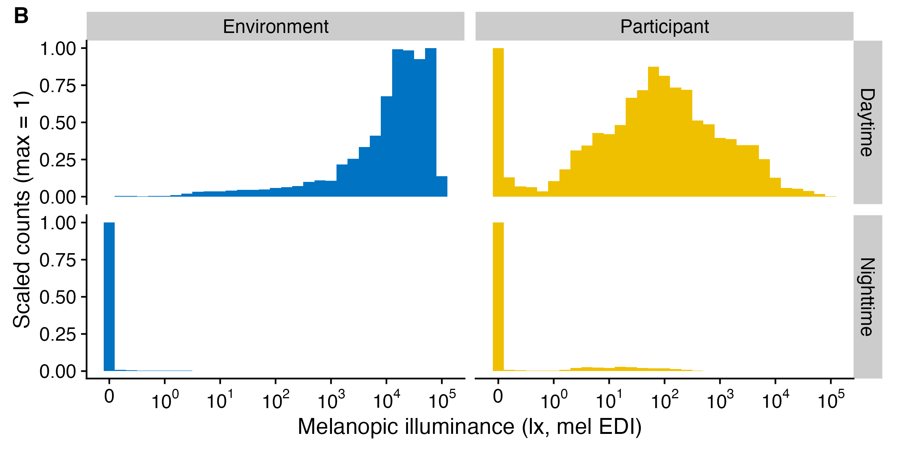

```{r, include = FALSE}
knitr::opts_chunk$set(
  collapse = TRUE,
  comment = "#>"
)
```



This article focuses on an important question when dealing with light exposure (and many other) important data: **To log or not to log?**. It is based on the article *How to deal with darkness: Modelling and visualization of zero-inflated personal light exposure data on a logarithmic scale* by Zauner et al. (2025). The article is currently in the proofing-stage, but the preprint can be found [here](https://www.biorxiv.org/content/10.1101/2024.12.30.630669v1.full).

```{r setup, message = FALSE}
library(LightLogR)
library(tidyverse)
library(gt)
library(gtsummary)
```

> Please note that this article uses the base pipe operator `|>`. You need an R version equal to or greater than 4.1.0 to use it. If you are using an older version, you can replace it with the `magrittr` pipe operator `%>%`.

# Importing Data

We will use data imported and cleaned already in the article [Import & Cleaning](https://tscnlab.github.io/LightLogR/articles/Import.html).

```{r, import}
#this assumes the data is in the cleaned_data folder in the working directory
data <- readRDS("cleaned_data/ll_data.rds")
```

As can be seen by using `gg_overview()`, the dataset contains 17 ids with one weeks worth of data each, and one to three participants per week.

```{r, overview}
data |> gg_overview()
```

# To log or not to log (transform)

Light exposure data (e.g., Illuminance, or melanopic EDI) is not normally distributed (see #. By their nature, their values are often highly skewed, and also overdispersed. Additionally, the data tend to show an excess of zero values (so called zero-inflation). The paper *How to deal with darkness: Modelling and visualization of zero-inflated personal light exposure data on a logarithmic scale* by [Zauner et al. (2025)](https://www.biorxiv.org/content/10.1101/2024.12.30.630669v1.full) explores ways to deal with this.

For visualization, the symlog scale is excellent (see `symlog_trans()`), which is the basis for all `LightLogR` visualizations. For statistical modelling, the [Tweedie](https://en.wikipedia.org/wiki/Tweedie_distribution) distribution is a good choice, as it can handle zero-inflation and overdispersion. But how about when one simply wants an average across portions of the dataset? In this case, the mean is not a good choice. Even the median is affected by the zero-inflation. Log-transforming the data removes zero values, which are a common occurance, thus is also removes valuable information from the dataset. Zauner et al. summize that adding a small, but not negligable value to a variable prior to log-transformation is a good way to deal with this issue, also for modelling. `LightLogR` has two functions to facilitate this: `log_zero_inflated()` and `exp_zero_inflated()` use a default offset of `0.1` and a logarithmic base of `10`, but can be adjusted. The function `log_zero_inflated()` is used to log-transform the data, while `exp_zero_inflated()` is used to back-transform the data. The functions are used in the following way:

```{r}
#no transformation
data$MEDI |> mean()
data$MEDI |> median()

#log-transformation
data$MEDI |> log() |> Filter(\(x) !is.infinite(x), x = _) |> mean() |> exp()

#log_zero_inflated
data$MEDI |> log_zero_inflated() |> mean() |> exp_zero_inflated()
```

What do those values represent in the dataset? Let's overlay them on a histogram

```{r}
#creating a histogram function
MEDI_histogram <- function(data) {

#creating a dataset with the location parameters
locations <- tibble(
  mean = data$MEDI |> mean(),
  median = data$MEDI |> median(),
  log_mean = data$MEDI |> log() |> Filter(\(x) !is.infinite(x), x = _) |> mean() |> exp(),
  log_zero_inflated_mean = data$MEDI |> log_zero_inflated() |> mean() |> exp_zero_inflated()
) |> pivot_longer(cols = everything())
  
#creating the histogram
data |> 
  ggplot(aes(x = MEDI, y = after_stat(ncount))) + 
  geom_histogram(binwidth = 0.2) + 
  scale_x_continuous(trans = "symlog", 
                     breaks = c(0, 10^(0:5)), 
                     labels= expression(0,10^0,10^1, 10^2, 10^3, 10^4, 10^5)
                     ) +
  geom_vline(data = locations, aes(xintercept = value, color = name), linetype = "dashed") +
  geom_label(data = locations, aes(x = value, y = c(0.4, 0.3, 0.35, 0.25), label = name, color = name), 
             size = 3) +
  ggsci::scale_color_jco()+
  guides(color = "none") +
  labs(x = "Melanopic illuminance (lx, mel EDI)", y = "Scaled counts (max = 1)") +
  theme_minimal()
}
```

```{r}
MEDI_histogram(data)
```

It can be readily seen that the median and the log_zero_inflated mean lead to similar results, but are still different by almost a factor 2. The mean doesn't represent anything well, and the log-transformed mean represents the "non-zero" part of the distribution quite well, as is to be expected. How does this look like when we only look at daytime values, which are expected to have fewer zero-lux values?

```{r}
#looking only at daytime values of light exposure
day_data <- 
data |> 
  add_photoperiod(c(48.5, 9)) |> 
  filter(photoperiod.state == "day")

MEDI_histogram(day_data)
```

In cases with fewer zero-values, the log-transformed mean and the log_zero_inflated mean are more similar, but still is 50% higher on the untransformed mel EDI level. 

# Summary

In cases with many zero values, the log_zero_inflated mean is arguably a better representation of the location parameter data, as is the median. The log_zero_inflated mean is also a good choice for modelling, as it is not affected by zero values. The difference to log transformed data becomes more pronounced as the number of zero values increases. 

We generally recommend to either use the median or the log_zero_inflated mean for summaries of light exposure data.