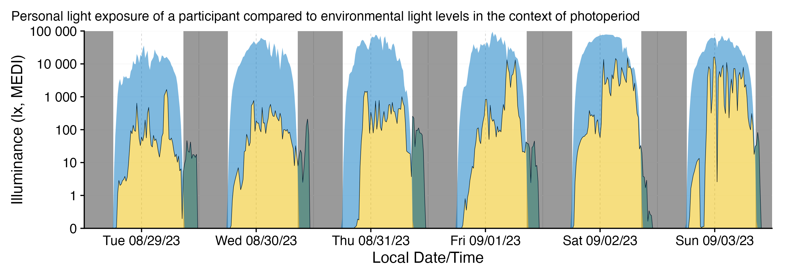

```{r, include = FALSE}
knitr::opts_chunk$set(
  collapse = TRUE,
  comment = "#>"
)
```



Photoperiod information such as dusk, dawn, sunrise, or sunset are highly relevant in the context of personal light exposure data. Compared to ambient environmental light levels, these data are usually not measured, but rather calculated, based on a participant's geographical location. Since the introduction of version `0.5.0 Civil dawn`, `LightLogR` aims to provide a simple yet powerful suite of functions to implement photoperiod information in visualizations, data processing, and metric calculation. This article showcases the extension of analysis pipelines when dealing with such data. 

We start off by loading `LightLogR` and packages needed for this tutorial:

```{r setup, message = FALSE}
library(LightLogR)
library(tidyverse)
library(gt)
library(gtsummary)

#convenience functions for table display
gt_tab <- function(dataset, caption) {
  dataset |> 
  gt() |> 
  tab_style(cell_text(weight = "bold"), 
            locations = cells_column_labels())
}
```

> Please note that this article uses the base pipe operator `|>`. You need an R version equal to or greater than 4.1.0 to use it. If you are using an older version, you can replace it with the `magrittr` pipe operator `%>%`.

# Importing Data

We will use data imported and cleaned already in the article [Import & Cleaning](https://tscnlab.github.io/LightLogR/articles/Import.html).

```{r, import}
#this assumes the data is in the `cleaned_data` folder in the working directory
data <- readRDS("cleaned_data/ll_data.rds")
#to save computational time, we will only use a few columns from the data
data <- data |> select(Id, Datetime, MEDI)
```

Here is are the first three lines of the data
```{r, import2}
data |> ungroup() |>  head(3) |> gt_tab()
```

As can be seen by using `gg_overview()`, the dataset contains 17 ids with one weeks worth of data each, and one to three participants per week.

```{r, overview}
data |> gg_overview()
```

# Adding photoperiod information

Adding photoperiod information to a dataset is easy, but requires four pieces of information:

  - For which dates should the photoperiod information be added?
  - For which timezone should the photoperiod information be provided?
  - For which location should the photoperiod information be added?
  - How is photoperiod defined?
  
The first two aspects are (usually) already defined by any dataset imported with `LightLogR`. It contains information about relevant days, and the `Datetime` column contains the necessary timezone information. The latter two aspects need to be provided by the user.

## Geolocation

The geographical location is defined by a set of coordinates in the form of `latitude` and `longitude`. Our sample data were collected in Tübingen, Germany, which is located at 48.52°N, and 9.06°E. The coordinates need to be stored in a numeric vector of length 2. **The order of latitude and longitude is essential.**

```{r coordinates}
coordinates <- c(48.521637, 9.057645)
```

## What is photoperiod?

Here, photoperiod covers the time the sun is above a given threshold elevation (or rather depression), relative to the horizon. What this elevation/depression should be is decided by the user. While `LightLogR` uses a default depression angle of `6 degrees`, yielding *Civil dawn/dusk*, other depression angles can be set, depending on the research at hand. A depression value of 0 degrees for *sunrise/sunset*, 12 degrees for *Nautical dawn/dusk*, or 18 degrees for *Astronomical dawn/dusk*. We find that *Civil dawn/dusk* relates best to the steep rise in environmental illuminance levels, which is why it was set as the default.

## Calculating photoperiod

`LightLogR` provides several ways to calculate dawn and dusk information. Likely the most useful function is `add_photoperiod()`, as is directly expands a dataset with all the necessary information.

```{r adding photoperiod}
data |> 
  add_photoperiod(coordinates) |> 
  #from here on out is just formatting
  head(3) |> 
  gt_tab(caption = "Photoperiod Information for the first three observations") |> 
  fmt_duration("photoperiod") |> 
  fmt_datetime(c("dawn", "dusk")) |> 
  tab_style(style = cell_text(color = "red"), 
            locations = list(cells_body(dawn:photoperiod.state),
                             cells_column_labels(dawn:photoperiod.state))
  )
```

The way `LightLogR` provides this information is not a singular number, but rather a set of values relevant for the photoperiod. `dawn` and `dusk` columns provide the start and end times of the photoperiod, respectively. `photoperiod` is the length of the photoperiod, defined by `dawn` and `dusk` times. Finally, the `photoperiod.state` defines whether the current observation (`Datetime`) is within (`day`) or outside (`night`) the relevant photoperiod.

Adding this information might not be necessary in all cases, however. If only the relevant photoperiods are required, but need not be part of the whole dataset, `extract_photoperiod()` is the right choice. This functions works the same way as `add_photoperiod()`, but returns a dataframe with relevant days:

```{r extracting photoperiod}
data |> 
  extract_photoperiod(coordinates) |> 
  #from here on out is just formatting
  head(3) |> 
  gt_tab(caption = "Photoperiod Information for the first three days") |> 
  fmt_duration("photoperiod") |> 
  fmt_number(c(lat, lon)) |> 
  fmt_datetime(c("dawn", "dusk"))
```

Finally, photoperiods not connected to a specific dataset might be required. In this case, `photoperiod()` is a useful basic helper function. As it does not draw upon a dataset, dates and the timezone must be supplied separately.

```{r photoperiod}
dates <- c("2025-06-21", "2025-12-21")
timezone <- "Europe/Berlin"

photoperiod(coordinates, dates, timezone) |> 
  #from here on out is just formatting
  gt_tab(caption = "Photoperiod information for winter and summer solstice") |> 
  fmt_datetime(c("dawn", "dusk")) |> 
  fmt_number(c(lat, lon)) |> 
  fmt_duration("photoperiod")
```

This provides a good opportunity to change the solar depression angle, showcasing the differences in photoperiod

```{r solarDep}
photoperiod(coordinates, dates, timezone, solarDep = 0) |> 
  #from here on out is just formatting
  gt_tab(caption = "Photoperiod information for sunrise/sunset") |> 
  fmt_datetime(c("dawn", "dusk")) |> 
  fmt_number(c(lat, lon)) |> 
  fmt_duration("photoperiod") |> 
  tab_style(style = cell_text(color = "red"),
            locations = list(cells_body(solar.angle),
                             cells_column_labels(solar.angle))
  )
```

To compare different settings, `purrr::map()` is your friend

```{r solarDep2}
solarDep <- c(0, 6, 12, 18)

solarDep |> 
  map(\(solarDep) photoperiod(coordinates, dates[1], timezone, solarDep)) |> 
  list_rbind() |> 
  arrange(date) |> 
  select(solar.angle, dawn, dusk, photoperiod) |> 
  gt(caption = "Comparing different solar depression values for summer solstice") |> 
  fmt_datetime(c("dawn", "dusk")) |> 
  fmt_duration("photoperiod") |> 
  tab_style(style = cell_text(color = "red"),
            locations = list(cells_body(solar.angle),
                             cells_column_labels(solar.angle))
  )
```

# Visualizing photoperiod

`LightLogR` provides a simple interface to add photoperiod information to plots created with `gg_day()`, `gg_days()`, or `gg_doubleplot()`. These can either draw on previously added photoperiod information, or create it on the fly.

As the dataset is quite extensive, we will use a portion of five days from three participants. This is easy with the `filter_Date()` function:

```{r partial data}
data_partial <- 
  data |> 
  filter_Date(start = "2023-08-15", length = "5 days")

data_partial |> gg_overview()
```


## Integration with gg_day()

```{r gg_day, fig.height= 6}
data_partial |> 
  gg_day(aes_col = Id, geom = "line") |> 
  gg_photoperiod(coordinates)
#this is identical to:
# data_partial |> 
#   add_photoperiod(coordinates) |> 
#   gg_day(aes_col = Id, geom = "line") |> 
#   gg_photoperiod()
```

## Integration with gg_days()

```{r gg_days, fig.width = 7.5}
data_partial |> 
  gg_days() |> 
  gg_photoperiod(coordinates)
#this is identical to:
# data_partial |> 
#   add_photoperiod(coordinates) |> 
#   gg_days() |> 
#   gg_photoperiod()
```

If photoperiod information is added prior to plotting, it can also be used for the main `geom`:

```{r gg_days 2, fig.width = 7.5}
data_partial |> 
  add_photoperiod(coordinates) |> 
  gg_days(
    aes_col = photoperiod.state, 
    group = consecutive_id(photoperiod.state),
    jco_color = TRUE) +
  theme(legend.position = "bottom") +
  labs(col = "State of the photoperiod")
```

## Integration with gg_doubleplot()

Integration in `gg_doubleplot()` is similar to the other plotting functions. However, because `gg_doubleplot()` uses some trickery under the hood in cases where it repeats the same day twice (which is the case when only one day per group is present, or `type = "repeat"` is set), we strongly suggest that the photoperiod information is added prior to plotting. If not, the photoperiod for the repeated day will actually draw on the consecutive calender date. While only a minor difference of a few minutes, this is easily avoided.

```{r gg_doubleplot}
data_partial |> 
  filter_Date(length = "1 day") |> 
  add_photoperiod(coordinates) |>
  gg_doubleplot() |> 
  gg_photoperiod()
#NOT the same as:
# data_partial |> 
#   filter_Date(length = "1 day") |> 
#   gg_doubleplot() |> 
#   gg_photoperiod(coordinates)
```

## Combination with aggregate_Date()

Adding photoperiod data to a dataset means it can be manipulated the same way any other column in the dataset. `aggregate_Date()` is a great way to condense multiple days of data collection into a single day. For this example, we will use the full dataset again to start off. We suggest that photoperiods are added after `aggregate_Date()` is applied, as the aggregation of `datetimes` can be error prone. E.g., the mean of dusk `6:00:00 on 1 Feb`, and `6:01:00 on 2 Feb` would be `18:00:30 on 1 Feb`. While certainly correct from a numeric standpoint (as `datetimes` are stored in seconds from a reference), it does not make much sense for `dusk` or `dawn` values to be shifted in this sense. By applying the photoperiod information after aggregation, you can be sure they are based on the aggregated datetimes.

```{r aggregate_Date, fig.height = 6.5}
data |> 
  filter(Id %in% c(201, 212, 216, 222)) |> 
  aggregate_Date(unit = "5 mins") |>
  add_photoperiod(coordinates) |>
  gg_doubleplot() |> 
  gg_photoperiod(alpha = 0.9)
```

## Differences in solar depression angle

We can show the difference the solar depression angle makes by visualizing different variants. We use the `sample.data.environment` that comes with `LightLogR`. It contains ambient environmental illuminance values:

```{r sample data environment, fig.width = 9}
sample.data.environment |> 
  gg_days() |> 
  gg_photoperiod(coordinates) 
```

```{r sample data environment2, echo = FALSE, include=FALSE}
sample.data.environment |> 
  aggregate_Datetime(unit = "15 mins") |> 
  filter_Date(length = "6 days") |> 
  data2reference(length.restriction.seconds = 3600, across.id = TRUE, filter.expression.reference = Id == "Environment") |> 
  filter(Id == "Participant") |> 
  ungroup() |> 
  gg_days(geom = "ribbon", aes_fill = "2", jco_color = TRUE, col = "black", size = 0.2, facetting = FALSE, alpha = 0.5) |> 
  gg_photoperiod(coordinates, alpha = 0.6) + 
  geom_ribbon(aes(ymin = MEDI, ymax = Reference, fill = Id), alpha = 0.5) +
  theme(legend.position = "bottom") + 
  coord_cartesian(ylim = c(0, 10^5), expand = FALSE) +
  guides(fill = "none") +
  labs(subtitle = "Personal light exposure of a participant compared to environmental light levels in the context of photoperiod")

ggsave("images/photoperiod.png", width = 10, height = 3.5)
```

We use the `Environment` data from `Sat 09/02/23` to showcase this.

```{r vis solar depression, fig.height = 6.2}
#preparing a dataset with multiple solar depression angles:
multiple_solarDep <-
  solarDep |>
  rlang::set_names() |>
  map(\(solarDep) {
    sample.data.environment |>
      filter(Id == "Environment") |>
      filter_Date(start = "2023-09-02", length = "1 day") |>
      add_photoperiod(coordinates, solarDep = solarDep)
  }) |>
  list_rbind(names_to = "solarDep") |>
  mutate(solarDep = paste0(solarDep, "°"),
         solarDep = factor(solarDep, levels = c("0°", "6°", "12°", "18°"))) |>
  group_by(solarDep)

#actual plotting:
multiple_solarDep |> 
  gg_doubleplot(facetting = FALSE) |> 
  gg_photoperiod(alpha = 0.8) +
  facet_wrap(~solarDep, ncol = 1) +
  labs(title = "Differences in photoperiod\ndepending on solar depression angle")
```

The influence of solar depression angle can also be displayed in a single plot:

```{r vis solar depression 2, fig.height = 4}
#plotting in one facet:
multiple_solarDep |> 
  gg_doubleplot(facetting = FALSE) |> 
  gg_photoperiod(alpha = 0.25) +
  labs(title = "Differences in photoperiod\ndepending on solar depression angle")
```


# Calculating metrics

Metrics calculation with photoperiod data is quite straightforward, as photoperiod can be used as a direct grouping aspect, or as an intermediary. In all cases it is sensible to add the photoperiod information to the data:

```{r prepare metrics}
data <- 
  data |> 
  add_photoperiod(coordinates)
```


## Photoperiod as a grouping aspect

We can group by photoperiod (within participants) to calculate metrics for daytime or nighttime sections. We will calculate a simple mean value and summarize the results with the help of the `gtsummary` package.

```{r}
data |> 
  group_by(photoperiod.state, .add = TRUE) |>  # setting .add = TRUE ensures prior grouping is kept
  summarize(mean_MEDI = mean(MEDI), .groups = "drop") |> 
  tbl_summary(by=photoperiod.state, 
              include = "mean_MEDI", 
              label = mean_MEDI ~ "mean mel EDI (lx)")
```

This results in a singular value per participant (N=17 in total) and photoperiod. If we are interested in the weekly values, we can further group by week.

```{r}
per_week <- 
data |> 
  group_by(Id, week = week(Datetime), photoperiod.state) |>
  summarize(mean_MEDI = mean(MEDI), .groups = "drop")

#uncomment next lines for a tabular view
# per_week |> 
#   pivot_wider(names_from = week, values_from = mean_MEDI, names_prefix = "week ") |> 
#   tbl_summary(by=photoperiod.state, 
#               include = -Id, 
#               type = 
#                 paste("week", 33:44) ~ "continuous", 
#               missing = "no"
#               ) |> 
#   modify_header(label = "**mean mel EDI (lx)**")

per_week |> 
  ggplot(aes(x=factor(week), y = mean_MEDI)) +
  geom_boxplot(aes(fill = photoperiod.state)) +
  scale_y_log10() +
  theme_minimal() +
  labs(x = "week", y = "mean mel EDI (lx)", fill = "Photoperiod") +
  theme(legend.position = "bottom")+
  scale_fill_manual(values = c("#FDFBD3", "#003153AA"))
```

If one were to group by day (calender day), one disadvantage is that the `night` portion of each day is split into two. From midnight to dawn is part of the same bin as from dusk to midnight, when grouping by day. This differs from our common understanding, where a night on day 1 goes from dusk till dawn - and depending on the research question, one or the other might be required. `LightLogR` has the useful `number_states()` function for this case. It allows to these types of counting independent of the 24 hour day. Let us apply the function to our dataset.

```{r number states}
data <-
  data |>
  number_states(photoperiod.state)

data |> pull(photoperiod.state.count) |> unique() |> head()
```

The function creates a new column that divides our dataset into individual days and nights, which can be used for grouping.

> this function is similarly useful if a "sleep/wake" column is present in the data, as it allows for the calculation of metrics based on singular sleep/wake episodes, indifferent of date.

```{r grouping 2}
per_day <- 
data |> 
  group_by(Id, photoperiod.state, photoperiod.state.count) |> 
  summarize(mean_MEDI = mean(MEDI), .groups = "drop") |> 
  select(-photoperiod.state) |> 
  separate_wider_delim(photoperiod.state.count, " ", names = c("photoperiod.state", "count"))

per_day |> 
  pivot_wider(names_from = count, values_from = mean_MEDI, names_prefix = "day ") |> 
  tbl_summary(by=photoperiod.state, 
              include = -Id,
              missing = "no"
              ) |> 
  modify_header(label = "**mean mel EDI (lx)**")
per_day  |> 
  ggplot(aes(x=count, y = mean_MEDI)) +
  geom_boxplot(aes(fill = photoperiod.state)) +
  scale_y_log10() +
  theme_minimal() +
  labs(x = "day", y = "mean mel EDI (lx)", fill = "Photoperiod") +
  theme(legend.position = "bottom") +
  scale_fill_manual(values = c("#FDFBD3", "#003153AA"))
```

This approach has the further benefit that it works regardless of *when* data collection started. It will always bin the first, second, and so forth daytime periods of all participants together, same as for nighttime.

## Photoperiod as an intermediary

Sometimes the photoperiod as a whole is not of interest, but rather it is used as a point of reference to calculate a metric. One such example was requested as a `LightLogR` feature in issue [#39](https://github.com/tscnlab/LightLogR/issues/39). There, the intensity of daytime light exposure is defined as the mean illuminance between first morning light exposure of 50 lux and the time of civil dusk). Similarly, the mean intensity of evening light exposure is defined as the mean illuminance between civil dusk and the last light exposure of 50 lux. With the tools that `LightLogR` provides, this is easy. 

We will in our example on the `intensity of daytime light exposure`, but evening light exposure will be calculated alongside it. Because our datasets start in the middle of the first day, and end in the middle of the last day, we will remove those days from the further analysis:

```{r remove first and last days}
data <- 
  data |> 
  mutate(Day = date(Datetime)) |>
  filter(Day > min(Day), Day < max(Day))
```

We will start by calculating the timing of first morning light exposure above 50 lux **per participant and day** through the `timing_above_threshold()` function. 

```{r first morning light exposure}
timing_light_exposure <-
  data |>
  group_by(Id, Day) |>
  summarize(
      timing_above_threshold(
        MEDI, Datetime, "above", 50, na.rm = TRUE, as.df = TRUE
        ),
    .groups = "drop"
  )

timing_light_exposure |> 
  head(4) |> 
  gt_tab() |> 
  tab_style(style = cell_text(color = "red"), 
            locations = list(cells_body(4),
                             cells_column_labels(4))
  )

```

This step provided us with the first timing of light above 50 lux, and, incidentally, also the last timing of light above 50 lux, which we need for the intensity of evening light. In the next step, we will add this information to our dataset. 

```{r join}
data <-
  data |>
  left_join(timing_light_exposure, by = join_by(Id, Day))

data |> 
  head(4) |> 
  select(Id, MEDI, Datetime, dusk, first_timing_above_50) |> 
  ungroup() |> 
  gt_tab() |> 
  fmt_datetime(dusk) |> 
  cols_label(first_timing_above_50 = "First timing above 50 lux",
             dusk = "Dusk") |> 
  tab_style(style = cell_text(color = "red"), 
            locations = list(cells_body(3:5),
                             cells_column_labels(3:5))
  )
```

This provides us with an expanded dataset containing the light exposure time series (`Datetime`), and information for `Dusk` and `First timing above 50 lux`. By checking whether each observation is within the first timing of light and dusk, we prepare our data for the final step.

```{r time frame}
data <-
  data |> 
  mutate(light.type = 
           case_when(
             between(Datetime, first_timing_above_50, dusk) ~ "daytime",
             between(Datetime, dusk, last_timing_above_50) ~ "evening",
             .default = NA)
  )
```

While we were at it, we also calculated the check for evening light. In the last step we calculate the `mean melanopic EDI` for each state, per **participant and day**.

```{r intensity}
metric <-
  data |>
  group_by(Id, Day, light.type) |>
  summarize(mean_MEDI = mean(MEDI), .groups = "drop") |>
  drop_na()

metric |> 
  head(9) |>  
  gt_tab() |> 
  fmt_number(mean_MEDI) |> 
  tab_style(style = cell_fill(color = "#FDFBD3"),
            locations = cells_body(rows = light.type == "daytime")
  ) |> 
  tab_style(style = list(cell_fill(color = "#003153AA"),
                         cell_text(color = "white")),
            locations = cells_body(rows = light.type == "evening")
  ) |> 
  cols_label(light.type = "Type", mean_MEDI = "mean MEDI (lux)")
  
```


You can see that not every day has a evening light intensity value. This is due to the way our calculation is set up - if a participant has no light exposure above 50 lux after dusk, there is no accompanying value. Also note that the value we are seeing for participant `202` on `2023-08-15` is about 8 lux, which is below 50 lux. Again, this is due to the way the calculation is set up. We calculate the last time a participant is above 50 lux after dusk. But they can very well be below 50 lux between dusk and that last time, yielding a lower average melanopic EDI value. In the final step, we aggregate this information across participants. We can see that there are 102 participant days for the daytime light condition, but only 75 participant days for the evening light condition.

```{r intensity 2}
metric |> 
  tbl_summary(by = light.type, 
              include = mean_MEDI, 
              label = mean_MEDI ~ "mean mel EDI (lx)"
              )
```


# Conclusion

The suite of photoperiod functions provides a powerful addition to the toolkit of `LightLogR`, be it for visualizations, metric calculations, or simply as part of the analysis process. If there are aspects of photoperiods you feel are missing from `LightLogR`, help us to improve it and submit an [issue on Github](https://github.com/tscnlab/LightLogR/issues).