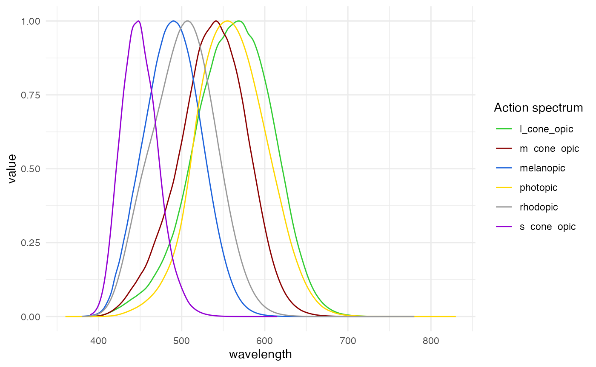

```{r, include = FALSE}
knitr::opts_chunk$set(
  collapse = TRUE,
  comment = "#>"
)
```



`LightLogR` focuses on wearable light exposure data, recorded in the form of, e.g., illuminance. Some devices also provide spectral information, that has to be preprocessed before being useful in an analysis. The package has some packages to facilitate this, but the user is expected to have some knowledge of spectral data and how to handle it. This article will show how to use the `LightLogR` package to process spectral data from the Actlumus device. 

```{r setup}
library(LightLogR)
library(tidyverse)
library(gt)
```

# Importing Data

We will use data imported and cleaned already in the article [Import & Cleaning](https://tscnlab.github.io/LightLogR/articles/Import.html).

```{r, import}
#this assumes the data is in the cleaned_data folder in the working directory
data <- readRDS("cleaned_data/ll_data.rds")
```

As can be seen by using `gg_overview()`, the dataset contains 17 ids with one weeks worth of data each, and one to three participants per week.

```{r, overview}
data |> gg_overview()
```

### Spectral power distributions

Some devices output a spectral power distribution, or SPD, directly. At the time of writing, the `nanoLambda` device, and the `OcuWEAR` are known to provide these data directly, at least as an export option. This section can be skipped if a device outputs SPDs directly.

Other devices do not provide this information directly, but have a set of channels that can be used to reconstruct the SPD. At the time of writing, the `ActLumus` and the `VEET` devices belong to this group. Some form of spectral reconstruction is needed to obtain an SPD from these devices. `LightLogR` provides one function to derive SPDs from sensor channels using a calibration matrix. **These matrices are not provided by `LightLogR`, but have to be acquired from the manufacturer of the device, metrology institutions tasked with device characterization, or the users own calibration efforts*.

We are going to use a simple dataset from the Actlumus device. First we load to the calibration matrix. `LightLogR` has a dummy matrix for the `ActLumus` device, but in no way is it a substitute for a real calibration matrix. The dummy matrix is only used for testing purposes, and should not be used for real analysis without checking back with the manufacturer.

The relevant column names are `F1` to `F8`, `CLEAR`, and `IR.Light`.

```{r}
#Path to data in LightLogR
path <- system.file("extdata", 
              package = "LightLogR")

#Load the calibration matrix
calib_mtx <- 
  read_csv(paste(path, "ActLumus_dummy_calibration_matrix.csv", sep = "/"))

#rename the columns, so that the column names are in line with the actlumus data
calib_mtx <- 
calib_mtx |> 
  rename_with( #collect the sensor channel names, which are inside of brackets
    ~ str_extract(., pattern = "(?<=\\()[^()]+(?=\\))"), .cols = -`...1`) |> 
    rename(wavelength = `...1`, #change the first column to wavelength
           IR.LIGHT = IR) #rename the IR channel to its name in the dataset

#show a table of the matrix
calib_mtx |> 
  gt(caption = "Calibration matrix") |> 
  fmt_number(columns = -wavelength)

#convert the matrix to an actual matrix
calib_mtx <-
  calib_mtx |> column_to_rownames("wavelength") |> as.matrix()
```

Next, we apply the `spectral_reconstruction()` function to the dataset. The function takes the sensor channels and the calibration matrix as input, and returns a tibble with the wavelength and irradiance values. The function is vectorized, so it can be applied to multiple rows at once.

**Important note: `spectral_reconstruction()` takes normalized sensor counts as inputs. The `ActLumus` device provides these values in their sensor channels, but other devices may not. E.g., the `VEET` device provides raw counts and a gain value. These values have to be normalized first. See the documentation for `normalize_counts()` to derive normalized counts based on raw counts, gain values, and a gain table. The user has to check the documentation of the device to find out which columns contain the normalized sensor counts.**

We start by demonstrating how the function works with a single observation.

```{r}
data_aggregated <- 
data|> 
  aggregate_Datetime(unit = "15 mins") #aggregate the data to 15 min intervals so as to reduce the amount of data
  
#collect a single row
single_obs <- 
data |> ungroup() |>  slice(10^5) |> select(F1:F8, CLEAR, IR.LIGHT)

#apply the function to the single observation
spectral_reconstruction(
  sensor_channels = single_obs,
  calibration_matrix = calib_mtx
) |> gt()
```

The SPD is rather short, because the calibration matrix only provides 9 wavelength rows. `spectral_reconstruction()` will output as many wavelengths, as there are rows in the calibration matrix. Now we add the Spectrum to the whole dataset. The function provides two ways to do that. The "long" form creates a list column, while the "wide" form adds new columns to the dataset. The "long" form is useful for plotting and spectral integration metrics, while the "wide" form is useful for easy "access" to individual wavelength values.

```{r}
# demonstrating the wide form
data_aggregated <- 
data_aggregated |> 
  dplyr::mutate(
    Spectrum = 
      spectral_reconstruction(
        #important to use dplyr::pick, as it expects a named vector or a 
        #dataframe (the latter of which pick provides)
        dplyr::pick(F1:F8, CLEAR, IR.LIGHT), 
        calib_mtx, 
        format = "wide" 
      )
  )

#show the first 3 observations
data_aggregated |> 
  select(Id, Datetime, Spectrum) |> 
  ungroup() |> 
  slice(2000:(2002)) |> 
  unnest(Spectrum) |> 
  gt() |> 
  fmt_scientific(decimals = 3)
```

We require the long form for the further tutorial

```{r}
# long form
data_aggregated <- 
data_aggregated|> 
 mutate(
       Spectrum = 
         spectral_reconstruction(
           #important to use dplyr::pick, as it expects a named vector or a 
           #dataframe (the latter of which pick provides)
           pick(F1:F8, CLEAR, IR.LIGHT), 
           calib_mtx, 
           format = "long" #long is also the default
           )
       )

#show the first 3 observations
data_aggregated |> 
  ungroup() |> 
  select(Id, Datetime, Spectrum) |> 
  head(3)
```

Each list column contains the corresponding spectrum. We can plot the spectra for one day as an example.

```{r}
data_1_day <- 
data_aggregated |> 
  filter_Date(length = "1 day") |> 
  filter(Id == "201") |> 
  create_Timedata()

data_1_day |> 
  unnest(Spectrum) |> #unnest the list column
  ggplot(aes(x=wavelength, y = irradiance, group = Datetime)) + 
  geom_path(aes(col = MEDI)) +
  theme_minimal() +
  labs(col = "mel EDI (lx)") + 
  scale_color_viridis_c(trans = "symlog", breaks = c(0, 10^(0:5)), 
                        labels= expression(0,10^0,10^1, 10^2, 10^3, 10^4, 10^5))
```

The plot shows the spectra for one day, with the color representing the mel EDI. Consequently, the more irradiance is in the spectrum, the higher the mel EDI. The plot is not very informative, as the spectra are all very similar, but it demonstrates that the derived spectra look plausible.

# Calculating metrics

## Integration

Once we have a spectrum, we can calculate various metrics from it. This can be done manually, but `LightLogR` provides a handy function: `spectral_integration()`. The function allows to integrate over portions of a spectrum. E.g., if the short or long wavelength range of a spectrum is of interest, it can easily be calculated by it. If just the total irradiance is of interest, the whole spectrum can be provided without any parameters. By setting a `wavelength_range`, the function will integrate over the specified range.

```{r}
data_aggregated <- 
data_aggregated |> 
  mutate(
    Total_irradiance = Spectrum |> map_dbl(spectral_integration),
    short_wl = Spectrum |> map_dbl(spectral_integration, 
                          wavelength.range = c(300, 500)),
    long_wl = Spectrum |> map_dbl(spectral_integration, 
                          wavelength.range = c(600, 800)),
    short_long_ratio = short_wl / long_wl
  )
```

Because the spectra are contained in a list column, `purrr::map_dbl()` is used obtain a single result per observation.
What do the results look like?

```{r}
#summarize spectral data per participant
data_aggregated |> 
  select(Id, Total_irradiance, short_wl, long_wl, short_long_ratio) |> 
  summarize_numeric() |> 
  head() |> 
  gt() |> 
  fmt_number()
```

In the "per participant" summary, we see the total irradiance, as well as the portions falling in the short and long wavelength ranges respectively. We also see, that the long wavelength range is always higher compared to the short one, which is expressed in the ratio.

## Weighted integration

`spectral_integration()` also allows to calculate weigthed integrations. Examples for weigthed integrations are illuminance (weighed by the photopic action spectrum), melanopic EDI (weighed by the melanopic action spectrum), and also the other alphaopic metrics. Any spectrum can be provided to the function via the `action.spectrum` argument (see the documentation for more info). There are also a number of inbuilt spectra:

- `photopic`: the photopic action spectrum
- `melanopic`: the melanopic action spectrum
- `rhodopic`: the rhodopic action spectrum
- `l_cone_opic`: the L-cone action spectrum
- `m_cone_opic`: the M-cone action spectrum
- `s_cone_opic`: the S-cone action spectrum

The basis for integration can be found in the dataset `alphaopic.action.spectra`. 

```{r}
#show the action spectra
alphaopic.action.spectra |> 
  pivot_longer(cols = -wavelength) |> 
  drop_na() |> 
  ggplot(aes(x = wavelength, y = value)) + 
  geom_line(aes(col = name)) +
  theme_minimal() +
  labs(col = "Action spectrum") +
  scale_color_manual(values = c("limegreen","darkred", "#1D63DC", "gold1",
                                "grey60", "darkviolet"))
```


In the final step, we will calculate illuminance and melanopic EDI from the Spectra and compare the derived values from the `ActLumus` direct export. The function will return the value in `lx` or `mel EDI` depending on the action spectrum provided.

```{r}
data_aggregated <- 
data_aggregated |> 
  mutate(
    illuminance = Spectrum |> map_dbl(spectral_integration,
                                      action.spectrum = "photopic",
                                      general.weight = "auto"),
    melEDI = Spectrum |> map_dbl(spectral_integration, 
                          action.spectrum = "melanopic",
                          general.weight = "auto")
    )

data_aggregated |> 
  select(Id, Datetime, LIGHT, MEDI, illuminance, melEDI) |> 
  create_Timedata() |> 
  ggplot(aes(x=MEDI, y = melEDI)) +
  geom_point(aes(col = abs(1- MEDI/melEDI))) + 
  geom_abline(slope = 1, intercept = 0, col = "red", linetype = 2) + 
  theme_minimal() +
  scale_color_viridis_c(trans = "symlog", 
                        limits = c(0, 5),
                        breaks = c(0, 0.5, 1, 5, 10),
                        labels = scales::label_percent())+
  scale_x_continuous(trans = "symlog", 
                                          breaks = c(-1, 0, 10^(0:5)), 
                     labels= expression(-1, 0, 1,10, 10^2, 10^3, 10^4, 10^5)
                     ) +
  scale_y_continuous(trans = "symlog", 
                                          breaks = c(-100, -10, -1, 0, 10^(0:5)), 
                     labels= expression(-10^2, -10, -1, 0,1,10, 10^2, 10^3, 10^4, 10^5)
                     ) 

data_aggregated |> 
  select(Id, Datetime, LIGHT, MEDI, illuminance, melEDI) |> 
  create_Timedata() |> 
  ggplot(aes(x=LIGHT, y = illuminance)) +
  geom_point(aes(col = abs(1- LIGHT/illuminance))) + 
  geom_abline(slope = 1, intercept = 0, col = "red", linetype = 2) + 
  theme_minimal() +
  scale_color_viridis_c(trans = "symlog", 
                        limits = c(0, 5),
                        breaks = c(0, 0.5, 1, 5, 10),
                        labels = scales::label_percent())+
  scale_x_continuous(trans = "symlog", 
                                          breaks = c(-1, 0, 10^(0:5)), 
                     labels= expression(-1, 0, 1,10, 10^2, 10^3, 10^4, 10^5)
                     ) +
  scale_y_continuous(trans = "symlog", 
                                          breaks = c(-100, -10, -1, 0, 10^(0:5)), 
                     labels= expression(-10^2, -10, -1, 0,1,10, 10^2, 10^3, 10^4, 10^5)
                     ) 


```

Why are there such strong deviations between the wearable data and the reconstructed spectrum, especially in the lower regions of melanopic EDI? The three most likely reasons are:

- The calibration matrix used for reconstruction here is not the same as used when recording the data

- Another method for conversion was used

- Other internal routines check for implausible values (such as negative values).

Indeed, ActLumus devices have their own calibration matrices for each photopic and alphaopic quantity, which can explain the differences seen.
`LightLogR`s goal is not to reproduce every manufacturers internal routines, but rather provide standardized pipelines for analysis. Wearable devices are not laboratory-grade measurement devices, and should not be treated as such. Thus, users can work with the derived spectra, but should do so with care. 