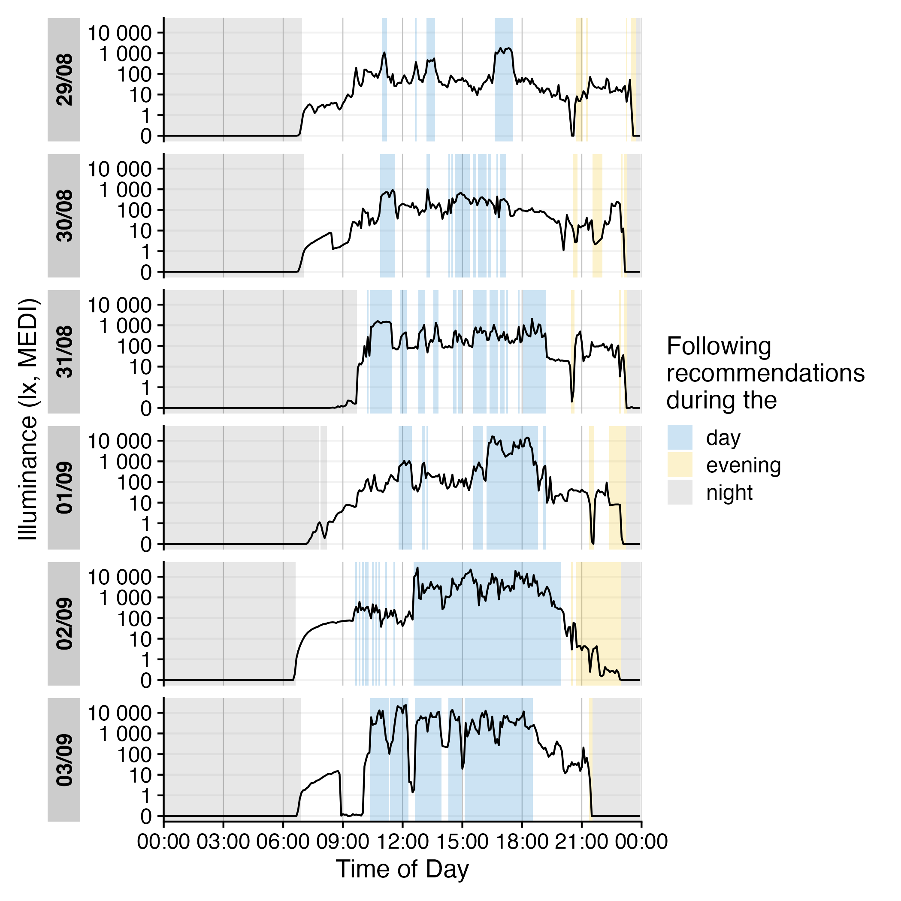

```{r, include = FALSE}
knitr::opts_chunk$set(
  collapse = TRUE,
  comment = "#>"
)
```



Creating, adding, extracting, and visualizing states in the time series collected through wearable devices is essential to give context to light exposure data and related measurements. **States**, in this case, are defined as logical, categorical, binned, or ordered variables, that exist somewhere on the time series of wearable data. That means states have a beginning and end time, and are associated with specific groups of data (e.g., the data by participant). A lot comes down to the durations states are active, and how other measurements behave during these states, which is why there is a heavy focus on `durations` in summary functions of `LightLogR`.

A special variant of states are **clusters**, which require a defined minimum/maximum length and that can contain defined interruptions of a given state and still be considered one cluster. One example might episodes spent in Daylight. If a participant spends 30 minutes outside above 1000 lx, then goes inside for 1 minute, and then goes outside again for 20 minutes, a strict assessment of times would yield two episodes of 30 and 20 minutes. Depending on the research topic, this might well be considered one episode of 51 minutes, however.

This article will dive into the various functions available in the `LightLogR` package to facilitate these analyses in a structured, reproducible, and efficient manner.l

The article will be divided into the following sections:

- [Creating states](#creating-states): How to work with the data you have
- [Adding states](#adding-states): How to add states to the data
- [Clusters](#clusters): Working with clusters

```{r setup}
library(LightLogR)
library(tidyverse)
library(gt)
```

# Importing Data

We will use data imported and cleaned already in the article [Import & Cleaning](https://tscnlab.github.io/LightLogR/articles/Import.html).

```{r, import}
#this assumes the data is in the cleaned_data folder in the working directory
data <- readRDS("cleaned_data/ll_data.rds")
```

As can be seen by using `gg_overview()`, the dataset contains 17 ids with one weeks worth of data each, and one to three participants per week.

```{r, overview}
data |> gg_overview()
```

# Creating states {#creating-states}

Whether existing states are part of the data very much depends on the devices employed in the data. These could be wear or non-wear indicators (usually for wrist-worn devices) or sleep/wake state. Most of the time, however, states have to be added to or created from the data. 

A simple example are binned continuous variables of light exposure. For melanopic EDI, it is typical to look for episodes ≤1lx (recommended for the sleep environment), ≤10lx( recommended during the evening), or ≥250lx (recommended during daytime). This and many other states can be created by established data analysis pipelines, which we will not dive into here. Rather, we will focus on how to use these variables, once they are created.

We start by adding the example above to our dataset. `Brown_cut()` does exactly that and adds a new column `state` to the dataset. We can choose the cutoff values, labels, and state name, but will use the defaults here. We also filter the dataset to only include two participants and to 1 minute intervals, which will make plots more manageable.

```{r}
dataset <- 
data |> 
  filter(Id %in% c("201", "202")) |> 
  aggregate_Datetime(unit = "1 min") |> 
      Brown_cut()

dataset |> 
ungroup() |> 
  count(state) |> 
  gt()
```

One of the first questions an analyst might have after adding states to the dataset is: **How long did each state last?** and **When do these states appear?**. This is a very important question, as it can be used to assess the quality of the data, and also to assess the validity of the created states. For example, if a participant spends 90% of their time in a state, this might be an indication that the state is not well defined.

For a simple quantification of the states, `durations()` can be used. It will return a tibble with the duration of each group. By default, this will only divide by participant (default group), but can easily be adjusted. If we also provide a variable, the function can check how much of the data is missing (i.e., NA) and how much is present. This is, alongside other summary statistics useful to assess the quality of the data.

```{r}
#without grouping
dataset |> 
  durations()

#providing a variable and show additional stats
dataset |> 
  durations(MEDI, show.missing = TRUE, show.interval = TRUE)

#extend grouping
extract <- 
dataset |> 
  group_by(state, .add = TRUE) |> 
  durations(MEDI) |> 
  ungroup(state)

extract |> gt()
```

While this is a good start, we might require additional information - for example what the mean melanopic EDI was during each state, or the actigraphy TAT (time above threshold) was. We can add these to the summary with `extract_metric()`. The function requires both the extract and the original dataset as input.

```{r}
#add metrics
extract |>  
  extract_metric(
    dataset,
    identifying.colname = state, 
    MEDI = mean(MEDI),
    TAT = mean(TAT)
  ) |> 
  gt() |> 
  fmt_number(c(MEDI, TAT))
```

This answers our first question, but what about **when** these states appear? For a visual representation, we can use `gg_state()`, and add-on to `gg_day()` and `gg_days()`. As `Brown_cut()` created a factor variable with `NA` as a factor level, it makes sense to convert `NA` levels to real `NA` values. This can be done with `forcats::fct_na_level_to_value()`.

```{r, fig.width = 10, message=FALSE}
#helper for colors
color <-   ggplot2::scale_fill_manual(
    values=c(`≤1lx` = "#868686FF", `≤10lx` = "#EFC000FF", `≥250lx` = "#0073C2FF")
    )

#plotting states
dataset |> 
  mutate(state = fct_na_level_to_value(state)) |> 
  filter_Date(length = "3 days") |> 
  gg_days() |> 
  gg_state(state, aes_fill = state) +
  color
```

A numeric representation of the **when** can be achieved with `extract_states()`.

```{r}
#extract states
extract <- 
dataset |> 
  extract_states(
    state
  )

extract |> head(3) |> gt()
```

This is a far more granular representation compared to the result derived with `durations()`. Here, every episode of a state is one row, each with start, end, duration, and epoch. Same as before, we can add metrics to the summary with `extract_metric()`.

```{r}
extract <- 
extract |> 
  extract_metric(
    dataset,
    identifying.colname = state.count, 
    MEDI = mean(MEDI),
    TAT = mean(TAT)
  )

extract |> 
  head(3) |> 
  gt() |> 
  fmt_number(c(MEDI, TAT))
```

With the universal function `summarize_numeric()`, we can condense the data further.

```{r}
extract |> 
  summarize_numeric(remove = c("epoch")) |> 
  gt() |> 
  fmt_number(c(mean_MEDI, mean_TAT)) |> 
  fmt_datetime(2:3) |> 
  fmt_duration(contains("duration"), input_units = "seconds")
```

While the number of rows is identical to the extract from `durations()`, here we gain more insights about the number of episodes and how long they were active. Note that extracted metrics are different here than from `durations()`. The reason being that the metrics are calculated for each episode, and then averaged. This means that the average from `durations()` deviates from the average of the averages here. This is important to keep in mind when interpreting the results. We can get an overall mean by regrouping to the state, which calculates averages across participants.

```{r}
extract |> 
  summarize_numeric(remove = c("epoch", "start", "end")) |> 
  group_by(state) |> 
  summarize_numeric(prefix = "") |> 
  gt() |> 
  fmt_number(c(mean_MEDI, mean_TAT)) |> 
  fmt_datetime(2:3) |> 
  fmt_duration(contains("duration"), input_units = "seconds")
```

# Adding states {#adding-states}

## Principles

Adding states to a dataset is a common task in data analysis. Very generally, any column from any extract can be added to a dataset with `add_states()` - one simply needs to specify what the `start` and `end` columns are. 

Let's assume that we are interested in looking at the brightest 10 hour period of each day. But we not only require the summary, we want to work that state in the context of our dataset. We start by grouping the data by day, which reveals a problem, as the very last datapoint in each group falls exactly on midnight, thus being a single datapoint in the group. These midnight cases are often problematic - in our case there are six full days of data, and the overhang.

```{r}
dataset |> 
  # group_by(Id, Date = date(Datetime)) |> 
  durations() |> 
  head(7)
```

It is best to remove these single datapoint groups, which is easy with `remove_partial_data()`. The function will throw a message about irregular/singular groups, and will remove them.

```{r}
#removing partial data
dataset <- 
  dataset |> 
  group_by(Id, Date = date(Datetime)) |> 
  remove_partial_data()
```

Now we can calculate the metric

```{r}
#calculate the brightest 10 hours
M10 <-
  dataset |> 
  group_by(Id, Date = date(Datetime)) |> 
  summarize(
    bright_dark_period(
              Light.vector = MEDI,
              Time.vector = Datetime,
              as.df = TRUE,
              period = "brightest",
              timespan = "10 hours"
              ),
    .groups = "drop_last"
  )

M10 |> head() |> gt() |> fmt_number()
```

This provides us with a table with the brightest 10 hours of each day, but we want to add this to our dataset. This can be done with `add_states()`.

```{r}
#adding the brightest 10 hours to the dataset
dataset <-
  dataset |> 
  add_states(
    M10 |> mutate(M10 = TRUE),
    start.colname = brightest_10h_onset,
    end.colname = brightest_10h_offset, 
    leave.out = c("brightest_10h_midpoint", "brightest_10h_mean")
  )
```

This added the column `M10` to the dataset, which is a logical variable indicating whether the datapoint is part of the brightest 10 hours. We can now use this variable in our analysis, for example to plot the data.

```{r, fig.width = 10}
dataset |>
  ungroup(Date) |> 
  gg_days() |> 
  gg_state(M10, fill = "yellow2")
```

## Example sleep/wake data

A special form of external state data are those coming from, e.g., diaries. This is often the case for sleep/wake data. In this example, we will add sleep/wake data to our dataset.

### Preparation

```{r}
#filter the dataset
data_205 <-
  data |> filter(Id == "205") 
```

Next we are importing sleep data for the participant `Id = 205`, which is included in `LightLogR`:

```{r}
#the the path to the sleep data
path <- system.file("extdata", 
              package = "LightLogR")
file.sleep <- "205_sleepdiary_all_20230904.csv"
#import sleep/wake data
dataset.sleep <- 
  import_Statechanges(file.sleep, path, 
                      Datetime.format = "dmyHM",
                      State.colnames = c("sleep", "offset"),
                      State.encoding = c("sleep", "wake"),
                      Id.colname = record_id,
                      sep = ";",
                      dec = ",",
                      tz = "Europe/Berlin")
```

This data gets added to the dataset with the `interval2state()` function and the `sc2interval()` function. This inbetween step of the two functions give us the option to also add the Brown et al. 2022 recommendations for healthy light, which can be extracted from sleep/wake data.

```{r}
data_205 <-
  data_205 |>
  interval2state(dataset.sleep |> sc2interval()) |> #add sleep/wake-data
  interval2state(
    dataset.sleep |> sc2interval() |> sleep_int2Brown(), 
    State.colname = State.Brown) #add Brown et al. 2022 states
```

### Sleep/Wake

Adding the sleep-wake information to a base plot.

```{r, fig.width = 10, fig.height = 5}
data_205 |> 
  aggregate_Datetime(unit = "5 mins") |> 
  gg_days() |> 
  gg_state(State, aes_fill = State)
```

What if we want to know the duration of sleep-wake states? We can number the states with the function `number_states()`. As long as there are no singular missing instances (like a sleep instance in the middle), this will yield a good result.

```{r}
data_205 |> 
  number_states(State, use.original.state = FALSE) |> 
  mutate(
    State.count = paste0("SW-cycle ", State.count)
  ) |>
  group_by(State.count) |> 
  extract_states(State.count) |> 
  select(-state.count) |> 
  ungroup() |> 
  gt() |> 
  tab_header("Sleep/Wake cycles")
```


### Brown recommendations

```{r, fig.height = 8}
data_205 |> 
  gg_day(geom = "line") |> 
  gg_state(State.Brown, aes_fill = State.Brown) +
  labs(fill = "Brown states")
```

We can even go a step beyond, and show at which times the participant complied with these recommendations. We will employ the helper function `Brown2reference()` that creates additional columns, including one that tests whether a light exposure level is within the required range (`Reference.check`). When we select this column for `gg_state()`, we can color by the `State.Brown` same as above, but get the selection of when this recommendation was actually met. 

```{r, fig.height = 8}
data_205 |> 
  Brown2reference() |>
  group_by(State.Brown, .add = TRUE) |>
  gg_day(geom = "line") |> 
  gg_state(Reference.check, aes_fill = State.Brown) +
  labs(fill = "Following\nrecommendations\nduring the")

```

We can check how well the recommendations were followed by using `durations()`.

```{r}
data_205 |> 
  Brown2reference() |> 
  group_by(State.Brown, .add = TRUE) |>
  durations(Reference.check, show.missing = TRUE, FALSE.as.NA = TRUE) |> 
  mutate(
    compliance = (duration/total) |> scales::percent()
  ) |> 
  ungroup() |> 
  gt()
  
```

### Photoperiods

Photoperiods are a powerful way to give context to light exposure data. Photoperiods only require the coordinates where the data were collected. There is a whole article on photoperiods, which can be found [here](https://tscnlab.github.io/LightLogR/articles/Photoperiods.html).

```{r, fig.width = 8}
#visualize photoperiods
data_205 |> 
  aggregate_Datetime(unit = "15 mins", type = "floor") |> 
  add_photoperiod(c(48.5, 9)) |> 
  gg_days() |> 
  gg_photoperiod()
```


```{r}
#summarize photoperiods
data_205 |> 
  add_photoperiod(c(48.5, 9)) |> 
  group_by(photoperiod.state, Date = date(Datetime)) |>
  durations() |> 
  ungroup(Date) |> 
  slice(1:3) |> 
  gt()
```

# Clusters {#clusters}

Clusters, as defined here, are states that can have interruptions but are still considered one episode. An example will make this more clear. Let us say we are interest in periods above 250 lx melanopic EDI. For participant `205`, this would look sth. like this:

```{r}
data_205 <- 
data_205 |> 
  mutate(
    above_250 = MEDI >= 250)

data_205 |> 
  gg_days() |> 
  gg_state(above_250, fill = "skyblue4") +
  labs(title = "Episodes above 250 lx")
```

```{r}
data_205 |> 
  extract_states(above_250) |> 
  summarize_numeric() |> 
  gt()|> tab_header("Episodes above 250 lx")
```

This shows that, on average, the participant was 105 seconds above 250 lx per episode, with around 940 episodes across the week in total. What if we want to know how often the participant spent 30 minutes or more above 250 lx? This is where clusters come in. We can use `extract_clusters()` to find those periods.

```{r}
data_205 |> 
  extract_clusters(
    above_250,
    cluster.duration = "30 mins"
  ) |> 
  summarize_numeric() |> 
  gt() |> tab_header("Clusters of 30 minutes or more above 250 lx")
```

During the six days of measurement, this participant spent 12 episodes of 30 minutes or more above 250 lx, with an average duration of 45 minutes. This is a good example of how clusters can be used to summarize data in a meaningful way.

Another trick clusters have, is the ability to allow for interruptions. Let's say we are looking for periods of 30 minutes or more, but we are allowing for interruptions of up to 3 minutes. How does that change our results?

```{r}
data_205 |> 
  extract_clusters(
    above_250,
    cluster.duration = "30 mins", 
    interruption.duration = "3 mins"
  ) |> 
  summarize_numeric() |> 
  gt()|> 
  tab_header("Clusters of 30 minutes or more above 250 lx",
                    subtitle = "with interruptions of up to 3 minutes")
```

This leads to an expected rise in the number of episodes (from 12 to 19), and an increase in the average duration (from 45 minutes to about 100 minutes). It is important to note, that the interruption duration is not cumulative. In theory, one could have bright/dark/bright/dark/... 2 minutes each, and this would count towards the cluster episode.

We can also add the clusters to the dataset, which can be useful for further analysis. This is done with `add_clusters()`, which works similar to `add_states()`. The only difference is that we need to provide the cluster properties.

```{r}
data_205 <- 
  data_205 |> 
  add_clusters(
    above_250,
    cluster.duration = "30 mins",
    interruption.duration = "3 mins", 
    cluster.colname = above_250_cluster
  )
```

The state can now be used in the same way as any other state. For example, we can plot the data with `gg_state()`.

```{r}
data_205 |> 
  filter_Date(length = "4 days") |> 
  aggregate_Datetime(unit = "3 mins", type = "floor") |>
  gg_days() |> 
  gg_state(above_250_cluster, fill = "skyblue4") +
  labs(title = "Clusters above 250 lx")
```

This concludes the article on states, clusters, and durations. We have seen how to create states, add them to the dataset, and extract useful information from them. We have also seen how to work with clusters and how to visualize them.